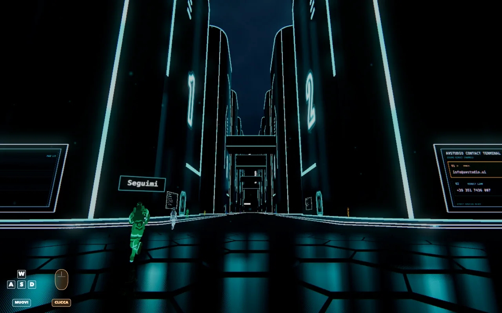

# Retro Future

Boulevard notturno esplorabile in WebGL: three.js in moduli ES, servito senza bundler,
con typecheck, prove di comportamento e un gate visivo che gira a ogni push.

[](https://github.com/ale-ehp/retro-future/actions/workflows/ci.yml)




**[Demo live](https://avstudio.ai/chi-siamo/retro-future/)** ·
**[Manuale tecnico](https://avstudio.ai/chi-siamo/retro-future/doc/)** ·
[English](README.en.md)

## Cos'è

Una città notturna navigabile in prima persona, costruita per misurare quanto si può
tenere in piedi in un browser senza toolchain: 97 moduli ES caricati da una importmap,
three.js r184 copiato in `vendor/` e servito in locale, nessun passo di build fra il
file sorgente e quello che arriva al browser.

Dentro ci sono una folla animata con fumetti e riflessi, un terminale dei contatti 3D
che prende il controllo della camera, un cielo procedurale con temporale e bake a cubo,
una catena di post-processing con bloom, antialiasing temporale e upscale, una colonna
sonora che pilota gli equalizzatori sulle facciate, e un pannello di regia con oltre
cinquecento controlli dal vivo.

Il **[manuale tecnico](https://avstudio.ai/chi-siamo/retro-future/doc/)** è la
documentazione vera: diciannove capitoli, uno per sottosistema, ognuno con il problema,
la soluzione, i numeri misurati e le cose che non so spiegare. La sua sorgente sta in
[`doc/`](doc/) e viene costruita in CI insieme al resto.

## Le decisioni che spiegano il resto

**Nessun bundler, di proposito.** `index.html` dichiara una importmap e i moduli
arrivano come li ho scritti. Il costo lo conosco e l'ho misurato: 1,36 MB su disco che
diventano 303 KB in brotli, e novantasette richieste condizionate alla seconda visita.
Il guadagno è che quello che debuggo nel browser è il file che ho aperto nell'editor.

**I tipi stanno nei commenti, il controllo è vero.** Niente TypeScript nella catena di
build, ma `tsc` con `checkJs` legge tutti i `.js`. Il debito di partenza, 524 errori, non
è stato nascosto: è diventato la soglia di un cricchetto che può solo scendere. È
arrivato a zero in quindici commit, un dominio per commit, senza usare `any` nemmeno una
volta, e lungo la strada ha scoperto cinque bug veri che i tipi larghi coprivano.

**Le prove guardano il comportamento, non il testo del codice.** Costruiscono la scena,
o aprono la pagina in Chromium, e misurano dove finiscono le cose. Solo quattro file
leggono il sorgente, e solo per affermazioni che il sorgente può fare da solo. Ogni
prova nuova nasce con la sua controprova: si rompe apposta quello che deve intercettare
e si verifica che diventi rossa.

**Il gate visivo ha una baseline per piattaforma.** Una scena 3D può passare tutte le
prove e cambiare aspetto. Il gate fotografa la pagina in Chromium a un istante fisso,
maschera le zone che pulsano e confronta i pixel contro un pavimento di rumore misurato.
La baseline di una macchina con GPU vera non vale sul runner senza GPU, e il perché sta
scritto con i numeri in [`test/baseline-linux/README.md`](test/baseline-linux/README.md).

## Cosa gira a ogni push

| cancello | cosa misura | oggi |
|---|---|---|
| prove | 160 prove su 35 file, comportamento della scena e della pagina | verdi |
| typecheck | `tsc --checkJs` su `src/` e `test/`, soglia a cricchetto | 0 errori |
| codice morto | nomi top level mai usati e import mai letti | 0 e 0 |
| gate visivo | copertina, scena statica e impronta strutturale contro la baseline del runner | verde |
| manuale | il build di Docusaurus si ferma su un link rotto o un'immagine mancante | verde |

Nessuno di questi si allenta per far passare un commit. La soglia del typecheck scende e
basta; la baseline visiva si rigenera solo dopo aver guardato le immagini nuove.

## Avvio

Sono file statici. Vanno serviti via HTTP, non aperti da `file://`, perché la pagina
importa moduli ES.

```sh
npm start                 # python3 -m http.server 8000
open http://localhost:8000/
```

Serve un browser con WebGL2. L'audio parte dopo la prima interazione, come vuole la
politica di autoplay.

## Comandi

```sh
npm install               # solo per i controlli: typescript, playwright, acorn, @types
npm test                  # 160 prove (node --test, Chromium per quelle di pagina)
npm run typecheck         # tsc con checkJs, soglia a cricchetto
npm run morto             # nomi morti e import inutili
npm run gate -- /tmp/rf   # cattura visiva; confronto con tools/confronto-visivo.py
npm run doc:dev           # il manuale in locale
```

La demo in sé non ha dipendenze: `npm install` serve solo ai controlli. three.js è
vendorizzato, e le prove lo risolvono con
[`test/resolve-three.mjs`](test/resolve-three.mjs), l'equivalente node della importmap.

## Controlli

| tasto | effetto |
|---|---|
| `Spazio` o il bottone a schermo | avvia |
| `W A S D` o frecce | movimento, `Shift` per correre |
| mouse | sguardo, `Esc` lo rilascia |
| `H` | rimette la camera all'altezza di partenza |
| `E` davanti al terminale | apre i contatti, frecce per scorrere, `Invio` per aprire |

Su telefono in orizzontale compare un joystick al posto della tastiera.

## Parametri URL

La scena si pilota dalla query string. Servono ai confronti A/B e a spegnere un effetto
senza toccare il codice.

| parametro | effetto |
|---|---|
| `?benchmark=1` | registra fps, frame peggiori e memoria, e mostra il pannello |
| `?benchmarkSeconds=N` | durata della registrazione |
| `?aa=fxaa\|msaa\|taa\|none` | modalità di antialiasing |
| `?taa=0` · `?taa.profile=quality\|lite` | spegne o profila l'antialiasing temporale |
| `?pipeline=0` | torna alla catena colore precedente |
| `?forceMobile=1` | profilo mobile su qualunque dispositivo |
| `?techBreakdown=1` | overlay con pipeline, frame, scena, LOD e stato dei bake |
| `?pixelRatio=N` | forza la risoluzione di render |

Le altre leve (`skyQuality`, `skyCheap`, `floorLite`, `floorReflect`, `buildingReflect`,
`dirLight`, `boardUpload`, `aaSamples`, `skyBake`) si leggono nelle funzioni
`*FromParams` dei moduli che le usano.

## Com'è diviso il codice

97 moduli, 34.578 righe, nessuno sopra le 1.500. `main.js` non costruisce la scena: apre
i sottosistemi nell'ordine giusto e li lega fra loro.

| cartella | cosa tiene |
|---|---|
| `src/engine/` | post-processing, antialiasing temporale, prewarm, ciclo dei frame, benchmark |
| `src/world/` | boulevard, palazzi, ponti, LED, tabelloni, terminale, cielo, rivelo della città |
| `src/character/` | corridore, folla, animazioni, fumetti, riflessi |
| `src/camera/` | posa, movimento, collisioni, sguardo del mouse |
| `src/controls/` | pannello di regia, input, equalizzatore, comandi mobile |
| `src/audio/` | colonna sonora e passi |
| `vendor/` | three.js r184 e i suoi addon, con `vendor/README.md` che dice cosa è modificato |
| `tools/` | typecheck, codice morto, gate visivo, screenshot del manuale |
| `doc/` | sorgente del manuale tecnico (Docusaurus) |

Le convenzioni che tengono in piedi la divisione, e che valgono per chi scrive codice
nuovo, stanno in [CONTRIBUTING.md](CONTRIBUTING.md).

## Licenza e crediti

© 2026 Alessandro Veneziano · [avstudio](https://avstudio.ai). Tutti i diritti
riservati: codice, grafica e musica sono pubblicati come vetrina e non sono riutilizzabili
senza permesso scritto. Il dettaglio, con le eccezioni di terze parti, sta in
[LICENSE](LICENSE).

Quello che non ho scritto io, con la sua licenza:

- **three.js r184** e i suoi addon, licenza MIT, © three.js authors. Due file sono
  modificati rispetto a upstream e [`vendor/README.md`](vendor/README.md) dice quali e
  come.
- **Le quattro teste della copertina**: “Kaonashi (No-Face)” di Riccardo Mazzi, da
  [Sketchfab](https://sketchfab.com/3d-models/kaonashi-no-face-bc0b122ee31a4909b3b2cee99c824ad0),
  licenza [CC BY 4.0](https://creativecommons.org/licenses/by/4.0/), adattato.
- **Space Grotesk** di Florian Karsten, licenza SIL Open Font License 1.1.
- **La colonna sonora** è mia, prodotta con Suno (piano Pro).

La pagina dei [crediti nel manuale](https://avstudio.ai/chi-siamo/retro-future/doc/riferimento/crediti)
tiene l'elenco completo.
