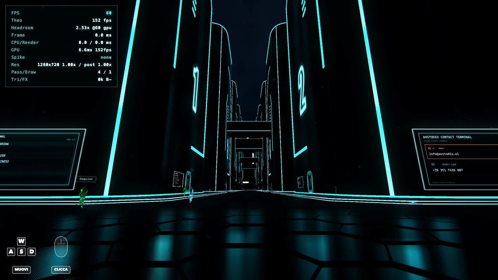
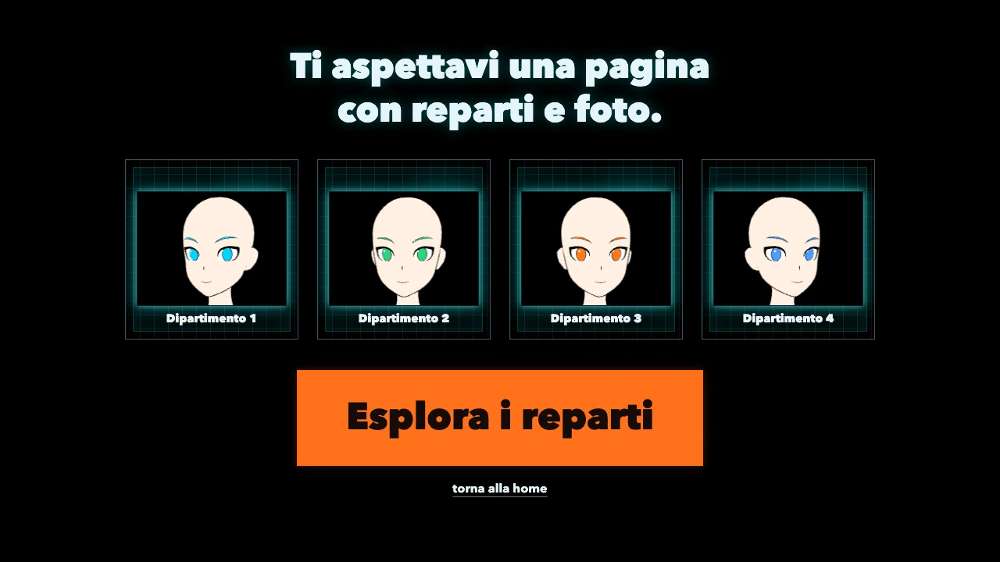

# retro-future

Demo interattiva three.js di [avstudio](https://avstudio.ai): un boulevard in stile Tron Legacy con folla animata, contact terminal 3D, board civiche, equalizer audio reattivo e pannello di controlli live. Vanilla JavaScript modulare, nessuna build: `index.html` + `src/` in moduli ES.

All'ingresso una schermata con le card dei reparti; da lì partono musica, reveal della città e camminata libera.

## Avvio

Sono file statici (nessuna build). Vanno serviti via HTTP, non da `file://`, perché la demo importa moduli ES.

    npm start          # equivale a python3 -m http.server 8000

poi apri http://localhost:8000/

Requisiti: browser recente con WebGL2. L'audio parte dopo la prima interazione.

## Test

    npm test

Suite `node --test`, 142 test su 25 file, nessuna dipendenza da installare. I moduli di scena importano `three` con lo specifier nudo: nel browser lo risolve la importmap di `index.html`, nei test un resolve hook di node (`test/resolve-three.mjs`) che punta agli stessi file di `vendor/`. `test/importmap.test.mjs` fallisce se le due tabelle divergono.

Serve node 22.15 o superiore, per `module.registerHooks`. La suite gira in CI su ogni push e pull request verso `main`.

## Controlli

- `Spazio` (o il bottone a schermo) avvia la demo
- `W A S D` / frecce · movimento (`Shift` sprint)
- mouse · sguardo, `Esc` lo rilascia
- `H` · rimette la camera all'altezza di default
- contact terminal: avvicinati al pannello contatti per interagire
- su mobile in orizzontale compare un joystick virtuale al posto di `W A S D`

## Flag URL

La demo si pilota da query string, utile per confronti A/B e per il rollback di un effetto senza toccare il codice.

| Flag | Effetto |
| --- | --- |
| `?benchmark=1` | avvia il benchmark e mostra il pannello con fps, frame peggiori e memoria |
| `?benchmarkSeconds=N` | durata della registrazione |
| `?pipeline=0` | rollback alla catena colore precedente, encode dentro il pass FSR |
| `?taa=0` | spegne il temporal AA |
| `?taa.profile=quality\|lite` | profilo del temporal AA |
| `?aa=fxaa\|msaa\|taa\|none` | modalità di antialiasing |
| `?look=classic` | disattiva il look cinematografico |
| `?forceMobile=1` | attiva il profilo performance mobile su qualunque device |
| `?techBreakdown=1` | overlay con pipeline, frame, scena, LOD e stato dei bake |
| `?heroShot=1` | inquadratura di apertura alternativa, orbita sulla città |
| `?pixelRatio=N` | forza la risoluzione di render |
| `?skyBake=1` | bake del cielo nel background, prova A/B per mobile |

Gli altri (`skyQuality`, `skyCheap`, `floorLite`, `floorReflect`, `buildingReflect`, `dirLight`, `boardUpload`, `aaSamples`, `benchmarkDownload`, `benchmarkSettleMs`) sono leve di misurazione: si leggono nelle funzioni `*FromParams` dei moduli che le usano.

## Struttura

- `index.html` shell della pagina, markup UI, importmap e boot differito
- `retro-future.css` stili
- `src/` codice della scena in moduli ES, con `main.js` come entry point
  - `camera/` sguardo mouse, cursore disco, volo di intro
  - `character/` runner giocante, folla, animazioni, fumetti, riflessi
  - `world/` boulevard, edifici, ponti, board, cielo, contact terminal, reveal
  - `engine/` postprocessing, temporal AA, shader, diagnostica, benchmark
  - `controls/` input, pannelli, equalizer, movimento mobile
  - `audio/` colonna sonora e passi
- `test/` infrastruttura di test (resolver di `three`) e test che non appartengono a un singolo modulo. I test dei moduli stanno accanto al modulo, come `src/camera/mouse-look.test.mjs`
- `vendor/` three.js r184 e i suoi moduli addons (EffectComposer, FXAA, UnrealBloom, GLTFLoader, ...). Due file non sono identici a upstream, `vendor/README.md` dice quali e perché
- `assets/`, `audio/`, `character-mockups/` asset di scena, colonna sonora e modelli dei personaggi
- `boulevard-canonical-settings.json` preset del pannello controlli, caricato al boot
- `docs/` screenshot, [frasi della folla](docs/frasi-folla.md), [roadmap WebGPU e TAA](docs/roadmap-webgpu-taa.md)

## Provenienza

Questo repository è la stessa cartella servita in produzione, rigenerata dal monorepo `osservatorio` dove la demo viene sviluppata e da cui viene deployata. Il codice della demo qui e quello live sono identici file per file: qui in più ci sono soltanto i file che servono a questo repository, cioè README, LICENSE, `package.json`, la CI e `docs/`.

I meta `canonical`, `og:url` e `og:image` di `index.html` puntano alla pagina di produzione: sono corretti lì e restano invariati qui perché questo repository serve la stessa build.

## Demo live

La demo gira su [avstudio.ai/chi-siamo/retro-future](https://avstudio.ai/chi-siamo/retro-future/), la pagina Chi siamo di [avstudio](https://avstudio.ai), studio italiano di automazioni AI per aziende. Questo repository è la stessa versione servita in produzione.

## Licenza e crediti

© Alessandro Veneziano · avstudio ([avstudio.ai](https://avstudio.ai)). Tutti i diritti riservati: codice, grafica e musica sono pubblicati come vetrina e non sono riutilizzabili senza permesso scritto.

La demo usa [three.js](https://threejs.org) (licenza MIT, © three.js authors), inclusa in `vendor/` (`three.core.js`, `three.module.min.js` e i moduli addons). `UnrealBloomPass.js` è un fork locale e `GLTFLoader.js` ha i percorsi di import adattati: le modifiche sono elencate in [`vendor/README.md`](vendor/README.md). Il modello `soldier.glb` dei character mockup proviene dagli esempi three.js (personaggio Mixamo "Vanguard").
