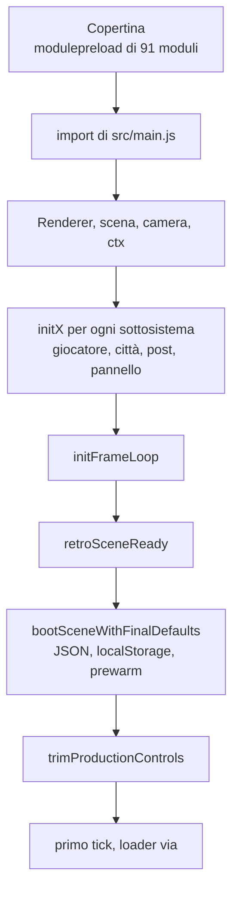

{/*
FONTI: docs/manuale-retro-future/schede/01-architettura-qualita-pannello.md, sezioni "Architettura".
Blocco 1: scheda §1 (index.html:162-198, 1299-1315, 1341-1385; README "Senza JavaScript"; 102c183d).
Blocco 2: scheda §2 (docs/retro-future-tappa5-opus.md:55-62; dc7cf29b; scripts/retro-future-typecheck.mjs:3-6; README regola 2; 8688d53b; src/audio-contesto-unico.test.mjs:1-6; scripts/retro-future-en.mjs:4-8; a1d3c24c; README "Quanto pesa src/"; apps/retro-future/src/index.ts:62-65).
Blocco 3: scheda §3 (index.html:770-782, 1180-1297, 1325-1338; vendor/README.md; src/main.js:243-276, 314-1280; src/ctx.js:4-27; README regole 1 e 2; src/engine/boot-prewarm.js:282-313; src/engine/frame-loop.js:113-289; src/ordine-boot-frame.test.mjs; scripts/retro-future-en.mjs:15-86; scripts/build-retro-future.mjs:20-61; apps/retro-future/src/index.ts:48-66; apps/retro-future/wrangler.toml; test/resolve-three.mjs; src/importmap.test.mjs; 586777c0).
Blocco 4: scheda §4 "Architettura" (intervista riga 5; README "Quanto pesa src/"; 422d8e0c; docs/retro-future-tappa5-opus.md:81-84, 117-123; dc7cf29b; aea0d767; src/ctx.js:6-12; 89729da5; 9f75e2a0; 8688d53b; 5d17b5cf; c30512d0; a1d3c24c; c5d52a2d; 0105b5a3; 2e96588e; 589b116f; 102c183d; 2b00f1cf; 586777c0) e §9 (domande aperte, dichiarate come tali).
Blocco 5: scheda §5 "Architettura" (misure del 2026-09-20 e date delle fonti).
Blocco 6: scheda §6 "Architettura" (wc -l 2026-09-20).
Blocco 7: ponte scritto senza affermazioni tecniche nuove.
*/}

# Architettura

:::note In breve

102 moduli ESM serviti senza bundler, risolti da una importmap. `main.js` monta i sottosistemi in un ordine che un test verifica sul sorgente; lo stato condiviso è un oggetto mutabile per dominio, e chi costruisce lo fa dentro `initX(deps)` perché gli import girano prima di scena, camera e renderer.

:::

## Cosa vede l'utente

Una pagina che si apre su una copertina: il titolo “Ti aspettavi una pagina con reparti e
foto.”, 4 schede con una faccia ciascuna, il bottone “Esplora i reparti” e il link alla home.
Mentre l'utente legge, la città si costruisce già in sottofondo. Al click il bottone diventa
“Caricamento…” e la scena parte appena è pronta; se il boot fallisce diventa “Ricarica la
demo”, e il secondo click ricarica la pagina.

## Il problema

Questa demo non ha un bundler, e con lui è saltata la diagnostica che il bundling dà gratis:
firme sbagliate, refusi nei nomi e import di export inesistenti si scoprivano solo aprendo la
pagina. Il browser carica i 102 moduli ESM così come stanno su disco, senza minificazione, uno
per richiesta.

Il 19 settembre 2026, quando l'ho mappato per spezzarlo, `main.js` teneva
6.824 righe, 153 `let` di modulo mutati fuori
dalla dichiarazione e 220 funzioni. Quei `let` erano condivisi fra domini: la sola
post-produzione ne aveva 35, letti o scritti da controlli, boot, ispezione e ciclo dei frame.
Spostare un dominio fuori voleva dire decidere come i domini si dividono lo stato: nessuna
scorciatoia.

Poi i vincoli di browser e rete:

- **I moduli vengono importati prima che la scena esista.** `main.js` importa tutto in cima,
  quando scena, camera e renderer non ci sono ancora: un modulo che chiama `scene.add()`
  all'import non può farlo.
- **Un effetto collaterale all'import rompe la demo in produzione.** Il 18 settembre
  precaricare `main.js` prima del click ha spento la scena: il modulo fotografava
  l'`AudioContext` all'import, quando ancora non esiste, e al click ne nasceva un secondo.
  Collegare nodi di contesti diversi alzava un `InvalidAccessError` a ogni frame: scena senza
  personaggi né cartelli, comandi morti.
- **La seconda visita costa richieste, non byte.** I moduli sono serviti con
  `cache-control: no-cache` più ETag: 102 moduli, 102 richieste condizionate per visita.
- **Una copia inglese di `index.html` divergerebbe alla prima modifica.** Il file pesa 114.216 byte fra markup, importmap e script inline, e cambia a ogni intervento.
- **Il build copiava tutto.** Il 7 agosto erano pubblici sul sito due documenti di lavoro e
  tutti e 23 i file di test, verificato con GET 200.

## Come funziona

### Niente bundler: importmap e vendor

`index.html` porta una importmap di 8 voci: `three` risolve su
`./vendor/three.module.min.js`, 7 `three/addons/...` su `./vendor/<nome>.js`. La cartella
`vendor/` contiene three.js r184 e i suoi addon copiati in locale: 16 file, 1,0 MB. 2 file non
sono identici a upstream: `UnrealBloomPass.js`, che è un fork, e `GLTFLoader.js`, solo nei
percorsi degli import.

I 102 moduli stanno sotto `src/`, divisi in `audio/`, `camera/`, `character/`, `config/`,
`controls/`, `engine/`, `world/`. La mediana è 241 righe; quattro file stanno sopra le
1.000, e il più grande è `main.js` con 1.280. La regola non è un tetto di righe: un
modulo è un sottosistema. I 4 grandi sono ognuno un sottosistema solo, e i 3 file che
tenevano insieme mestieri diversi sono stati divisi il 21 settembre: la folla, il rivelo
e i tabelloni. Sulla rete viaggiano in brotli da
Cloudflare: `main.js` passa da 46 KB a 11, il totale compresso è 303 KB.

node:test non legge la importmap, quindi `test/resolve-three.mjs` registra un resolve hook che
mappa gli stessi specifier sugli stessi file di `vendor/`. Le 3 copie della mappa (importmap,
hook, `paths` di `jsconfig.json`) devono coincidere, e un test lo verifica.

### La copertina precarica la città

Lo script inline della copertina importa subito solo il runtime della colonna sonora e
trasforma una lista di 91 moduli (15 di `vendor/`, 76 di `src/`) in altrettanti
`<link rel="modulepreload">`. Al `load` della pagina parte `precaricaCitta()` via
`requestIdleCallback`, timeout 1.500 ms, o `setTimeout` di 300 ms dove non c'è.

`scheduleRetroFutureCityBoot()` tiene una sola promessa: `requestAnimationFrame`, poi il
preload, poi `import('./src/main.js')`. Un secondo click si aggancia alla stessa promessa.
L'`AudioContext` nasce qui, nella copertina, e viene pubblicato su `window.__retroAudio`;
`main.js` lo riusa invece di crearne uno suo. Misurato in Chromium con 25 secondi di attesa
prima del click: la copertina se ne va dopo 0,1 s invece di 1,4.

### main.js apre i sottosistemi

`main.js` è un modulo ESM con top-level `await`. Lancia 2 gruppi di `import()` dinamici (5
addon di post-processing; `GLTFLoader` e `SkeletonUtils`) prima di aspettare l'uno o l'altro,
così le richieste si sovrappongono. Se il primo gruppo fallisce si va avanti senza
post-processing, se fallisce il secondo senza personaggi.

Poi costruisce, in quest'ordine: i valori fissi dei controlli e la lettura del pannello;
il renderer WebGL (antialias spento, tone mapping ACES, esposizione 0,85, sRGB, ombre
spente); la diagnostica e il benchmark; scena e camera (FOV fisso, near 0,1, far 10.000)
raccolte in `ctx`; lo stato del giocatore; la copertina e il bottone; il cursore a
disco, il mouse-look, il movimento da telefono, i passi, la colonna sonora; il cielo, le
mappe di riflessione, le texture dei materiali; la strada e gli esagoni; le collisioni;
il confine, il volo del drone, il movimento, la tastiera; i marciapiedi, con dentro la
mappa del boulevard; le luci; il cablaggio della città; la catena di post-processing; i
controlli live e il pannello; il prewarm; le scorciatoie di ispezione; il ciclo dei
frame; le particelle. Ogni sottosistema si apre con una `initX(deps)` chiamata dove
stava il codice, non in cima.

`retroSceneReady` è la promessa che la copertina aspetta: boot con i valori definitivi,
pannello via dal DOM, poi dentro un `requestAnimationFrame` contatori azzerati, rivelo in
wireframe, primo `tick(now)`, loader nascosto, `player.sceneBootComplete`. Un `catch` logga
con il prefisso `[retro-future]` e rilancia; la funzione che parte al click è esportata come
`startRetroFuture`.

### Lo stato condiviso: un oggetto per dominio

Regola 1: lo stato che più moduli toccano è un oggetto mutabile esportato dal dominio che lo
possiede. Ce ne sono 5:

- `post`, 30 chiavi: composer, pass, risoluzione, bloom, upscale, TAA, modo prestazioni.
- `boulevard`, 28 chiavi: scale dei palazzi, piazzole, larghezze, lunghezza della strada.
- `player`, 33 chiavi: yaw, pitch, spawn, posa di atterraggio, velocità, dondolio, superficie
  di cammino.
- `collisioni`, 5 chiavi.
- `frame`, 9 chiavi: contatori FPS e del ciclo.

Fuori dal file si scrive `post.bloomEnabled` e basta. Nell'oggetto ci finisce un nome solo se
qualcuno fuori dal file lo legge o lo scrive; il resto resta `let` privato. I 30 nomi di
`post` li ho misurati sull'AST prima di tagliare: i 14 che servivano solo lì dentro sono
rimasti variabili normali. Oggi `main.js` ha 4 `let` di modulo, da 153. Altri oggetti
condivisi dello stesso tipo: `keys` per la tastiera, `movementVelocity`, lo stato
dell'equalizer.

`ctx` è un'altra cosa: porta solo `scene`, `camera`, `renderer`, un getter `composer` (creato
più tardi, legato in ritardo) e uno `state` che parte vuoto. Il solo campo trasversale oggi è
`state.boundaryError`. 7 moduli ricevono `ctx`; gli altri un oggetto `deps` con quello che
serve, spesso come getter.

Regola 2: chi costruisce lo fa dentro `initX(deps)`. I binding sono `let` dichiarati in cima
al file, tipati in JSDoc, assegnati per destrutturazione dentro la funzione. 3 moduli che
scrivevano su `window` all'import ora controllano `typeof window !== 'undefined'`, così si
importano anche fuori dal browser.

### L'ordine del boot e del frame, protetto da un test

`bootSceneWithFinalDefaults()` applica il JSON canonico dei controlli, poi quello che sta in
localStorage, poi i tempi del rivelo presi dalle costanti, l'upscale forzato a risoluzione
piena, i valori fissi dei ponti, lo spawn salvato; rilegge tutti i cursori con
`applyLiveControls()`; costruisce l'equalizer nascosto; applica lo spawn; carica i personaggi
e svuota la coda di costruzione; poi i prewarm (ossa, texture, un render nascosto dei
personaggi, i pass di post-processing), con un `waitForNextFrame()` fra un blocco e l'altro
per non bloccare il main thread; infine l'audio dei passi, un pass reale e il volo automatico
del drone.

Il ciclo `tick(now)` si riprenota subito con `requestAnimationFrame`, taglia `dt` a 0,05 s,
aggiorna il cursore a disco, ogni 500 ms ricalcola gli FPS e ritocca il budget, muove il
drone, chiede al terminale dei contatti se possiede la camera e applica il movimento solo se
né lui né il drone la tengono; poi il LOD della strada; poi, se il rivelo non è in fase
critica, esagoni, confine, effetti secondari a passo ridotto, camminata, personaggi, folla;
l'etichetta della posizione ogni 180 ms; cielo, tabelloni, particelle, cartelli; il profilo
prestazioni; i pass del composer; equalizer e LED; il culling statico; il render con timer
GPU; i tempi alla diagnostica. Un solo `requestAnimationFrame` per evento di `resize`.

L'ordine è logica, non stile. Un test lo legge dal sorgente e pretende che la coda della folla
sia svuotata prima delle texture, il post-processing scaldato per ultimo, il LOD della strada
prima del controllo del rivelo critico, il terminale a decidere se possiede la camera prima di
camminata e dondolio.

### La pagina inglese e il build

La stessa demo esiste su `/en/chi-siamo/retro-future/`: il Worker Cloudflare instrada 6
pattern di rotta sugli stessi asset. La pagina inglese non è una copia:
`scripts/retro-future-en.mjs` tiene un dizionario di 40 coppie italiano-inglese (2 con modo
“tutte”), e ogni coppia deve comparire esattamente una volta nel sorgente, altrimenti il build
fallisce. Il canonical viene riscritto su `/en/` e vengono aggiunti 3 `hreflang` (it-IT, en,
x-default); gli stessi `hreflang` vanno sull'italiano, in modo idempotente. Il pannello dei
controlli resta in italiano di proposito.

Il build copia la cartella della demo in `dist-retro/` filtrando una denylist di 6 pattern
(`.md`, `.d.ts`, `.test.mjs`, `.DS_Store`, `jsconfig.json`, `doc/`), scrive `index.en.html`,
riscrive `index.html` con gli `hreflang` e verifica che nessun file non pubblicabile sia
passato: 137 file. Il deploy è build più `wrangler deploy --strict`. Il Worker manda l'HTML con
CSP e `no-cache`; `.opus` e `.webp` con cache pubblica di una settimana e
`stale-while-revalidate` di un giorno; `.js`, `.css`, `.json`, `.glb` con `no-cache`.

Senza JavaScript la copertina si vede intera: foto statiche nei canvas, titolo, link alla
home. Un `<noscript>` nasconde il bottone e mostra la frase “Questa demo è una scena 3D e ha
bisogno di JavaScript, che qui è spento.” Le 4 facce sono canvas con `aria-hidden`, con
accanto l'etichetta visibile del reparto.

## Perché così e non altrimenti

- **Niente bundler.** Il prodotto è un link dentro un sito, ed è nato così. La ragione
  misurata: il costo della seconda visita lo decidono le richieste, non i byte. Minificare
  non lo cambierebbe; cambiare la politica di cache del Worker sì. Nessuna delle due è stata
  fatta: scelte di prodotto.
- **`no-cache` sui moduli, non `max-age`.** Prima i moduli avevano `max-age=300` mentre
  `index.html` era `no-cache`: a ogni deploy un `index.html` fresco poteva caricare moduli
  stantii con export cambiati, e il boot moriva con lo schermo nero. Ora si rivalida tutto a
  ogni caricamento.
- **Un oggetto di stato per dominio, non getter e setter.** L'alternativa era passare a ogni
  modulo decine di getter e setter per ogni `let`: lo stile di `initMouseLook` e
  `initKeyboard`, che regge 5-10 dipendenze, non 35.
- **Non `ctx.state`.** Quello resta per i pochi campi davvero trasversali, e il suo commento
  avverte di non farlo diventare il prossimo `controlEls`, un contenitore di tutto.
  Dichiarava 3 fette (`reveal`, `runner`, `perf`) e dei `flags` che nessun modulo leggeva,
  zero occorrenze in tutto `src/`: ora parte vuoto.
- **`composer` come getter.** Viene creato più tardi ed è riassegnabile; scena, camera e
  renderer sono `const` create prima e passano per valore.
- **`initX` chiamata dove stava il codice.** Alcune dipendono da variabili dichiarate poche
  righe prima, `initPlayerFootsteps` per esempio: cambiare l'ordine non era gratis.
- **Il ciclo dei frame è uscito per ultimo.** Finché gli altri domini stavano in `main.js`,
  muoverlo avrebbe mescolato due cambiamenti.
- **`postModulesPromise` resta in `main.js`.** Portarla nel modulo avrebbe anticipato le
  richieste di rete degli addon.
- **La città si costruisce prima del click.** Il costo è che three.js e la scena si
  scaricano anche per chi non entra: l'attesa al click contava di più. Il precarico era stato
  spento e riacceso il 18 settembre: la causa non era lui ma l'`AudioContext` fotografato
  all'import, e ora chi lo crea per primo lo pubblica su `window.__retroAudio.context`.
- **Pagina inglese generata, non copiata.** Se il testo italiano cambia e la traduzione non
  lo trova più, il build si ferma invece di pubblicare una pagina inglese a metà. Le 3
  etichette del bottone d'ingresso stanno nel dizionario perché senza la pagina inglese
  tornava in italiano appena partiva il caricamento.
- **Una denylist nel build.** I `.md` e i test perché erano online; `jsconfig.json` e i
  `.d.ts` perché servono a tsc, non al browser; `doc/` perché con i suoi `node_modules` la
  copia integrale avrebbe pubblicato 714 MB, e lo pubblica un Worker suo.
- **I nomi di `vendor/` sono allineati alla vetrina pubblica.** Prima ogni correzione andava
  portata a mano da una parte all'altra traducendo i percorsi.
- **`<noscript>` invece di un bottone morto.** Senza JavaScript il bottone non potrebbe
  fare niente.
- **Un `catch` su `retroSceneReady`.** Senza, un boot che fallisce è una unhandled rejection:
  il loader resta appeso e in console non compare niente di riconducibile alla demo.
- **Niente effetti collaterali all'import.** Un import che scrive su un globale del browser
  rende il modulo caricabile solo dentro una pagina.

Cose che non so spiegare, e lo dico:

- Il README elenca `pannello` fra gli oggetti di stato, ma il commit che ha tolto il codice
  morto dice che l'oggetto sparisce, e oggi nessun modulo lo esporta.
- Il README e un commit dicono 84 moduli prima della tappa 5; `git ls-tree` a quel commit ne
  conta 83 non di test.
- La politica di cache del Worker, 102 richieste condizionate a ogni visita, è dichiarata
  scelta di prodotto e resta aperta.
- Al boot l'upscale viene forzato spento e la scala a 1 dopo il JSON canonico e il
  localStorage: nessuna fonte scritta spiega perché il valore del JSON non basti.

## I numeri

| cosa | valore | fonte e data |
|---|---|---|
| moduli sotto `src/` | 102 (più 35 file di test e 1 `.d.ts`) | `find`, misurato il 2026-09-21 |
| peso dei moduli | 1.435.658 byte su disco; 323.738 compressi in brotli | `wc -c` e `brotli -q 11`, 2026-09-21 |
| `main.js` | 1.280 righe, 46 KB, 11 KB in brotli | `wc` 2026-09-20; `README.md` 2026-09-19 |
| `main.js` all'inizio della tappa 5 | 7.135 righe | commit a05e8e47, 2026-09-19 |
| `main.js` a metà tappa, quando è stato mappato | 6.824 righe, 153 `let` di modulo, 220 funzioni | `docs/retro-future-tappa5-opus.md`, 2026-09-19 |
| `let` di modulo in `main.js` oggi | 4 | `grep`, misurato il 2026-09-20 |
| file più grande di `src/` | `main.js`, 1.280 righe; mediana 241; quattro file sopra le 1.000 | `wc -l`, misurato il 2026-09-21 |
| importmap / modulepreload | 8 voci / 91 voci | `index.html`, misurato il 2026-09-20 |
| `vendor/` | 16 file, 1,0 MB, three r184 | `ls`, `du` 2026-09-20; `vendor/README.md` |
| chiavi degli oggetti di stato | `post` 30, `boulevard` 28, `player` 33, `collisioni` 5, `frame` 9 | python, misurato il 2026-09-20 |
| dizionario inglese | 40 coppie, 2 con modo “tutte” | `scripts/retro-future-en.mjs`, misurato il 2026-09-20 |
| denylist / file pubblicati | 6 pattern / 137 file in `dist-retro` | `scripts/build-retro-future.mjs`; commit 2e96588e, 2026-09-20 |
| cache del Worker | media `max-age=604800` più `stale-while-revalidate=86400`; HTML e moduli `no-cache` | `apps/retro-future/src/index.ts` |
| rotte del Worker | 6 pattern | `apps/retro-future/wrangler.toml` |
| precarico | idle con timeout 1.500 ms, fallback 300 ms; copertina via in 0,1 s invece di 1,4 | `index.html`; commit 8688d53b, 2026-09-18 |
| renderer | esposizione 0,85; camera near 0,1, far 10.000 | `src/main.js` |
| ciclo dei frame | `dt` massimo 0,05 s; FPS ogni 500 ms; etichetta posizione ogni 180 ms | `src/engine/frame-loop.js` |

## Dove sta nel codice

| file | righe | ruolo |
|---|---|---|
| `index.html` | 1.389 | copertina, HUD, markup del pannello, importmap, script della copertina e del boot in sottofondo |
| `src/main.js` | 1.280 | apre i sottosistemi nell'ordine giusto e li lega; crea renderer, scena, camera, `ctx`; esporta `retroSceneReady` e `startRetroFuture` |
| `src/ctx.js` | 27 | l'oggetto `ctx` (scena, camera, renderer, getter del composer, `state`) |
| `src/config/costanti.js` | 109 | le costanti pure uscite da `main.js` |
| `src/engine/post-pipeline.js` | 788 | oggetto `post`, composer e catena dei pass |
| `src/engine/frame-loop.js` | 289 | `tick()`, oggetto `frame`, contatore FPS, ridimensionamento |
| `src/engine/boot-prewarm.js` | 313 | `bootSceneWithFinalDefaults()` e i prewarm |
| `src/engine/inspect-hooks.js` | 468 | le scorciatoie `window.__tron*` |
| `src/world/boulevard-layout.js` | 371 | oggetto `boulevard`, mappa del boulevard |
| `src/world/city-wiring.js` | 782 | montaggio di palazzi, ponti, LED, tabelloni, terminale, equalizer, rivelo |
| `src/camera/player-state.js` | 138 | oggetto `player`, spawn, superficie di cammino |
| `src/camera/camera-collision.js` | 173 | oggetto `collisioni` |
| `src/character/runner-wiring.js` | 1.128 | cablaggio del corridore e della folla |
| `src/globali.d.ts` | 99 | i nomi appesi a `window` e quello che lib.dom non dichiara |
| `scripts/retro-future-en.mjs` | 86 | dizionario e generazione della pagina inglese |
| `scripts/build-retro-future.mjs` | 61 | build in `dist-retro/` con denylist e verifiche |
| `apps/retro-future/src/index.ts` | 120 | Worker Cloudflare, intestazioni, rotte inglesi |
| `apps/retro-future/wrangler.toml` | 28 | rotte e binding degli asset |
| `vendor/README.md` | 42 | three r184, i 2 file modificati rispetto a upstream |
| `README.md` | 126 | comandi, regole dei test, divisione di `src/`, peso sulla rete |

I test: `ordine-boot-frame.test.mjs` legge dal sorgente l'ordine del boot e del frame;
`importmap.test.mjs` verifica che le 3 copie della mappa di `three` coincidano; il test
sull'`AudioContext` verifica che `main.js` non lo fotografi all'import; `pagina-cover.test.mjs`
misura la copertina in Chromium, con e senza JavaScript.

## Per chi viene dal backend

`main.js` è il punto di composizione del servizio: istanzia i componenti e li collega
nell'ordine delle dipendenze, e il test sull'ordine protegge quel cablaggio. Gli oggetti di
stato per dominio sono tabelle possedute da un servizio, con una regola di visibilità:
espongono solo le colonne che un altro servizio legge. Il precarico della città è il warm-up
del pool prima di aprire il traffico. `no-cache` più ETag è una cache con revalidazione, e
legare i moduli all'`index.html` è la stessa scelta di versionare il client insieme all'API.
La pagina inglese è un template compilato al build: se una chiave manca, fallisce il build,
non la richiesta.
