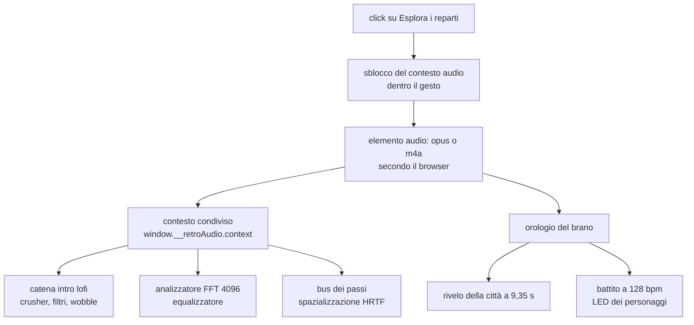

{/*
FONTI: docs/manuale-retro-future/schede/07-audio-rivelo.md, sottosezioni "Audio" delle sezioni 1-6 e 9.
Blocco 1: §1 Audio (partenza al click con dissolvenza di 3 s verso 0,09; intro lofi che si apre sul beat drop; crossfade a 8 s dalla fine ripartendo dal secondo 30; passi strada/marciapiede; passi della folla con HRTF dopo il rivelo; equalizzatore 16x22 sul muro; LED a 128 bpm; scheda Audio FX; m4a su Safari, adba8478; tap che sblocca su telefono, 676f6324).
Blocco 2: §2 Audio (due AudioContext e InvalidAccessError, 8688d53b; il difetto solo con attesa fra apertura e click; autoplay e gesto utente; Ogg non supportato su Safari, adba8478; due orologi con 35-100 ms di deriva, 8cc1dd36; opus in ritardo su cache fredda, 1de5867b; costo per frame di equalizzatore e battito, 71719cd8 e fa096457; il sequencer morto, fabb5491).
Blocco 3: §3 Audio (contesto unico risolto all'uso e pubblicato su window; colonna sonora e i suoi tempi; equalizzatore FFT 4096 e i suoi parametri; passi del giocatore e della folla; battito 128 bpm) e §5 Audio (numeri).
Blocco 4: §4 Audio (contesto all'uso; prove che leggono il sorgente come eccezione dichiarata; il brano come orologio maestro; anticipo di 200 ms; opzione introLofi esplicita; priming nel tap; doppio formato con durata preservata; prefetch aggiunto e tolto; stato in soundtrack-runtime; il contesto resta fuori dal runtime; rimozione del sintetizzatore; playsInline tolto; kick spento e rinominato in bpm-clock; equalizzatore a 20 Hz; renderOrder cambiato; colori HSLA memorizzati).
Blocco 5: §5 Audio.
Blocco 6: §6 Audio.
Blocco 7: analogia scritta qui.
Colonna sonora: prodotta dall'autore con Suno, piano Pro (intervista, risposta 8).
*/}

# Audio

## Cosa vede l'utente

Al click sul bottone parte la musica, ma attutita, come se venisse da un'altra stanza.
Resta così per nove secondi, mentre la città è ancora in fil di ferro. Poi il brano si
apre di colpo, nello stesso istante in cui la città cade al suo posto. Da lì in poi si
sentono i propri passi, diversi sull'asfalto e sul marciapiede, i passi delle persone
che camminano attorno, e su un muro dietro il punto di partenza un equalizzatore a
sedici colonne segue lo spettro del brano.

La colonna sonora l'ho prodotta io con Suno, piano Pro: volevo movimento, e i LED dei
personaggi lampeggiano sul suo ritmo.

## Il problema

**Un contesto audio, non due.** Il browser dà a ogni pagina un contesto audio, e i nodi
di due contesti diversi non si possono collegare. Il modulo principale fotografava il
contesto al momento dell'importazione, cioè prima del click, quando ancora non
esisteva: ne nasceva uno per modulo, e collegare un nodo dell'uno all'altro sollevava
un errore a ogni fotogramma. La demo restava senza personaggi. Il difetto compariva
solo se fra l'apertura della pagina e il click passava del tempo, e le prove
cliccavano subito.

**Il browser non lascia partire l'audio da solo.** La riproduzione e la riattivazione
del contesto devono avvenire dentro un gesto dell'utente. Sul telefono la demo aspetta
che giri il dispositivo, e l'evento di rotazione non porta con sé l'attivazione: il
sistema rifiuta.

**Il formato non è universale.** Il contenitore Ogg, che comprime meglio, non si carica
su Safari e su iPhone: l'elemento resta muto e l'equalizzatore legge zero. Due sintomi,
una causa.

**Due orologi non restano allineati.** La musica partiva con un timer dal click e il
rivelo della città con un altro, e fra un caricamento e l'altro la differenza si
spostava di 35-100 millisecondi. Si accordava a orecchio, e cambiava a ogni prova.

## Come funziona

### Il contesto condiviso

Il contesto si risolve al momento dell'uso, non all'importazione, e chi arriva primo lo
pubblica su una proprietà della finestra perché gli altri lo riusino. Tre prove
leggono il sorgente per impedire che qualcuno torni a fotografarlo all'importazione: è
un'eccezione dichiarata alla regola che le prove guardano il comportamento, e c'è
perché il difetto si vede solo lasciando passare tempo prima del click.

### La colonna sonora

Il brano parte dal secondo zero con una dissolvenza di tre secondi verso un volume
basso, e parte dentro una catena di effetti che lo rende attutito. Quando l'orologio
del brano arriva al colpo di basso, la catena si apre. Non va in ciclo secco: a otto
secondi dalla fine un secondo elemento riparte dal secondo trenta e i due si
incrociano.

Esistono due file, uno per formato, con la durata quasi identica: la costante che
sincronizza il rivelo vale per entrambi.

### Il beat drop come orologio

Il momento del colpo di basso non è stato scelto a orecchio: è misurato sul segnale,
con una media quadratica su finestre di cinquanta millesimi filtrata sotto i 150 hertz.
Il salto è a 9,35 secondi, e nel codice c'è scritto di rimisurarlo se il brano cambia.
Il fronte del rivelo parte con duecento millesimi di anticipo, che è una scelta
artistica, una sola manopola, espressa in tempo di brano e non in tempo di orologio.

### L'equalizzatore

Un analizzatore con finestra da 4096 campioni legge lo spettro fra 35 e 15.500 hertz,
lo distribuisce su sedici colonne di ventidue segmenti e lo disegna su una texture. Il
campionamento è a 30 volte al secondo, il disegno a 20: fra due disegni gli ingressi si
muovono meno della precisione delle stringhe di colore, quindi i colori sono
memorizzati invece di essere ricostruiti.

### I passi

Quelli del giocatore scattano a ogni mezzo periodo dell'oscillazione del passo, con
otto campioni divisi in due banchi, strada e marciapiede, alternando destro e sinistro,
con un intervallo minimo fra due passi e un filtro passa basso diverso per superficie.
Quelli dei personaggi passano per un bus spazializzato che tiene conto di dove si trova
chi cammina rispetto a chi ascolta, e si accendono solo a rivelo finito.

## Perché così e non altrimenti

- **Il contesto si risolve all'uso.** Il precaricamento della città era stato spento
  perché rompeva la demo, e la causa erano i due contesti. Risolvendolo al momento
  dell'uso il precaricamento è tornato acceso.
- **Il brano è l'orologio maestro, non un timer.** Il fronte parte quando l'orologio
  del brano raggiunge il colpo di basso misurato; il vecchio timer resta come riserva
  per chi non ha musica. Su quattro caricamenti lo scarto è sceso a undici millesimi.
- **L'opzione che chiede l'intro attutita è esplicita.** Prima dipendeva da un prefisso
  nel nome della sorgente, e bastava cambiarlo per disattivarla in silenzio.
- **L'audio si sblocca nel tocco, non nella rotazione.** Il tocco è un gesto vero; la
  rotazione no, e il sistema rifiuta. I guadagni partono quasi a zero, così la
  riproduzione avviata nel gesto non si sente.
- **Due formati, con la durata verificata.** Il più piccolo dove si può, l'altro
  altrove, e le due durate coincidono al millesimo: la costante della sincronizzazione
  non cambia.
- **Il sintetizzatore è stato tolto.** Duecentonovantacinque righe che costruivano
  musica procedurale non erano mai chiamate: la musica che si sente è il file. Restano
  nella storia, se un giorno servisse.
- **Gli oggetti dell'equalizzatore e del battito si riusano.** Allocavano oggetti e
  stringhe a ogni fotogramma, dentro la finestra in cui la demo ha meno margine.

Cose che non so spiegare, e lo dico:

- Il sorgente del battito è passato da un rilevamento del colpo di cassa a un semplice
  orologio a 128 battute, e il commit non dice perché.
- Il ritmo di aggiornamento dell'equalizzatore è passato da 15 a 20 volte al secondo, e
  l'ordine di disegno da 40 a 18, entrambi senza motivo scritto.
- Un precaricamento del brano è stato aggiunto per il caso di cache fredda e poi tolto,
  e il commit che lo toglie non spiega il perché.

## I numeri

| cosa | valore | fonte e data |
|---|---|---|
| colpo di basso del brano | 9,35 s, misurato con media quadratica filtrata a 150 Hz | `audio.js` |
| anticipo del fronte | 200 ms, in tempo di brano | `config.js` |
| scarto fra quattro caricamenti | 11 ms | commit 8cc1dd36 |
| file audio | 1.864.846 byte (Opus), 2.512.761 (M4A) | `ls`, 2026-09-20 |
| durata | 148,668 s e 148,661 s | `afinfo`, 2026-09-20 |
| volume di destinazione | 0,09, con dissolvenza di 3 s | `audio.js` |
| ciclo del brano | incrocio di 8 s, ripartendo dal secondo 30 | `audio.js` |
| equalizzatore | 16 colonne per 22 segmenti, finestra 4096, 35-15.500 Hz | `equalizer.js` |
| ritmi dell'equalizzatore | lettura 30 volte al secondo, disegno 20 | `equalizer.js` |
| battito dei LED | 128 battute al minuto, moltiplicatore fino a 4 | `characters.js` |
| campioni dei passi | 8 file, da 29.940 a 40.682 byte | `ls`, 2026-09-20 |
| intervallo minimo fra passi | 105 ms | `costanti.js` |

## Dove sta nel codice

| file | ruolo |
|---|---|
| `src/audio/audio.js` | elemento audio, formati, intro attutita, ciclo, colpo di basso |
| `src/audio/soundtrack-runtime.js` | lo stato della colonna sonora, estratto dal file principale |
| `src/audio/player-footsteps.js` | i passi del giocatore, banchi e filtri |
| `src/audio/footstep-audio.js` | il bus spazializzato |
| `src/character/runner-footsteps.js` | i passi dei personaggi |
| `src/character/runner-beat-pulse.js` | il battito che muove i LED |
| `src/controls/equalizer.js` | analizzatore, colonne, texture, riflesso |
| `src/audio-contesto-unico.test.mjs` | le tre prove che impediscono il secondo contesto |

## Per chi viene dal backend

Il contesto audio è un singleton che non può essere risolto al caricamento del modulo,
perché non esiste ancora: è lo stesso problema di una connessione al database presa
all'importazione invece che al primo uso, con la differenza che qui il secondo
contesto non dà errore subito, ma a ogni fotogramma. E il brano usato come orologio è
la scelta fra un timer locale e un clock condiviso: due timer indipendenti derivano
sempre, un clock solo no.
