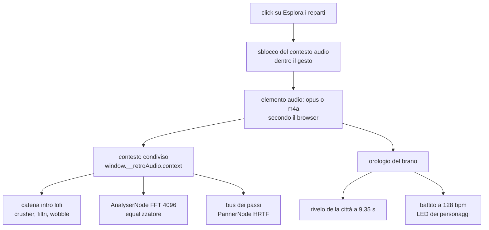

{/*
FONTI: docs/manuale-retro-future/schede/07-audio-rivelo.md, sottosezioni "Audio" delle sezioni 1-6 e 9.
Blocco 1: §1 Audio (partenza al click con dissolvenza di 3 s verso 0,09; intro lofi che si apre sul beat drop; crossfade a 8 s dalla fine ripartendo dal secondo 30; passi strada/marciapiede; passi della folla con HRTF dopo il rivelo; equalizzatore 16x22 sul muro; LED a 128 bpm; scheda Audio FX; m4a su Safari, adba8478; tap che sblocca su telefono, 676f6324).
Blocco 2: §2 Audio (due AudioContext e InvalidAccessError, 8688d53b; il difetto solo con attesa fra apertura e click; autoplay e gesto utente; Ogg non supportato su Safari, adba8478; due orologi con 35-100 ms di deriva, 8cc1dd36; opus in ritardo su cache fredda, 1de5867b; costo per frame di equalizzatore e battito, 71719cd8 e fa096457; il sequencer morto, fabb5491).
Blocco 3: §3 Audio (contesto unico risolto all'uso e pubblicato su window; colonna sonora e i suoi tempi; equalizzatore FFT 4096 e i suoi parametri; passi del giocatore e della folla; battito 128 bpm) e §5 Audio (numeri).
Blocco 4: §4 Audio (contesto all'uso; prove che leggono il sorgente come eccezione dichiarata; il brano come orologio maestro; anticipo di 200 ms; opzione introLofi esplicita; priming nel tap; doppio formato con durata preservata; prefetch aggiunto e tolto; stato in soundtrack-runtime; il contesto resta fuori dal runtime; rimozione del sintetizzatore; playsInline tolto; kick spento e rinominato in bpm-clock; equalizzatore a 20 Hz; renderOrder cambiato; colori HSLA memorizzati).
Blocco 5: §5 Audio.
Blocco 6: §6 Audio.
Blocco 7: analogia scritta qui.
Colonna sonora: prodotta dall'autore con Suno, piano Pro (intervista, risposta 8).
*/}

# Audio

:::info Se è la prima volta

Il browser dà a ogni pagina un solo impianto audio, e non lo accende finché non clicchi. Da lì passano la musica, i passi e l'analisi dello spettro che muove l'equalizzatore. Questo capitolo segue quel percorso, e il motivo per cui la musica fa da orologio.

:::

## Cosa vede l'utente

Al click sul bottone parte la musica, ma attutita, come se venisse da un'altra stanza.
Resta così per 9 secondi, mentre la città è ancora in fil di ferro. Poi il brano si
apre di colpo, nello stesso istante in cui la città cade al suo posto. Da lì in poi si
sentono i propri passi, diversi sull'asfalto e sul marciapiede, i passi delle persone
che camminano attorno, e su un muro dietro il punto di partenza un equalizzatore a
16 colonne segue lo spettro del brano.

La colonna sonora l'ho prodotta io con Suno, piano Pro: volevo movimento, e i LED dei
personaggi lampeggiano sul suo ritmo.

## Il problema

**Un `AudioContext`, non due.** I nodi di due `AudioContext` diversi non si possono
collegare. Il modulo principale fotografava il contesto all'importazione, prima del
click, quando ancora non esisteva: ne nasceva uno per modulo, e collegare un nodo
dell'uno all'altro sollevava `InvalidAccessError` a ogni frame. La demo restava senza
personaggi. Il difetto compariva solo se fra l'apertura della pagina e il click
passava del tempo, e i test cliccavano subito.

**L'autoplay è bloccato.** Riproduzione e riattivazione del contesto devono stare
dentro un gesto dell'utente. Sul telefono la demo aspetta che giri il dispositivo, e
l'evento di rotazione non vale come gesto: il sistema rifiuta.

**Il formato non è universale.** Ogg, che comprime meglio, non si carica su Safari e
su iPhone: l'elemento resta muto e l'equalizzatore legge zero. Due sintomi, una
causa.

**Due orologi non restano allineati.** La musica partiva con un timer dal click e il
rivelo della città con un altro, e fra un caricamento e l'altro la differenza si
spostava di 35-100 ms. Si accordava a orecchio, e cambiava a ogni caricamento.

## Come funziona

### Il contesto condiviso

Il contesto si risolve all'uso, non all'importazione, e chi arriva primo lo pubblica
su `window.__retroAudio.context` perché gli altri lo riusino. 3 test leggono il
sorgente per impedire che qualcuno torni a fotografarlo all'importazione: eccezione
dichiarata alla regola che i test guardano il comportamento, e c'è perché il difetto
si vede solo lasciando passare tempo prima del click.

### La colonna sonora

Il brano parte dal secondo 0 con una dissolvenza di 3 secondi verso un volume basso,
dentro una catena di effetti che lo rende attutito. Quando l'orologio del brano
arriva al colpo di basso, la catena si apre. Non va in ciclo secco: a 8 secondi dalla
fine un secondo elemento riparte dal secondo 30 e i due si incrociano.

Esistono 2 file, uno per formato, con la durata quasi identica: la costante che
sincronizza il rivelo vale per entrambi.

### Il beat drop come orologio

Il colpo di basso non è stato scelto a orecchio: è misurato sul segnale, con una RMS
su finestre di 50 ms filtrata sotto i 150 Hz. Il salto è a 9,35 secondi, e nel codice
c'è scritto di rimisurarlo se il brano cambia. Il fronte del rivelo parte con 200 ms
di anticipo, scelta artistica, una sola manopola, espressa in tempo di brano e non in
tempo di orologio.

### L'equalizzatore

Un `AnalyserNode` con FFT da 4096 campioni legge lo spettro fra 35 e 15.500 Hz, lo
distribuisce su 16 colonne di 22 segmenti e lo disegna su una texture. Campionamento
a 30 Hz, disegno a 20: fra due disegni gli ingressi si muovono meno della precisione
delle stringhe di colore, quindi i colori sono memorizzati invece di essere
ricostruiti.

### I passi

Quelli del giocatore scattano a ogni mezzo periodo dell'oscillazione del passo, con 8
campioni divisi in 2 banchi, strada e marciapiede, alternando destro e sinistro, con
un intervallo minimo fra 2 passi e un passa-basso diverso per superficie. Quelli dei
personaggi passano per un bus con `PannerNode` in HRTF, e si accendono solo a rivelo
finito.

## Perché così e non altrimenti

- **Il contesto si risolve all'uso.** Il precaricamento della città era stato spento
  perché rompeva la demo, e la causa erano i 2 contesti. Risolvendolo all'uso il
  precaricamento è tornato acceso.
- **Il brano è l'orologio maestro, non un timer.** Il fronte parte quando l'orologio
  del brano raggiunge il colpo di basso misurato; il vecchio timer resta come riserva
  per chi non ha musica. Su 4 caricamenti lo scarto è sceso a 11 ms.
- **L'opzione `introLofi` è esplicita.** Prima dipendeva da un prefisso nel nome della
  sorgente, e bastava cambiarlo per disattivarla in silenzio.
- **L'audio si sblocca nel tocco, non nella rotazione.** Il tocco è un gesto vero; la
  rotazione no, e il sistema rifiuta. I guadagni partono quasi a zero, così la
  riproduzione avviata nel gesto non si sente.
- **2 formati, con la durata verificata.** Il più piccolo dove si può, l'altro
  altrove, e le 2 durate coincidono al millesimo: la costante della sincronizzazione
  non cambia.
- **Il sintetizzatore è stato tolto.** 295 righe che costruivano musica procedurale
  non erano mai chiamate: la musica che si sente è il file. Restano nella storia, se
  un giorno servisse.
- **Gli oggetti dell'equalizzatore e del battito si riusano.** Prima allocavano
  oggetti e stringhe a ogni frame.

Cose che non so spiegare, e lo dico:

- Il sorgente del battito è passato dal rilevamento del kick a un orologio a 128 bpm,
  e il commit non dice perché.
- Il ritmo di aggiornamento dell'equalizzatore è passato da 15 a 20 Hz, e il
  `renderOrder` da 40 a 18, entrambi senza motivo scritto.
- Un precaricamento del brano è stato aggiunto per il caso di cache fredda e poi
  tolto, e il commit che lo toglie non spiega perché.

## I numeri

| cosa | valore | fonte e data |
|---|---|---|
| colpo di basso del brano | 9,35 s, misurato con RMS filtrata a 150 Hz | `audio.js` |
| anticipo del fronte | 200 ms, in tempo di brano | `config.js` |
| scarto fra 4 caricamenti | 11 ms | commit 8cc1dd36 |
| file audio | 1.864.846 byte (Opus), 2.512.761 (M4A) | `ls`, 2026-09-20 |
| durata | 148,668 s e 148,661 s | `afinfo`, 2026-09-20 |
| volume di destinazione | 0,09, con dissolvenza di 3 s | `audio.js` |
| ciclo del brano | incrocio di 8 s, ripartendo dal secondo 30 | `audio.js` |
| equalizzatore | 16 colonne per 22 segmenti, finestra 4096, 35-15.500 Hz | `equalizer.js` |
| ritmi dell'equalizzatore | lettura 30 Hz, disegno 20 | `equalizer.js` |
| battito dei LED | 128 bpm, moltiplicatore fino a 4 | `characters.js` |
| campioni dei passi | 8 file, da 29.940 a 40.682 byte | `ls`, 2026-09-20 |
| intervallo minimo fra passi | 105 ms | `costanti.js` |

## Dove sta nel codice

| file | ruolo |
|---|---|
| `src/audio/audio.js` | elemento audio, formati, intro attutita, ciclo, colpo di basso |
| `src/audio/soundtrack-runtime.js` | stato della colonna sonora, estratto dal file principale |
| `src/audio/player-footsteps.js` | passi del giocatore, banchi e filtri |
| `src/audio/footstep-audio.js` | bus spazializzato |
| `src/character/runner-footsteps.js` | passi dei personaggi |
| `src/character/runner-beat-pulse.js` | battito che muove i LED |
| `src/controls/equalizer.js` | analizzatore, colonne, texture, riflesso |
| `src/audio-contesto-unico.test.mjs` | i 3 test che impediscono il secondo contesto |

## Per chi viene dal backend

L'`AudioContext` è un singleton che non può essere risolto al caricamento del modulo,
perché non esiste ancora: stesso problema di una connessione al database presa
all'importazione invece che al primo uso, con la differenza che qui il secondo
contesto non dà errore subito, ma a ogni frame. Il brano usato come orologio è la
scelta fra timer locale e clock condiviso: due timer indipendenti derivano sempre, un
clock solo no.
