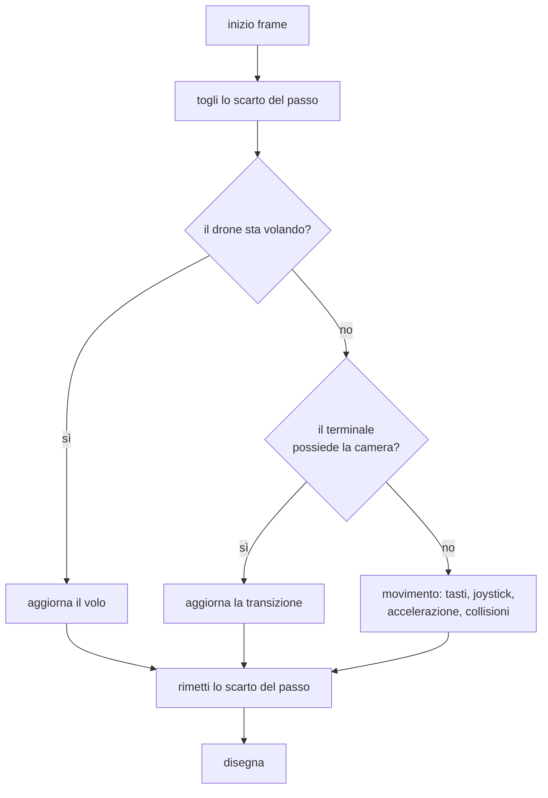

{/*
FONTI: docs/manuale-retro-future/schede/06-camera-movimento-terminale.md, sottosezioni "Camera e movimento" delle sezioni 1-6 e 9.
Blocco 1: §1 (copertina e noscript; teste che partono all'avvicinamento; porta "ruota il telefono"; volo del drone; indicatore WASD; disco cursore; suggerimento del pointer lock; joystick mobile; tasti H e P).
Blocco 2: §2 (tutto dentro main.js con decine di let condivisi, 1073...; l'ordine del frame è logica, 89729da5; il pointer lock arriva in ritardo; touchstart passive:false; due dita che convivono; audio iOS sbloccato nel tap, 676f6324; due AudioContext; quattro contesti WebGL della copertina, c06117eb; dt reale in headless, bd17db47; getBoundingClientRect a ogni evento).
Blocco 3: §3 e §5 (volo del drone e hero shot; mouse look, sensibilità, soglie; disco cursore; movimento, bob, run mix; superficie di cammino; collisioni; joystick; ordine del frame).
Blocco 4: §4 (il drone primo pezzo estratto; ctx.state rifiutato per il mouse look; movementVelocity oggetto mutabile condiviso; il volo verticale tolto, fa5fe5e6; pinch disabilitato, 201d5d09; joystick che aspetta il rivelo, a6356ec8; precaricamento della città, 9f75e2a0; noscript invece di alt; basePadAtPoint in cache, 0710af3d; il mouse look "armato dopo il rivelo" fatto e disfatto tre volte; l'avvio immersivo annullato lo stesso giorno).
Blocco 5: §5 (numeri, letti il 2026-09-20).
Blocco 6: §6 e §5 (righe dei file).
Blocco 7: analogia scritta qui.
*/}

# Camera e movimento

:::note In breve

Pointer lock con finestra di guardia contro il delta accumulato, fallback a drag oltre 4 px, touch con `passive: false` e dita separate fra look e joystick. Le collisioni sono raggi contro rettangoli arrotondati; l'ordine delle chiamate nel frame è vincolato da un test sul sorgente.

:::

## Cosa vede l'utente

La pagina si apre su una copertina nera con 4 schede e un bottone. Le teste 3D nelle
schede non girano finché non ci avvicini il puntatore: fino a lì sono fotografie. Al
click il bottone dice “Caricamento…”, la copertina si dissolve e la camera vola:
parte da quasi 600 unità sopra la città e scende in strada con un arco, come un drone
che atterra.

Finito il rivelo compare in basso a sinistra un indicatore con i tasti e il mouse, il
cursore del sistema sparisce e al suo posto gira un disco luminoso, tanto più veloce
quanto più muovi il mouse. Da lì in poi si cammina: WASD o frecce, Shift per correre,
il mouse per guardare. Sul telefono in orizzontale compare invece un joystick
circolare in basso a sinistra.

## Il problema

Un visore in prima persona dentro un browser ha 3 difficoltà che il risultato non
mostra.

**Il pointer lock arriva in ritardo.** Quando scatta, i primi eventi di movimento
portano lo scarto accumulato fino a quel momento, e la camera fa un salto. Chi ha
provato un visore web lo riconosce subito.

**Il tocco combatte con il browser.** Un dito che trascina sul canvas, per il browser,
è uno scroll o un pinch-zoom. E un dito sul joystick più un dito sul canvas devono
convivere: uno muove, l'altro guarda.

**L'ordine dentro il frame è logica, non stile.** Prima si toglie dalla camera lo
scarto del passo, poi si aggiornano il drone, il terminale dei contatti e il
movimento, e solo alla fine si rimette lo scarto. Invertire 2 righe non dà errore:
per questo un test legge il sorgente e verifica che l'ordine resti.

C'era anche un problema di forma: volo, mouse, cursore, tastiera, movimento e
joystick vivevano nello stesso file e condividevano decine di `let`, uno letto da 21
punti diversi.

## Come funziona

### Il volo di ingresso

5.600 ms da una posizione fissa sopra la città al punto di atterraggio in
strada, con un arco la cui altezza dipende dalla distanza. Un parametro
nell'indirizzo lo trasforma in un'orbita di 7.600 ms attorno alla città prima
della discesa.

### Guardare

Il mouse gira la camera solo a 2 condizioni: rivelo finito e terminale dei contatti
che non ha preso il controllo. Al click parte la richiesta di pointer lock; se
non arriva, un trascinamento di almeno 4 pixel gira la camera lo stesso. La
sensibilità è 0,0022 rad/px con il pointer lock e 0,0035 senza; i 2 numeri stanno nel
codice e nessun commit li motiva.

Contro il salto iniziale ci sono 3 difese: si scartano gli eventi per 220 ms dopo il
pointer lock, per 420 dopo un click, e in ogni caso i primi 8 movimenti. Il pitch si
ferma poco sotto la verticale.

Sul tocco, un dito gira la camera e 2 dita non fanno niente. Il gestore di
`touchstart` è registrato con `passive: false`, altrimenti la pagina scorre. I tocchi
che partono dal joystick sono esclusi dai candidati per la camera.

### Camminare

Il movimento ha velocità base e di corsa, accelerazione e decelerazione separate,
coefficienti diversi per indietro, di lato e in diagonale. Camminando la
vista oscilla in verticale, ondeggia di lato e rolla; andando di lato si inclina; in
corsa oscillazione e cadenza crescono. I passi scattano a ogni mezzo periodo
dell'oscillazione, alternando destro e sinistro, con campioni diversi su strada e
marciapiede.

La camera è sempre agganciata al suolo: i tasti per salire e scendere sono stati
tolti. Sul marciapiede di un palazzo si alza della sua altezza, e la ricerca di quale
marciapiede si stia calpestando gira a ogni frame su una lista in cache.

### Sbattere contro le cose

3 tipi di collisione: i palazzi, rettangoli con gli angoli arrotondati, con una
distanza di sicurezza diversa per i laterali e per il principale; la folla, con una
distanza minima da centro a centro; il bordo della strada esagonale. Toccando il
bordo mentre ci si spinge contro partono un impulso luminoso sull'orlo e l'avviso di
confine.

### Sul telefono

In verticale la demo non parte: compare un pannello che chiede di girare il
dispositivo, perché joystick e schermo intero hanno senso solo in orizzontale. Il
joystick ha raggio 58 unità e zona morta del 12%, e appare solo a rivelo finito, come
l'indicatore dei tasti sul computer.

## Perché così e non altrimenti

- **Il volo è stato il primo pezzo portato fuori dal file grande**, perché era la
  foglia pulita a rischio più basso: yaw e pitch sono rimasti dov'erano, raggiunti con
  2 funzioni, così lo spostamento non cambia nulla.
- **Lo stato del mouse non è finito in `ctx.state`.** Quasi tutto è privato: 2 soli
  campi avevano un lettore esterno, e promuoverli avrebbe allargato un contratto per
  niente.
- **`movementVelocity` è un oggetto mutato sul posto**, letto e scritto da
  collisioni, azzeramenti e avviso di confine. I parametri di regolazione restano
  privati: nello stato condiviso finisce un nome solo se qualcuno fuori lo tocca.
- **Il volo verticale è stato tolto** insieme al pannello: una camera libera di salire
  e scendere rende inutile il lavoro sulla superficie di cammino.
- **Il pinch non fa niente.** Con più di un dito il codice ferma solo il
  comportamento del browser; il commit che l'ha deciso non dice perché.
- **La città si precarica prima del click.** three.js si scarica anche per chi non
  entra, ma chi entra non aspetta: l'attesa al click contava di più.
- **Senza JavaScript c'è un `noscript` dedicato, non un `alt` sulle facce.** Le facce
  sono decorative e accanto c'è già l'etichetta del reparto: un `alt` non
  aggiungerebbe niente a uno screen reader.

Cose che non so spiegare, e lo dico:

- Il mouse look “armato dopo il rivelo” è stato fatto, annullato e rifatto 3 volte in
  2 giorni, a giugno, e i commit non dicono che cosa non andava.
- L'avvio immersivo su telefono è stato aggiunto e annullato lo stesso giorno, senza
  motivo scritto.
- La sensibilità del mouse vale 0,0022 rad/px con il pointer lock e 0,0035 senza. I 2
  numeri stanno nel codice da sempre e nessun commit dice come sono stati scelti.
- I 3 ritardi che difendono dal salto iniziale, 220 e 420 ms e 8 movimenti scartati,
  sono nella stessa condizione: nessuna fonte li motiva.

## I numeri

| cosa | valore | fonte e data |
|---|---|---|
| volo di ingresso | 5.600 ms, 7.600 ms con l'orbita | `drone-intro.js`, 2026-09-20 |
| arco del volo | 24-90 unità, in proporzione alla distanza | `drone-intro.js` |
| posizione di partenza della camera | 701, 591, 1111, FOV 70 gradi | `main.js`, `config.js` |
| punto di atterraggio | 0, 4,1, 828,87 | `player-state.js` |
| sensibilità del mouse | 0,0022 rad/px con blocco, 0,0035 senza | `mouse-look.js` |
| difese contro il salto iniziale | 220 ms, 420 ms, 8 movimenti scartati | `costanti.js` |
| soglia del trascinamento | 4 px | `costanti.js` |
| velocità applicate al boot | cammino 30, corsa 180, accelerazione 9, decelerazione 8 | file canonico, 2026-09-20 |
| oscillazione del passo | 0,31 camminando, 0,39 correndo | file canonico |
| altezza minima della camera | 4,1 (1,8 nel codice, il file canonico vince) | `player-state.js`, file canonico |
| distanza minima dalla folla | 1,6 unità | `costanti.js` |
| disco del cursore | da 78 a 28.500 gradi/s | `disc-cursor.js` |
| joystick | raggio 58, zona morta 12% | `mobile-movement.js` |

## Dove sta nel codice

| file | righe | ruolo |
|---|---|---|
| `src/camera/drone-intro.js` | 400 | il volo di ingresso e l'orbita |
| `src/camera/mouse-look.js` | 363 | pointer lock, trascinamento, tocco |
| `src/camera/camera-collision.js` | 173 | palazzi, folla, bordo della strada |
| `src/camera/disc-cursor.js` | 171 | il cursore a disco |
| `src/camera/player-state.js` | 138 | posa, spawn, parametri, superficie di cammino |
| `src/controls/movement.js` | 267 | tasti, accelerazione, oscillazione, cadenza |
| `src/controls/mobile-movement.js` | 269 | joystick, schermo intero, profilo touch |
| `src/controls/keyboard.js` | 101 | instradamento dei tasti |

I test: 2 sul volo (orbita accesa solo su richiesta), 3 sul mouse (un dito che gira,
2 che non fanno niente, un dito sul joystick e uno sul canvas che convivono), 12
sulla copertina, 3 sull'ordine del boot e del frame.

## Per chi viene dal backend

L'ordine dentro il frame è una catena di middleware dove la posizione conta: chi
possiede la camera, drone o terminale, corto-circuita il resto, come un handler che
interrompe la catena. Le 3 difese contro il salto del pointer lock sono un debounce
con finestra di guardia su un evento che arriva sporco. E la superficie di cammino è
una query spaziale che gira a 60 Hz: per questo la lista su cui cerca è in cache e non
viene allocata a ogni frame.
