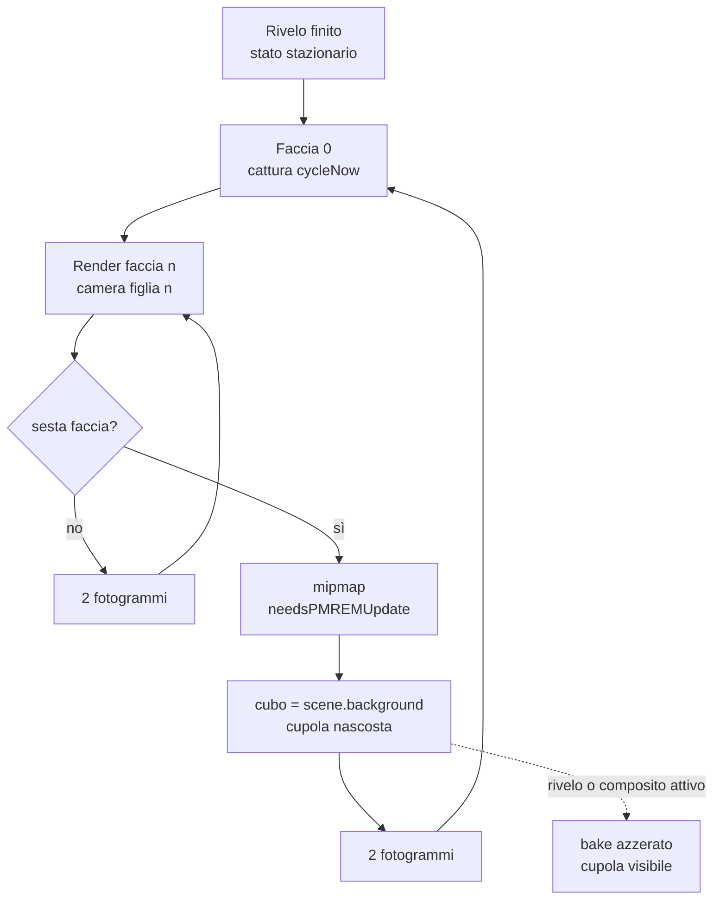

{/*
FONTI: docs/manuale-retro-future/schede/04-cielo-luce-riflessi.md, parte "Cielo e atmosfera".
Blocco 1: scheda §1 (src/world/sky-dome.js:81-82, :343-359, :362-399, :463; boulevard-canonical-settings.json:35; src/world/atmosphere-particles.js:11-12, :49-55; 42e9ad75; src/main.js:784; 74dfccba; 36266d52).
Blocco 2: scheda §2 (36266d52; sky-dome.js:49-53; 78247e3f; ef584e57; test/retro-future-baseline/README.md:22-25, :41).
Blocco 3: scheda §3 (sky-dome.js:134-219, :274-357, :401-405, :461-479, :516-519, :42-69, :558-692, :420-459; atmosphere-particles.js:16-77; frame-loop.js:147-248; fx-debug-toggles.js:9-21; inspect-hooks.js:450-451).
Blocco 4: scheda §4 (ef584e57, 8618d7fc, c62506ff, 36266d52, 481daf57, 42e9ad75, README baseline :28-38) e §9 (78247e3f, 695b44ba, d732411e, sky-dome.js:518/:588, README baseline :41).
Blocco 5: scheda §5. Blocco 6: scheda §6 (wc -l 2026-09-20). Blocco 7: ponte senza affermazioni nuove.
L'eccezione nota del cursore della luminosità è omessa per decisione dell'autore.
*/}

# Cielo e atmosfera

## Cosa vede l'utente

Sopra la città c'è un cielo di nuvole scure con i bordi verde acqua, che scorrono
piano e non finiscono mai. Con il cielo scelto dal file canonico, dentro le nuvole
passano lampi: scintille locali e raffiche a glitch, in una fascia sopra l'orizzonte.
Nell'aria salgono e derivano 400 punti ciano, polvere o braci, che il bloom ammorbidisce.
Non c'è nebbia: quello che sembra nebbia è il buio della scena e la luce dei LED.

## Il problema

Il cielo non è una texture: è calcolato per pixel, ogni fotogramma, da uno shader
procedurale, cioè una formula che gira sulla scheda grafica per ogni pixel, senza
immagini. Nel ramo `full`, quello di serie sul computer, ogni pixel di cielo valuta
circa 11 campi di rumore 3D a più ottave, circa 340 operazioni fra seni e hash. Il
cielo copre più o meno la metà del fotogramma a livello strada. Metà del frame, ogni
frame, per sempre.

Il ramo `balanced` costa circa 3,5 volte meno. Sul telefono il cielo è comunque il
primo costo di riempimento: spegnendolo con `?fx.sky=0` ho misurato 5,4 fotogrammi al
secondo in più. Ridurre le ottave, gli strati di rumore sommati, non ha pagato: il
resto dello shader gira lo stesso.

C'è un secondo problema, meno visibile. Nuvole e luci vanno a tempo di
`performance.now()`, l'orologio del browser in millisecondi dall'apertura della
pagina. Una scena “ferma” non è mai ferma: due fotogrammi a 3 secondi di distanza
differiscono del 2,3%, e la baseline della mattina batteva quelle del pomeriggio del
3,7% a codice identico. Bloccare quell'orologio non si può senza toccare molti moduli:
il README della baseline ne conta quindici.

## Come funziona

### La cupola

`createSkyDome` costruisce una sfera di raggio 8.500 unità, 32 per 18 segmenti,
disegnata dall'interno (`side: BackSide`), con `renderOrder = 1000` e
`frustumCulled = false`. Il frustum culling è il salto degli oggetti fuori dal cono
della camera; qui è spento perché la cupola segue la camera: a ogni fotogramma
`update(now)` copia la posizione della camera sulla sfera, e il cielo sembra
all'infinito. Il vertex shader passa solo la direzione normalizzata del vertice.

### Lo shader delle nuvole

Il colore parte da un gradiente scuro fra `low` e `top`. Poi entra il campo delle
nuvole, che è rumore: hash a seno, value noise 2D e 3D (un rumore continuo ottenuto
interpolando una funzione hash), somme `fbm` a 4 ottave (strati a scale crescenti e
ampiezze decrescenti) e `ridge` a 3 (il rumore ripiegato, `1 - |2n - 1|`, che produce
creste). Varianti a 2 ottave servono i livelli economici del telefono.

Il punto di campionamento è `cloudP = dir * 1,45 + deriva`. Un domain warp a tre
componenti lo deforma con altro rumore prima di campionare, e da `warpedP` escono
quattro campi: `broad`, `detail`, `rolling`, `under`. Il ramo `full`
(`uSkyQuality > 0,5`) spende tre `fbm3` di warp, due più due `fbm3`/`ridge3` per
`broad` e `detail`, quattro `fbm3` per `rolling` e `under`, con un morphing fra
coppie; `aggressive` e `conservative` (`uSkyCheap` sopra 1,5 o 0,5) usano le
varianti a 2 ottave; `balanced` un `fbm3`, un `ridge3` e due `noise3`, 7 ottave in tutto.

La composizione è `cloudRaw = broad * 0,68 + detail * 0,18 + rolling * 0,24`. Un
contrasto `uCloudContrast` (fra 0 e 5) stringe il campo intorno a 0,5, una maschera
`smoothstep` lo taglia, `ceiling` e `lowShelf` lo modulano con l'altezza,
`distanceFade` lo spegne fra 0,34 e 0,68. Il risultato mescola `cloudDark` e
`cloudLit`. La tinta alza il colore verso `tintLift` con
`mix(col, max(col, tintLift), uSkyTintStrength)`. In chiusura una scanline sottile
(`sin(y * 420 + uTime * 2,2)`, ampiezza 0,008), un rumore per pixel di 0,0015, la
rotazione di tonalità `hueShift` e la moltiplicazione per `uBrightness`.

### Preset e pannello

`applySkyPreset(choice, brightness, hueDeg, quality)` prende il colore base da
`skyPalette` e lo passa a `tunedColor`, che lavora in HSL: somma la tonalità in
gradi, scala saturazione e luminosità, blocca fra 0 e 1. Quel colore,
`skyDisplayColor`, finisce in `scene.background`, nella uniform `uSkyTint` (una
uniform è un valore che la CPU passa allo shader, uguale per tutti i pixel) e nella
forza della tinta: 0,08 per `void`, 0,26 per `steel`, 0,42 per gli altri. La qualità
viene da `?skyQuality=` se c'è, altrimenti è `balanced` sul telefono, altrimenti dal
pannello. `uSkyCheap` viene da `?skyCheap=` o da `SKY_CHEAP_MOBILE_DEFAULT = 0`. I
sei cursori del temporale scrivono direttamente le uniform `uStorm*`.

### I lampi

Si accendono solo con `uLightningMode > 0,5`, cioè con la scelta di cielo del JSON
canonico; con le altre cinque (`storm`, `void`, `grid`, `teal`, `steel`) restano
spenti. Un `lightningThread` (ridge a scala 7,8 nel `full`, `noise3` nel `balanced`)
è confinato in una fascia regolata da `uStormBand` e da un `cloudGate` sulla soglia
`uStormCloudThreshold`. Sopra corrono due orologi: le raffiche `glitchBurst` a celle
temporali (`floor(t * 1,86)`) e le scintille, una per cella di
`sparkClock = uTime * 5,234375 * frequenza`, con centro pseudo-casuale e decadimento
`1 - d² / (0,01171875 * uStormSize)`. `uStormVeil` vela. Il colore è
`hueShift(vec3(0,38, 0,92, 1,0), uLightningHue)`.

### Il bake a cubo

Qui sta il fatto centrale: il cielo che vedete non è la cupola, è una fotografia
della cupola. Una `CubeCamera(1, 20000)` la fotografa in un `WebGLCubeRenderTarget`,
sei immagini quadrate che coprono tutte le direzioni, e quel cubo diventa
`scene.background`, che three.js disegna con un campionamento economico. La cupola
vera, `domeMesh`, si nasconde.

Il bake è acceso di default su computer e telefono, con cubo di 512 pixel per faccia
sul primo e 128 sul secondo; `?skyBake=0|1` forza. È “spread”: rifaccio una faccia
ogni `SKY_BAKE_FACE_STRIDE = round(12 / 6) = 2` fotogrammi, e il ciclo delle sei
facce dura 12 fotogrammi. `?skyBakeSpread=0` torna al bake intero ogni 12.

Le sei facce di un ciclo condividono lo stesso istante, `cycleNow`, catturato sulla
faccia 0. Ogni faccia usa la camera figlia `cubeCam.children[faceIndex]` e
`renderer.setRenderTarget(cubeRT, faceIndex, 0)`; le mipmap (le copie a risoluzione
decrescente della texture) si generano solo sull'ultima, si alza `needsPMREMUpdate`,
e si ripristinano target, faccia attiva, mip e `xr.enabled`. La sorgente è la scena
cielo del rivelo con `background = null`: la cupola copre tutte le direzioni, una
tinta piatta di clear non serve.

Il bake vale solo in stato stazionario:
`syncSkyBackgroundBake(now, cityRevealComplete && !isCityRevealCompositeActive())`.
Fuori da quello stato il bake si azzera e la cupola torna visibile con
`scene.background = skyDisplayColor`. Se il profilo cambia a metà sessione, il cubo
viene ricostruito alla dimensione giusta.

Una conseguenza da dire: con il bake attivo la cupola è nascosta, e `update(now)`
avanza `uTime` solo se la cupola è visibile. Il tempo del cielo avanza ai bake, e le
nuvole procedono a scatti di 12 fotogrammi.

### Il cielo del rivelo

Il rivelo della città ha una sua scena cielo, `cityRevealSkyScene`, con un clone della
cupola (`domeMat.clone()`) sincronizzato uniform per uniform. Mentre il budget del
rivelo è attivo (wireframe acceso, rivelo non completo) la qualità del clone è forzata
a 0. Quella scena è il primo pass del composer (`RenderPass` con `clear = true`) o il
primo render diretto.

### Le particelle

400 posizioni casuali in una scatola di 240 per 95 per 240 unità, un seme per punto.
Nel vertex shader la deriva è
`(sin(t * 0,12 + seed) * 4, t * 2,2, cos(t * 0,1 + seed * 1,7) * 4)` e la posizione
`cell + mod(position + drift - cell, uBox)` con `cell = cameraPosition - uBox / 2`: la
scatola è agganciata alla camera e i punti ricircolano dentro, sfumati verso i bordi
da uno `smoothstep` (0,7..1,0 in X e Z, 0,6..1,0 in Y) così il ricircolo non si vede.
Il fragment disegna un disco morbido, scarta fuori dal raggio e somma in additivo
(luce su luce) con `depthWrite: false`, `renderOrder = 22`, `boundingSphere` di raggio
1e9 e `frustumCulled = false`. L'orologio è `uTime = now * 0,001`, lo stesso degli
impulsi sui LED. Si vedono solo a rivelo completato.

### La nebbia che non c'è

Nel progetto non esiste `scene.fog`. I materiali portano `fog: false`. L'aria la
danno le particelle, il bloom e il buio.

### L'orologio

`now` è il tempo di `requestAnimationFrame`, stessa base di `performance.now()`, e
arriva a `tick(now)`; la cupola lo scala, `uTime = now * 0,001 * 0,45`. L'ordine nel
tick è fisso: movimento e folla, `skyDome.update(now)`, `syncSkyBackgroundBake`,
tabelloni, `updateEdgePulse`, `updateAtmosphereParticles`, le abilitazioni di bloom,
look, TAA e merge, il culling statico, il render composito.

Per il gate visivo questo conta: la fotografia si scatta a
`performance.now() >= 60000`, l'orologio da cui dipendono luci e nuvole, così le fasi
coincidono fra sessioni, con una raffica di 40 fotogrammi. A istante fisso due
sessioni differiscono dello 0,22%.

### Interruttori e ispezione

`?fx.sky=0` e `?fx.particles=0` spengono i due sottosistemi, solo sul profilo mobile
o con `?forceMobile=1`. Dalla console il gancio di ispezione espone `.storm` (le
uniform del temporale) e `.skyBake` (lo stato del bake). Il benchmark registra
`skyQuality`, `skyBakeSpread` e `skyBakeFaceStride` in ogni cattura.

## Perché così e non altrimenti

- **Il bake, non la riduzione delle ottave.** Ridurre le ottave non pagava, il resto
  dello shader gira comunque. Ho preferito fotografare il cielo in un cubo da 128
  pixel ogni 12 fotogrammi e riusarlo come `scene.background`. Vale perché il cielo è
  uno sfondo liscio all'infinito: il cubo resta valido mentre la camera si muove, solo
  la deriva lenta si aggiorna al bake successivo.
- **Partito spento, promosso dopo un A/B sul dispositivo.** Il default mobile è
  rimasto `false` finché un confronto sul telefono non ha confermato che il guadagno di
  riempimento batteva il picco periodico del bake.
- **Acceso anche sul computer, con cubo da 512.** Il ramo `full` è il default sul
  desktop e valuta circa 11 campi di rumore per pixel; il cubo più grande tiene il
  dettaglio per cui quel ramo esiste.
- **Un istante solo per le sei facce.** Senza `cycleNow` ogni faccia era un paio di
  fotogrammi più avanti della precedente: cuciture lungo gli spigoli del cubo.
- **Il bake solo dopo il rivelo.** Il percorso del cielo durante il rivelo resta intatto.
- **Mobile forzato a `balanced`.** Il default `full` del pannello passava da
  `applySkyPreset` senza un cancello per il telefono, e gli screenshot `full` e
  `balanced` in prima persona sono indistinguibili.
- **Le nuvole più veloci del 50%.** `SKY_ANIMATION_SPEED` da 0,3 a 0,45, il solo
  numero in gioco: misurato 0,300 al secondo prima, 0,450 dopo.
- **Particelle additive e sfumate ai bordi.** Il bloom le trasforma in braci morbide,
  e il ricircolo nella scatola non si vede.
- **Il gate fotografa a 60 secondi di orologio.** Le fasi di luci e nuvole coincidono
  fra sessioni; la raffica di 40 fotogrammi fa il resto.

Cose che non so spiegare, e lo dico:

- `SKY_CHEAP_MOBILE_DEFAULT` resta 0: il commit rimanda a una “look review” che in
  git non è mai stata registrata.
- Le particelle sono nate a circa 600 e sono scese a 400 lo stesso giorno; il commit
  non ha corpo.
- Un modulo “cinematic atmosphere”, 229 righe, è stato aggiunto e ritirato lo stesso
  giorno di agosto 2026, con un revert senza motivazione.
- Con il bake attivo le nuvole avanzano a scatti di 12 fotogrammi; nessun documento
  dice se è stato accettato o misurato.
- Il README della baseline conta quindici file con `performance.now()`; il conteggio
  del 2026-09-20 ne dà 28 in `src/`.

## I numeri

| cosa | valore | fonte e data |
|---|---|---|
| cupola | raggio 8.500, 32x18 segmenti, `CubeCamera(1, 20000)` | `src/world/sky-dome.js`, letto il 2026-09-20 |
| velocità delle nuvole | 0,45 (era 0,3) | `src/world/sky-dome.js`; commit 481daf57, 2026-09-19 |
| cubo del bake | 512 desktop, 128 mobile; ciclo 12 fotogrammi; una faccia ogni 2 | `src/world/sky-dome.js`; `src/world/sky-dome.test.mjs` |
| texel per ciclo desktop | 6 x 512 x 512 = 1.572.864 | calcolo dalle costanti di `src/world/sky-dome.js`, 2026-09-20 |
| costo `full` contro `balanced` | circa 3,5x; circa 340 operazioni seno/hash per pixel | `src/world/sky-dome.js`; commit 36266d52, 2026-07-09 |
| ramo `balanced` | 7 ottave di rumore 3D per pixel | commit 78247e3f, 2026-07-09 |
| cielo spento sul telefono | +5,4 fps | commit 78247e3f, 2026-07-09 |
| particelle | 400 (nate a circa 600), scatola 240x95x240, dimensione 2,4, opacità 0,35, salita 2,2 unità/s | `src/world/atmosphere-particles.js`; commit 42e9ad75 e 695b44ba, 2026-06-17 |
| ordine di disegno | cupola 1000, particelle 22 | `src/world/sky-dome.js`; `src/world/atmosphere-particles.js` |
| deriva fra fotogrammi | 2,3% a 3 s, 0,4% a 11 s, 0,22% a istante fisso, 3,7% mattina contro pomeriggio | `test/retro-future-baseline/README.md`, misure del 2026-09-19 |
| temporale canonico | frequenza 1,6, intensità 4, dimensione 5, soglia nuvole 0,91, fascia 2,5, velatura 0, tonalità 11 | `boulevard-canonical-settings.json`, letto il 2026-09-20 |
| file con `performance.now()` | 15 secondo il README della baseline; 28 in `src/` | `test/retro-future-baseline/README.md`, 2026-09-19; grep del 2026-09-20 |

## Dove sta nel codice

| file | righe | ruolo |
|---|---|---|
| `src/world/sky-dome.js` | 730 | cupola, shader, preset, temporale, clone per il rivelo, bake a cubo, ispezione |
| `src/world/sky-dome.test.mjs` | 55 | la cupola costruita davvero e le funzioni pure del bake spread |
| `src/world/atmosphere-particles.js` | 91 | particelle agganciate alla camera |
| `src/engine/frame-loop.js` | 289 | `tick(now)`: cupola, bake, impulsi, particelle |
| `src/world/city-reveal-render-runtime.js` | 257 | il pass del cielo del rivelo e il render composito |
| `src/engine/fx-debug-toggles.js` | 108 | `?fx.sky=0`, `?fx.particles=0` (solo mobile) |
| `src/engine/performance-mobile.js` | 51 | il profilo mobile e `?forceMobile=1` |
| `src/controls/controls.js` | 762 | elementi del pannello per cielo e temporale |
| `src/engine/inspect-hooks.js` | 468 | il gancio di ispezione `.storm` e `.skyBake` |
| `src/engine/retro-benchmark-runtime.js` | 336 | registra le leve del cielo nel JSON del benchmark |
| `index.html` | 1389 | i cursori del cielo e del temporale |

Le prove: `sky-dome.test.mjs` prima leggeva il sorgente, ora costruisce la cupola,
applica la luminosità, e verifica che un rebake completo si distribuisca sulla
finestra di stride originale. `src/invarianti.test.mjs` fissa l'ordine di disegno (i
cartelli dei personaggi a 2000, il massimo). Il protocollo della cattura a istante
fisso sta in `test/retro-future-baseline/README.md`.

## Per chi viene dal backend

Il bake del cielo è una cache con scadenza di 12 fotogrammi, aggiornata a rotazione
(una faccia ogni due) invece che tutta insieme, e `cycleNow` è la lettura coerente:
le sei facce vedono lo stesso istante, come una transazione che legge uno snapshot.
`scene.background` è la risposta servita dalla cache; la cupola nascosta è l'origine
che si interroga solo per rinfrescare. `performance.now()` è il wall clock che rende
i test non deterministici, e il gate che scatta a 60 secondi è il seme fisso che li
rende ripetibili. Gli interruttori `?fx.*` sono feature flag validi solo
nell'ambiente mobile.
