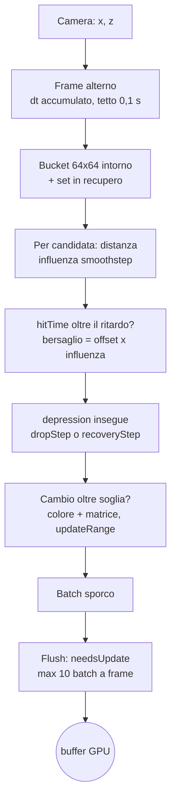

{/*
FONTI: docs/manuale-retro-future/schede/03-mondo.md (ogni riga della scheda porta file:riga o commit).
Blocco 1: scheda §1 (viale src/world/boulevard-constants.js:25 e buildings.js:171-182; LED building-leds.js:674-681; impulso energy-pulse.js:45-51 e 381bb7fa; porte e civici building-doors.js:415-442, :479-483; ponti city-wiring.js:522; pavimento hex-tiles.js:930-995).
Blocco 2: scheda §2 (docs/retro-future-mobile-fill-benchmark.md:115-117; 385e17ab; 37754726; 3d877968; 2a9f23f0; e877598a; hex-tiles.js:2-4; main.js:906-921).
Blocco 3: scheda §3.1 (mappa), §3.6-3.8 (palazzi, porte, piazzole), §3.9 (ponti), §3.10-3.12 (LED e impulso), §3.13 (tabelloni), §3.2-3.5 (pavimento), §3.3 (rabbocco), §3.15 (culling statico), §3.14 (confine).
Blocco 4: scheda §4 (37754726, 385e17ab, c53fc110, 77f76c79, 5479c776, 4aef8dcc, 2a6ad140, 33de6c5c, 9ffc449c, a4beb9ec, 3d877968, 7e5449c4, f8c20ee5, fc58e944, 33c01d80, 2a9f23f0, 5317daa0, bfda3982, 00b3c82e) e §9 (depthTest dei civici, terzo ponte a 66, record vuoti, fondo dell'esagono, 230,4).
Blocco 5: scheda §5 (node e conta-esagoni.mjs del 2026-09-20; commit 37754726, 385e17ab, 3d877968, a4beb9ec, 7e5449c4, f8c20ee5, 0097cbbd).
Blocco 6: scheda §6 (wc -l 2026-09-20).
Blocco 7: ponte scritto dall'autore del manuale, senza affermazioni tecniche nuove.
*/}

# Il mondo

:::note In breve

Il boulevard come dati: InstancedMesh per famiglia di oggetti, bucket spaziali 64x64 per la ricerca di prossimità, dirty tracking e upload limitato per frame. Il pavimento sono 21.637 esagoni istanziati che rispondono ai passi con due costanti di tempo e isteresi sul LOD.

:::

## Cosa vede l'utente

Un viale rettilineo di notte, 6 palazzi per lato e un tredicesimo più alto in fondo,
4 ponti, e strisce LED ciano lungo cui corre una testa luminosa, come corrente in un
filo. Ogni palazzo laterale ha una porta, un civico gigante e un tabellone dei ruoli
accanto; sul primo c'è anche il tabellone dei reparti, mentre il tredicesimo non ha né
porta né civico. Sotto i piedi un tappeto di esagoni: dove il giocatore cammina le
piastrelle intorno si abbassano e si accendono, poi risalgono.

## Il problema

Il pavimento è la superficie più grande dello schermo ed è fatto di piastrelle che si
muovono. Il costo sta in 3 posti: il fill rate della GPU, l'upload dei buffer di
istanza, e la CPU che decide quali piastrelle toccare. Prima degli upload parziali
ogni striscia ricaricava circa 512 KB di matrici e 96 KB di colore anche per una
piastrella sola.

I cursori del pannello allargano e allungano la strada e stringono il passo degli
esagoni. Seminare per il caso peggiore (lunghezza 4.608, gap -8) costava 189.263
istanze e 12 MB di buffer, quando i controlli normali ne usavano circa 33 mila.

- **Le piastrelle devono reagire senza scorrere tutte le istanze a ogni frame.**
  Serve un indice spaziale e una lista corta di quelle che stanno risalendo.
- **Palazzi, ponti, tabelloni e LED sono centinaia di oggetti.** Senza raggrupparli le
  draw call esplodevano: le strisce dei ponti da sole erano 48 mesh, 48 materiali e 48
  geometrie.
- **I valori della mappa sono derivati l'uno dall'altro.** Cambiarne uno a mano rompe
  una relazione geometrica in silenzio.

E il culling statico gira per ultimo nel frame, ultimo a scrivere `visible`: qualunque
interruttore applicato prima veniva sovrascritto. Il pavimento è anche collisione: i
limiti del bordo derivano dalla banda di piastrelle, e la quota della superficie la
leggono movimento, collisioni, folla e rivelo.

## Come funziona

### La mappa del boulevard

Tutto deriva da un modulo di griglia, GRID_BLOCK = 12. Carreggiata larga 88; base dei
laterali 72 (6 blocchi) più 24 di gap, quindi passo di corsia 96. I laterali stanno
a x = ±96 sulle quote z = -240, -144, -48, 48, 144, 240, uno per lato; le altezze
degradano lungo la fila: 220, 190, 172, 158, 145, 132. La carreggiata è lunga 560
più 120 dal lato di partenza, centrata a z = 60. Il palazzo principale è 100 x 100 e
alto 230: il markup lo mette a z = -301, il file canonico dei controlli, applicato al
boot sopra al markup, a -1.072. I 4 ponti stanno a z = -144, -48, 48 e 144,
con mezza campata 54, 6 unità prima della facciata; quello a z = 48 è il portale
principale, più alto e più profondo.

I 28 numeri regolabili vivono nell'oggetto `boulevard`. La banda di piastrelle è larga
quanto il massimo fra carreggiata, span dei laterali e span del principale, più le
file extra (3 nel markup, 1 nel canonico); è lunga quanto la carreggiata fissa (z da
-280 a 400), allungata se un palazzo sporge, fino a inglobare il principale con
margine 96 più 8 file dal lato opposto. I test fissano le relazioni, non i numeri.

### Palazzi, piazzole, porte e civici

Un palazzo è una scatola con gli angoli a curva quadratica, estrusa con un bevel. Le
BufferGeometry identiche si condividono per chiave `w|h|d|chamfer`; un materiale solo
per i 12 laterali e uno per i ponti. Il materiale è “asfalto bagnato”: metalness 0,94,
roughness 0,10, texture procedurale su canvas 256 x 256 e una envMap per le
riflessioni. Ogni palazzo porta un collider, risolto come rettangolo arrotondato.

Sotto, una piazzola di 5 oggetti (superficie, rampa del cordolo, piano interno, 2
bordi): la cima è almeno la quota del marciapiede, il fondo scende sotto la strada di
0,035, così tocca sempre il pavimento. I suoi LED sono un InstancedMesh, un box per
lato del poligono.

Una porta è un `Group` vuoto usato come ancora; i 6 pezzi sono InstancedMesh per
materiale, uno per tutte le porte. Il civico è una CanvasTexture 1.024 x 640
rasterizzata a scala 0,5, 5 strati di contorno, montata su 4 piani a opacità crescente
con renderOrder 18, a 12,7 + 2,1 dalla facciata. Dispari a sinistra, pari a destra,
1 e 2 sulla corsia più vicina alla partenza: civico = (5 - corsia) x 2 + lato + 1.

### LED di spigolo, di facciata, e l'impulso

`elStrip` decide per ruolo: strisce dei laterali in un batch istanziato, quelle dei
ponti in un altro, quelle del principale mesh veri perché partecipano al rivelo. Ogni
elemento, palazzi e ponti, ha 4 strisce verticali agli spigoli e 2 anelli, alto e
basso; i ponti ne hanno altre 8 orizzontali, 12 in tutto, 48 per 4 ponti. Sulla
facciata verso la strada c'è un disegno di nastri: 3 colonne a -0,30, 0,02 e
0,28 della base, 3 quote a 0,12, 0,48 e 0,88 dell'altezza di riferimento (132); 6
segmenti e 6 slot per i laterali, 2 polilinee e 8 slot per il principale, con un
rivelo verticale scritto in `onBeforeCompile`.

L'impulso è uno shader sulle strisce: la Z locale dell'istanza è la lunghezza,
`edgeFlow = fract((posizione - t x velocità) / periodo)`, e una testa a smoothstep
moltiplica il colore. Velocità -30, periodo 42, intensità 2. Un uniform di tempo si
aggiorna a ogni frame per gli spigoli laterali e i LED delle piazzole; i ponti non lo
hanno. Sui civici pari gli estremi sono invertiti, così la corrente scorre al
contrario.

### I tabelloni

Il tabellone dei reparti è uno solo, accanto al civico 1: 31,5 x 15,75, CanvasTexture
2.048 x 1.024 a scala 0,5, senza mipmap. La parte statica è rasterizzata una volta e
ricopiata con `drawImage`. Il ciclo tiene 2.600 ms, cambia in 1.100 ms e ridisegna a
8 Hz solo durante il cambio, carattere per carattere con caratteri di scramble, come
un tabellone a palette. I materiali sono trasparenti, con depthTest e senza
depthWrite, in un gruppo a renderOrder 30. I tabelloni dei ruoli sono 12, 18 x 9,
texture 512 x 256; la loro posa viene dalla porta del palazzo, quella del tabellone
dei reparti dal poligono della piazzola. Entrambe si ricontrollano ogni 250 ms.

### Il pavimento: geometria e materiale

Raggio 7,08, spessore 0,54. Una sola CylinderGeometry a 6 segmenti, ruotata di 30
gradi, condivisa da tutte le istanze; il gruppo del fondo è rimosso, restano 18
triangoli per istanza. Passo fra le file: radice di 3 per il raggio più il gap; fra le
colonne, il passo di fila per radice di 3 mezzi; le colonne dispari sfalsate di mezzo
passo, il nido d'ape. A gap 0: 12,263 e 10,62; al canonico -4,7: 7,563 e 6,550. La
quota della superficie è 0,03 + 0,54 x scala altezza x 0,5: 0,3675 al canonico 1,25.

Il materiale è metallico (0,88 e 0,16), con envMap ed emissivo. Ogni batch clona il
materiale con i vertex colors accesi: il colore lo porta l'istanza nel buffer.
`configureHexRoadMaterial` inietta nello shader un termine emissivo per istanza,
`max(vColor - colore base, 0) x glow`, con glow = 1,25 + luce colpita x 1,1 + luce
giocatore x 1,4 + luce strada x 0,25: così una piastrella accesa brilla oltre il suo
colore. Su mobile l'envMap sparisce (metalness 0,32, roughness 0,5) in favore di una
lucentezza Fresnel, e la normal map va a zero.

### Il pavimento: istanze, strisce, bucket

Una piastrella è un oggetto JS con batch, `instanceId`, `visible` e un seme in
`userData`: colonna, riga, centro, baseY, `depression`, `hitTime`, `wasInfluenced`, le
luci. `addHexRoadTiles` semina colonne e righe al passo minimo (gap -8) dentro il
rettangolo e raggruppa i semi per striscia: `floor(zLocale / 230,4)`, dove 230,4 =
4.608 / 20, calcolata sulla Z di semina e non su quella corrente, così l'appartenenza
al batch non dipende da quando la piastrella è nata. Ogni striscia è un InstancedMesh
con capacità pari ai suoi semi, `instanceMatrix` in DynamicDrawUsage e frustum culling
attivo.

`setHexTileLayoutPosition` ricalcola x e z con il passo corrente e nasconde ciò che
cade fuori dal rettangolo, azzerando depressione e luci. `compactHexTileBatch`
riassegna gli `instanceId` alle sole visibili, scrive matrice e colore, mette
`mesh.count` al numero di visibili e spegne i batch vuoti; un'istanza invisibile va a
y = -10.000 con scala 0,0001.

I bucket sono una griglia di celle 64 x 64 con la lista delle piastrelle di ciascuna:
una `Map` con chiave numerica `(ix + 100000) x 1000000 + (iz + 100000)`, perché la
stringa `${ix}:${iz}` costava circa 49 allocazioni per passo. Si ricostruisce solo
quando cambia il layout.

### Il pavimento: la reazione ai passi

Non c'è un evento di passo: la “posizione del giocatore” è la x, z della camera, tutto
è distanza. L'aggiornamento gira un frame sì e uno no accumulando il dt saltato, con
un tetto di 0,1 s perché un frame lungo non faccia scattare le piastrelle; non gira
durante la fase critica del rivelo. Ordine nel frame: movimento della camera, LOD dei
batch, `stepHexRoadTiles`, e più tardi gli upload.

Riga per riga. 3 parametri per frame: il ritardo, una soglia in secondi, e i 2 passi
dell'inseguimento, `dropStep = min(1, discesa x dt)` in discesa e `recoveryStep =
min(1, recupero x dt)` in risalita. Il raggio di aggiornamento è il raggio di
influenza più il modulo dell'offset più 2 raggi di esagono. I candidati: lista
svuotata, contatore di frame incrementato, bucket intorno alla camera (raggio in
bucket ceil(raggio / 64) + 1) più le piastrelle del set `recoveringHexTiles`;
`userData.frameId` confrontato con il contatore fa entrare ogni piastrella una volta
sola.

Per ogni candidata: se è invisibile esce dal set di recupero. `recovering` è vero se
la depressione supera 0,001 in modulo o se era influenzata al passo prima; fuori
raggio e non in recupero, si salta. L'influenza è smoothstep(raggio - dist, 0,
raggio): 1 sotto la camera, 0 al bordo. `hitTime` parte da 0 al primo frame
influenzato, cresce di dt finché resta influenzata, si azzera appena esce. Il
bersaglio è offset x influenza solo se influenzata e `hitTime` ha superato il ritardo,
altrimenti 0; l'offset è negativo, quindi scende. La depressione insegue con
`depression += (target - depression) x step`, con step `dropStep` in discesa e
`recoveryStep` in risalita. La depressione entra nella Y dell'istanza; le luci sono
influenza per intensità, con un clamp.

Nel canonico: offset -1,1, raggio 36, ritardo 710 ms, discesa 4, recupero 1,5, luce
colpita 0, luce sotto il giocatore 2. Il markup dice altro (offset -2,65, raggio 50,5,
ritardo 0, discesa 18, recupero 8,5); al boot vince il canonico.

### Dirty tracking e upload

Si scrive sul buffer solo oltre soglia: depressione 0,0005, luci 0,003. La chiamata
compone colore e matrice e marca il batch sporco; ogni sync registra un `updateRange`
di 16 float per la matrice e 3 per il colore, e oltre 512 range pendenti si torna a un
range intero. `flushHexTileBatchUploads` mette `needsUpdate` su al massimo 10 batch
per frame e conta i frame in cui è rimasto lavoro; le statistiche arrivano in
`window.__tronInspect()`.

### LOD con isteresi

Ogni batch ha un rettangolo `bounds` sulle piastrelle visibili. La distanza LOD è dal
punto al rettangolo, non al centro: 0 se la camera è dentro. L'isteresi usa 2 soglie:
un batch visibile resta tale fino a near più isteresi, uno nascosto torna solo sotto
near, così al confine non sfarfalla. Desktop 520 e 120, mobile 320 e 80.
`mesh.visible` di un batch è: non vuoto, e LOD visibile, e `fxEnabled('hexFloor')`. I
triangoli risparmiati si contano come istanze x 18.

### Il rabbocco dal vivo

A ogni cambio di cursore `updateHexTileLayout` riposiziona le piastrelle, ricompatta i
batch e ricostruisce i bucket. `ensureHexRoadTileCoverage` confronta colonne e righe
necessarie con l'estensione già seminata e solo se serve genera i semi mancanti nella
striscia giusta. Una striscia che cresce sostituisce il proprio mesh con uno più
capiente, stesso record e stesso materiale, e libera i buffer di quello ritirato:
sempre un batch per striscia. Al boot la banda è seminata per i valori correnti.

### Il culling statico, l'ultimo scrittore

Per ultimo prima del render, il culling statico costruisce il frustum e testa una
bounding sphere per ogni palazzo, ponte e tabellone: raggio dall'ipotenusa del
collider più 72 di margine, 36 per i tabelloni. Un palazzo nascosto trascina con sé
piazzola, civico, porta e LED della piazzola; le strisce di un ponte seguono il ponte
via istanza, a scala 0. Gli interruttori `fxEnabled(...)` di palazzi, porte, piazzole
e tabelloni si applicano qui, perché è l'ultimo scrittore. Al boot: 30 cluster, 13
palazzi.

### L'errore di confine

I limiti sono ±(larghezza banda / 2 - margine) e centro ± (lunghezza / 2 - margine).
Se la posizione anticipata della camera (posizione più direzione per un lead, 6 nel
canonico) esce, la camera torna dentro e la velocità verso il bordo si azzera; il
feedback parte solo se il giocatore preme verso quel bordo: un'onda di 4 piani alti 8,
additivi, che decade di 1,8 al secondo, e il cartello “//error”, texture 768 x 360,
glitch ogni 0,15 s, 3 secondi. Le file perimetrali sono campionate dallo stesso
reticolo della strada, fuori dal rettangolo, in un InstancedMesh con 3 materiali.

## Perché così e non altrimenti

- **Semina a richiesta, non per gli estremi dei cursori.** Prima 189.263 piastrelle e
  12 MB per coprire lunghezza 4.608 e gap -8; ora la banda si semina al boot per i
  valori correnti e il rabbocco la allunga: capacità 189.263 → 33.155, batch 20 → 6,
  heap 119 → 67 MB (commit 37754726).
- **Strisce da 230,4 e crescita in loco.** Una striscia che cresce sostituisce il suo
  batch, così c'è sempre un batch per striscia e il LOD non dipende dalla storia delle
  crescite (37754726).
- **Upload parziali con `updateRange`.** Il flush ricarica solo le istanze toccate
  invece del buffer intero (385e17ab).
- **Chiave numerica dei bucket.** Circa 49 allocazioni di stringa per passo in meno
  (c53fc110).
- **Un solo passaggio LOD per frame.** Il secondo era ridondante (77f76c79). Il
  LOD dei batch lontani, le soglie mobile e il culling dei batch vuoti hanno solo il
  soggetto del commit (5479c776, 4aef8dcc, 2a6ad140).
- **Riflessione “lite” su mobile.** L'envMap del pavimento era il costo per pixel più
  alto sulla superficie più grande; la lucentezza Fresnel lo tiene acceso invece di
  farlo andare nero, e il desktop resta byte-identico (33de6c5c). Normal map
  a zero e anisotropia 16 → 4 senza perdita visibile (9ffc449c).
- **Geometrie condivise e ponti in un batch.** I valori erano già scritti in blocco su
  ogni palazzo: geometrie 232 → 224 (a4beb9ec); 48 strisce in un InstancedMesh, draw
  call 295 → 248 (3d877968).
- **Texture dei civici dimezzate, dei ruoli a un quarto.** Più morbide solo davanti a
  una porta: 42 → 10,5 MB e circa 18 MB in meno (7e5449c4, f8c20ee5).
- **Tabellone a 8 Hz, ciclo dimezzato, firma ogni 250 ms.** 8 Hz si legge ancora come
  meccanico e taglia un terzo del lavoro; hold 5.200 → 2.600 ms (fc58e944); la firma
  a ogni frame erano 5-6 mila allocazioni al secondo (33c01d80).
- **Interruttori fx nel culling statico.** È lo scrittore che ha l'ultima parola su
  `visible` (2a9f23f0).
- **Configurazione come dati.** I 72 input nascosti di LED e ponti erano configurazione
  travestita da DOM (5317daa0); i 28 numeri della mappa stanno in `boulevard` perché
  tutti si leggono o scrivono da fuori (bfda3982).
- **Cursori sul passo.** 2 cursori del pavimento avevano dalla prima versione un valore
  non multiplo del proprio passo, corretto in silenzio dal browser; ora portano i
  valori giusti, con un test che li tiene (00b3c82e).

Cose che non so spiegare, e lo dico:

- La costante `SIDE_BUILDING_CIVIC_NUMBER_DEPTH_TEST = false` è esportata e provata, ma
  il materiale del civico ha `depthTest: true` scritto a mano e nessuno legge la
  costante: il test verifica un numero, non il comportamento.
- Il terzo ponte ha l'offset Y forzato a 66 dal codice, qualunque cosa dica il
  controllo. Nei dati il terzo vale 17 ed è il quarto ad avere 66: il 17 non arriva
  mai alla scena, e il nome `BRIDGE_PAIR_5_6` non è spiegato da nessuna fonte.
- Il layout degli incroci e delle strade laterali gira a ogni aggiornamento dal vivo,
  ma i record su cui itera sono vuoti e i flag sono a `false`: codice vivo su record
  vuoti, con 3 cursori che alimentano solo quei record.
- Il fondo dell'esagono viene tolto dalla geometria; nessun commit dice perché.
- 230,4 = 4.608 / 20 è “la partizione storica del caso peggiore”, ma non c'è scritto
  da dove vengano 4.608 e 20.

## I numeri

| cosa | valore | fonte e data |
|---|---|---|
| griglia, carreggiata, passo di corsia | 12, 88, 96 | `src/world/boulevard-constants.js`, letto il 2026-09-20 |
| palazzi | 12 laterali + 1 principale; altezze 220..132 e 230 | `src/world/buildings.js`; commit 0097cbbd, 2026-06-16 |
| esagono | raggio 7,08, spessore 0,54, 18 triangoli | `src/world/hex-tiles.js`; node, 2026-09-20 |
| passi fra file e colonne | gap 0: 12,263 e 10,62; gap -4,7: 7,563 e 6,550 | node su `src/world/hex-tiles.js`, 2026-09-20 |
| piastrelle visibili con il canonico | 21.637, bucket 280, banda 496,05 x 2.179,56 | `conta-esagoni.mjs`, 2026-09-20; “active 21,637” in 37754726, 2026-07-08 |
| piastrelle visibili con il markup | 3.333, semi 28.131 in 6 strisce | `conta-esagoni.mjs`, 2026-09-20 |
| capacità dopo la semina a richiesta | 33.155 (da 189.263), 6 batch (da 20), heap 67 MB (da 119) | commit 37754726, 2026-07-08 |
| aggiornamento del pavimento | un frame su 2, dt accumulato max 0,1 s | `src/world/config.js` |
| bucket, limite upload, soglie | 64 x 64; 10 batch per frame; 0,0005 e 0,003 | `src/world/hex-tiles.js` |
| LOD con isteresi | desktop 520 / 120, mobile 320 / 80 | `src/world/hex-tiles.js`; commit 4aef8dcc, 2026-06-28 |
| buffer per striscia prima degli upload parziali | circa 512 KB + 96 KB; “recovering 183, uploads 1/frame” | commit 385e17ab, 2026-07-08 |
| reazione ai passi, canonico | offset -1,1, raggio 36, ritardo 710 ms, discesa 4, recupero 1,5 | `boulevard-canonical-settings.json`, letto il 2026-09-20 |
| strisce dei ponti in un batch | 48; draw call 295 → 248 | commit 3d877968, 2026-07-08 |
| texture dei civici e dei ruoli | 42 MB → 10,5 MB; circa 18 MB in meno | commit 7e5449c4 e f8c20ee5, 2026-07-07 |
| culling statico | margine 72 palazzi e ponti, 36 tabelloni; 30 cluster al boot | `src/engine/static-city-culling.js`; commit 0097cbbd |

## Dove sta nel codice

| file | righe | ruolo |
|---|---|---|
| `src/world/hex-tiles.js` | 1010 | geometria, materiali, batch, upload, LOD, semina, rabbocco, bucket, reazione ai passi |
| `src/world/boulevard-constants.js` | 33 | le misure pure della mappa, derivate da GRID_BLOCK |
| `src/world/boulevard-layout.js` | 371 | l'oggetto `boulevard`, larghezza della banda, strade laterali dormienti |
| `src/world/buildings.js` | 275 | scatole smussate, asfalto bagnato, i 13 palazzi, collider |
| `src/world/base-pads.js` | 681 | piazzole, cordolo, poligoni di calpestio, LED |
| `src/world/building-doors.js` | 548 | porte istanziate, atlante LED, civici |
| `src/world/building-leds.js` | 913 | strisce di spigolo, anelli, batch laterali e ponti |
| `src/world/facade-led-treatment.js` | 690 | nastri e slot di facciata, rivelo verticale |
| `src/world/energy-pulse.js` | 63 | shader dell'impulso e clock condiviso |
| `src/world/bridges.js` | 126 | i 4 portali |
| `src/world/city-boards.js` | 1200 | tabellone dei reparti e 12 tabelloni dei ruoli |
| `src/world/boundary-error.js` | 925 | file perimetrali, onda, cartello //error, noclip |
| `src/engine/static-city-culling.js` | 251 | culling per frustum di palazzi, ponti, tabelloni e satelliti |
| `src/world/city-wiring.js` | 782 | l'ordine di montaggio e le dipendenze |

Pavimento e confine si montano in `src/main.js`; l'aggiornamento dal vivo sta in
`src/controls/live-controls.js`. I test: `boulevard-constants.test.mjs` fissa le
relazioni della mappa; `hex-tiles.test.mjs` copre distanza al rettangolo, isteresi,
soglie mobile e triangoli risparmiati; `building-doors.test.mjs`, `city-boards.test.mjs`
e `board-perimeter-pose.test.mjs` coprono misure, depthTest e posa;
`ordine-boot-frame.test.mjs` fissa che il LOD stia prima del controllo del rivelo.

## Per chi viene dal backend

I bucket 64 x 64 sono un indice spaziale: la query “chi sta vicino alla camera” tocca
poche celle invece di tutta la tabella. Il dirty tracking
con il tetto di 10 batch per frame è una cache write-behind con un limite di flush
per tick. Il LOD con isteresi è un autoscaler con cooldown, 2 soglie perché non
oscilli al confine. Il rabbocco delle strisce è storage che cresce a richiesta invece
del provisioning al picco. E il culling statico è il middleware finale: ha l'ultima
parola sulla risposta, quindi è lì che stanno i feature flag.
