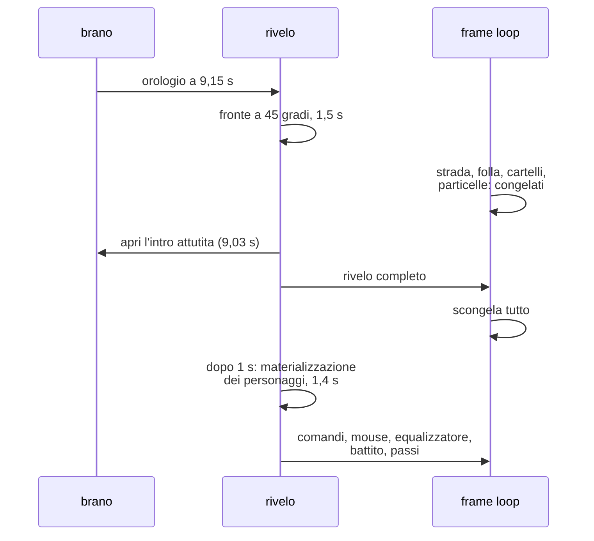

{/*
FONTI: docs/manuale-retro-future/schede/07-audio-rivelo.md, sottosezioni "Il rivelo della città" delle sezioni 1-6 e 9.
Blocco 1: §1 Rivelo (wireframe ciano e etichetta Attendi; fronte a 45 gradi sul beat drop; scan glow; zona lenta sul palazzo principale; 1,5 s con smoothstep e 1 ms con motion ridotto; indicatore e joystick a fine rivelo; rez dei personaggi dopo 1 s in 1,4 s con anello; equalizzatore, battito e passi solo dopo).
Blocco 2: §2 Rivelo (fino a 6 passate a schermo pieno e gli stutter, 8139be8d; il congelamento di tutto il resto; gli interventi per stabilizzare; cityRevealComplete 1-2 s prima dello stop vero; i personaggi come popup, ac5c3915; il gate che non può fotografare a tempo fisso).
Blocco 3: §3 Rivelo (stato e orologio; geometria del fronte; scan glow; LED principale su layer 2 con scissor; runtime di resa; profiler; rez dei personaggi; chi aspetta la fine) e §5 Rivelo (numeri).
Blocco 4: §4 Rivelo (bypass del bloom; congelamento e profiler opt-in; matchMedia una volta; il flag invece del polling; geometrie distrutte; pool dei proxy; prewarm con il piano di taglio; target distrutto; limiti della facciata non ricalcolati; strisce escluse; storia dei tempi senza corpo; le costanti che sovrascrivono i cursori senza motivo scritto; rez dal basso invece della dissolvenza; attesa spostata; InstancedMesh per gli anelli; quota per personaggio; prova a runtime vero).
Blocco 5: §5 Rivelo.
Blocco 6: §6 Rivelo.
Blocco 7: analogia scritta qui.
*/}

# Il rivelo della città

:::note In breve

Fino a 6 pass a schermo intero in una finestra di 1,5 s: wireframe, griglia, backplate, scena vera con clipping plane a 45 gradi, overlay LED su layer dedicato con scissor. Il frame loop sospende strada, folla, cartelli ed equalizzatore finché il fronte non è passato.

:::

## Cosa vede l'utente

Dopo il click la città non c'è: c'è il suo scheletro, linee ciano su fondo cielo,
mentre il cursore mostra un anello di attesa e in un angolo pulsa “Attendi…”. Il
drone intanto scende. Poi il brano arriva al colpo di basso, e un fronte inclinato a
45 gradi parte da dove sei e corre verso il fondo del viale: davanti lo scheletro,
dietro la città vera, con un bagliore a strisce che accompagna il passaggio.

Un secondo dopo i personaggi si materializzano dal basso, ognuno con un anello di luce
che sale dai piedi alla testa. Da lì compaiono i comandi, il mouse si arma,
l'equalizzatore si accende e i LED battono a tempo.

## Il problema

Il rivelo è la finestra con **meno margine di prestazioni di tutta la demo**. Il
compositore arriva a 6 passate a schermo intero (cielo, scheletro, griglia della
strada, città vera, anti-aliasing, upscale) e i picchi di scatto cadono tutti lì. Su
un iPhone vero il primo percentile scendeva intorno ai 20 fps.

E c'è un problema di lettura, non di prestazioni: i personaggi comparivano come una
finestra di dialogo. Una dissolvenza dell'opacità su tutto il corpo, il gruppo della
folla nascosto per 1 secondo mentre la materializzazione era già al 71%, un anello di
scansione appeso a un personaggio ancora invisibile. Si leggeva come un popup, non
come un arrivo.

## Come funziona

### Il fronte

Un piano inclinato a 45 gradi che avanza. Davanti a lui la scena è disegnata come
scheletro; dietro, la città vera viene disegnata con un clipping plane installato,
così i pixel oltre il fronte non esistono. La corsa dura 1,5 s con uno smoothstep agli
estremi, e con `prefers-reduced-motion` scende a 1 ms. Sul palazzo principale il
fronte rallenta a metà velocità; il motivo non è scritto in nessun commit.

Il bagliore che lo accompagna è largo quanto la città, alto quanto i palazzi, e pulsa
a metà corsa.

### Che cosa viene congelato

Mentre il fronte corre, il ciclo dei frame sospende strada esagonale, folla,
cartelli, particelle e fumetti. Il bloom viene saltato e il pixel ratio limitato. Il
profiler che campiona la scena, e per farlo attraversa tutto l'albero, si accende solo
su richiesta: girare dentro la finestra che tutto il resto protegge sarebbe una
contraddizione.

### La materializzazione dei personaggi

Un secondo dopo la fine, ogni personaggio viene rivelato dal basso da un clipping
plane che sale, non da una dissolvenza: quello che è già arrivato sembra materia.
L'anello di luce che accompagna il taglio si ferma all'altezza della testa di **quel**
personaggio, non a un'altezza nominale: la folla è più bassa del corridore, e l'anello
arrivava quasi 3 unità sopra le teste. Gli anelli stanno tutti in un `InstancedMesh`,
perché sono decine e ognuno durerebbe 1,5 s.

### Chi aspetta la fine

Un flag sulla finestra dice quando il rivelo è finito. Lo leggono gate visivo,
benchmark, comandi, equalizzatore, battito e passi. Prima era un polling ogni 400 ms
che ricostruiva l'intera fotografia diagnostica, dentro la finestra protetta.

## Perché così e non altrimenti

- **Il rivelo dal basso invece della dissolvenza.** La dissolvenza si leggeva come un
  popup; il taglio che sale si legge come un arrivo, e l'ho verificato rallentandolo a
  8 secondi.
- **L'attesa è all'inizio della materializzazione, non prima del gruppo.** Nascondere
  il gruppo della folla per 1 secondo significava mostrarla quando era già al 71%:
  sembrava che apparisse mezza fatta.
- **L'anello si ferma alla testa di chi arriva.** Con un'altezza nominale unica la
  folla, più bassa, aveva l'anello sopra la testa.
- **Tutti gli anelli in un `InstancedMesh`.** Decine di chiamate di disegno separate
  per un lampo di 1,5 s sarebbero uno spreco proprio dove il margine manca.
- **La compilazione preventiva degli shader avviene con il clipping plane già
  installato.** La variante compilata dipende da quello: senza, si sarebbero compilate
  le varianti sbagliate e quelle giuste sarebbero nate durante il rivelo, nel momento
  peggiore.
- **Le geometrie dello scheletro vengono distrutte alla fine.** È un effetto che
  succede una volta, i percorsi di disegno escono subito dopo: tenerle occuperebbe
  memoria per niente.
- **Gli oggetti temporanei si riusano.** La versione precedente allocava un array e un
  oggetto per ogni palazzo e ponte, fra 25 e 45, a ogni frame del rivelo.
- **Il test guarda il comportamento a runtime.** Quello precedente verificava la forma
  del testo del codice, non che il taglio salisse davvero dai piedi alla testa.

Cose che non so spiegare, e lo dico:

- I tempi del rivelo sono cambiati 5 volte fra il 13 e il 15 giugno, e nessuno di
  quei commit ha un corpo che lo spieghi.
- Le costanti del codice sovrascrivono al boot i valori dei cursori, ed è questo a
  decidere la durata vera. Il motivo non è scritto da nessuna parte.
- Il segnale di completamento scatta 1 o 2 secondi prima che le passate si spengano
  davvero. Il benchmark lo sa e aspetta; il resto del codice no.

## I numeri

| cosa | valore | fonte e data |
|---|---|---|
| attesa prima del fronte | 8.800 ms, o l'orologio del brano se c'è musica | `config.js` |
| durata della corsa | 1.500 ms (1 ms con `prefers-reduced-motion`) | `config.js` |
| anticipo sul colpo di basso | 200 ms | `config.js` |
| tetto di attesa della musica | 6.000 ms | `config.js` |
| momenti in tempo di brano | intro aperta a 9,03 s, fronte a 9,15 s | `city-reveal-wireframe.js` |
| inclinazione del fronte | 45 gradi | `city-reveal-wireframe.js` |
| rallentamento sul palazzo principale | metà velocità | `city-reveal-wireframe.js` |
| passate a schermo intero | fino a 6 | commit 8139be8d |
| prestazione nel rivelo su iPhone | primo percentile intorno a 20 fps | commit 8139be8d |
| materializzazione dei personaggi | attesa 1.000 ms, durata 1.400 ms | `runner-reveal.js` |
| anelli accesi insieme | 18 | commit a8c3c23d |
| limite di risoluzione nel rivelo | pixel ratio 1,5 | `config.js` |
| assestamento atteso dal gate | 2.500 ms dopo il completamento | `retro-future-visual-gate.mjs` |

## Dove sta nel codice

| file | ruolo |
|---|---|
| `src/world/city-reveal-wireframe.js` | scheletro, fronte, orologio, zona lenta |
| `src/world/city-reveal-scan-glow.js` | bagliore che accompagna il fronte |
| `src/world/city-reveal-main-led.js` | overlay verticale dei LED del palazzo principale |
| `src/world/city-reveal-render-runtime.js` | passate, frame composito, compilazione preventiva |
| `src/engine/city-reveal-profiler.js` | campionamento, acceso solo su richiesta |
| `src/character/runner-reveal.js` | materializzazione dei personaggi e anelli |

## Per chi viene dal backend

È una migrazione con finestra di manutenzione: per 1,5 s il sistema sospende tutto il
lavoro non essenziale, perché la banda serve altrove, e riprende quando il fronte è
passato. La compilazione preventiva con il clipping plane installato è il warm-up
della cache con le stesse chiavi che userà il traffico vero, non con chiavi simili. E il segnale di completamento che scatta prima dello stop
reale è un readiness probe che dice “pronto” mentre qualcosa sta ancora chiudendo:
chi misura deve saperlo.
