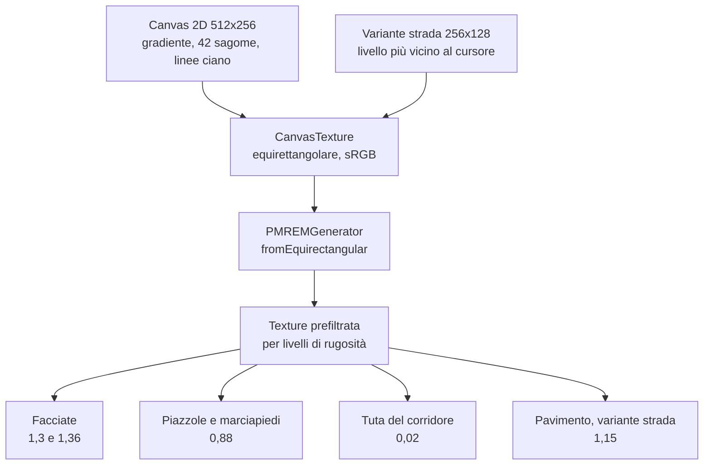

{/*
FONTI: docs/manuale-retro-future/schede/04-cielo-luce-riflessi.md, parte "Luce e riflessi" (ogni riga porta file:riga o commit).
Blocco 1: scheda §1 (luci src/main.js:1106-1123; canonico boulevard-canonical-settings.json:32-34; be30701c; facciate src/world/buildings.js:99-110; pavimento src/world/hex-tiles.js:116-121, :176-186; 33de6c5c; riflessi src/character/runner-orchestration.js:375-378, characters.js:70-75, character-materials.js:29-68; occlusione 83b3c5c7; LED building-leds.js:227-229, energy-pulse.js:2-13).
Blocco 2: scheda §2 (docs/retro-future-mobile-fill-benchmark.md:8; 33de6c5c; be30701c; b03119f5; 83b3c5c7; runner-crowd-runtime.js:342-347; vendor/README.md:16-17; reflection-env.js:58-63).
Blocco 3: scheda §3 (renderer main.js:317, :359-364; boot boot-prewarm.js:282-289, control-settings-runtime.js:213-231; luci main.js:1106-1123; sceneLightResponse control-panel.js:228-237; palette main.js:279-285; env map reflection-env.js:16-110; materiali buildings.js, hex-tiles.js, material-textures.js; riflessi character-reflections.js:30-289, runner-reflection-rig.js:46-98; bloom post-pipeline.js:429-437, :500-532, :565-567; energy-pulse.js:16-57).
Blocco 4: scheda §4 (be30701c, d84bc2d0, 33de6c5c, docs benchmark :216-228, reflection-env.js:58-63, runner-crowd-runtime.js:342-347, b03119f5, b0ccce4d, 83b3c5c7, 78c60089, f266dbe0, 8cbaaaf1, post-pipeline.js:503-511, a4beb9ec, 9ffc449c) e §9 (domande aperte dichiarate come tali).
Blocco 5: scheda §5.
Blocco 6: scheda §6 (wc -l 2026-09-20).
Blocco 7: ponte scritto dall'autore del manuale, senza affermazioni tecniche nuove.
*/}

# Luce e riflessi

:::note In breve

Nessuna riflessione planare e nessuna cubemap della scena vera: env map disegnata su canvas 2D e prefiltrata con PMREMGenerator, cloni capovolti per i personaggi con budget di 2, e un termine di Fresnel iniettato via `onBeforeCompile` al posto della env map sul pavimento mobile.

:::

## Cosa vede l'utente

Una città quasi senza luce diretta: le facciate sono asfalto bagnato che specchia
sagome di palazzi e linee ciano, il pavimento esagonale è metallo lucido, e sotto il
corridore e un paio di persone della folla c'è un riflesso capovolto che sparisce
quando un palazzo si mette in mezzo. I LED sui bordi dei palazzi, sugli anelli e lungo
i marciapiedi sembrano sorgenti luminose, e lungo le strisce corre una banda di luce.

## Il problema

Su mobile la demo è fill-bound: conta il costo per pixel, non i triangoli. E i costi
per pixel stanno tutti qui: la env map, le luci valutate per frammento, l'overdraw dei
trasparenti. La riflessione a env map del pavimento era il costo per pixel più alto
sulla superficie più grande, e la sola luce direzionale faceva girare una BRDF per
frammento su ogni pixel illuminato di pavimento e facciate: il grosso del costo del
pavimento.

I riflessi dei personaggi hanno i loro problemi. Ogni riflesso attivo è un render in
più di un personaggio con scheletro, specchiato. Sono finti: copie del modello con
`depthTest: false` per non finire coperte dal pavimento, e per questo passavano anche
attraverso i palazzi. E costruire il rig per tutti i membri della folla, a effetto
spento, produceva circa 60 rig con scheletro che non avrebbero mai potuto disegnarsi.

I valori delle luci vivono a 3 livelli. Nel codice
la luce emisferica vale 0,10 e la direzionale 0,18, con esposizione 0,85. Nel markup
0,10, 0,18 e 0,81. Nel JSON canonico, che vince al boot, l'ambientale è 0, la key light
3 e l'esposizione 0,51, mentre i commenti nel codice ragionano su una key light a 0,18.
La scena che vedete è quella del JSON.

## Come funziona

### Renderer, esposizione e ordine del boot

Il renderer nasce con tone mapping ACES Filmic, `toneMappingExposure = 0,85`, uscita
sRGB, `antialias: false` e ombre spente. L'esposizione la riscrive poi il cursore
`exposure` a ogni passata dei controlli. Al boot `bootSceneWithFinalDefaults()` carica
il JSON canonico con un fetch `cache: 'no-store'`, poi i default salvati, poi
`applyLiveControls()`. Se il fetch fallisce, restano i valori del markup.

### Le luci e la risposta della scena

2 luci: una `HemisphereLight(0x182a32, 0x02050a, 0,10)` e una
`DirectionalLight(0x6ec8e6, 0,18)` in posizione (40, 220, 120). La visibilità dipende
da `fx.hemiLight`, `fx.dirLight` e, per la direzionale, da `?dirLight=on|off` con
default `!mobile`: su mobile è spenta. I cursori scrivono `ambientLight.intensity` e
`dirKey.intensity`.

`sceneLightResponse(ambient, key)` traduce i 2 cursori in 5 fattori: `surface`,
`reflection`, `emissive`, `floorFill`, `facadeFill`, combinazioni lineari degli
scarti da 0,10 e 0,18, bloccate in intervalli. Con i valori canonici (0, 3) escono
1,389, 1,538, 1,244, 0,036 e 0,024. I fattori moltiplicano colore, `envMapIntensity`
ed emissiva di pavimento, piazzole e palazzi.

### La palette

`PAL` ha 5 colori: `cyan 0x62f7ff`, `edgeLine 0x78d7de`, `buildingSkin 0x02090b`,
`mainSkin 0x031116`, `tealLight 0xccffff`. Servono per la pelle e i bordi dei palazzi,
il colore delle particelle, i bordi strada e i LED delle piazzole. Il cielo ha la sua
`skyPalette` con 6 colori scuri, da `0x01070a` a `0x111820`.

### L'asfalto bagnato

La texture delle facciate è un canvas 256x256 generato per pixel (grana, onda,
striature, graffi), ripetuto 8x24, in sRGB, con anisotropia al massimo del renderer e
limitata a 4 su mobile. Sopra c'è un `MeshStandardMaterial`: metalness 0,94, roughness
0,10, `envMapIntensity` 1,3 per i palazzi laterali e 1,36 per il principale, emissiva
`0x000202` a 0,035. Un solo materiale serve i 12 palazzi laterali, perché
`updateBuildingMaterials` scriveva già gli stessi valori a tutti.

Il pavimento esagonale parte da metalness 0,88, roughness 0,16 e `envMapIntensity`
1,15, ma a ogni passata dei controlli riceve `roadReflect * lightResponse.reflection`
e metalness e roughness dai cursori. Le piazzole: 0,08, 0,18, 0,88.

### La env map: un disegno, non una foto

La env map dei riflessi non è una cubemap fotografata dalla scena. È un canvas 2D di
512x256 pixel: un gradiente verticale scuro a 5 stop fra `#01070a` e `#03181d`,
42 sagome di palazzi come rettangoli `rgba(0,8,12, 0,92 * alpha)` in modalità
`lighter`, 2 linee verticali ciano per palazzo, righe orizzontali ogni 18 pixel sotto
l'orizzonte. Diventa una `CanvasTexture` con `EquirectangularReflectionMapping` e
`SRGBColorSpace`, e passa per `PMREMGenerator.fromEquirectangular`, che la pre-sfoca
per livelli di rugosità: un materiale ruvido riflette sfocato senza costo extra.
Compile, bake, dispose subito; la texture del target è la env map.

`scene.environment` è `null`: nessuna illuminazione a immagine globale, la env map
entra solo come `material.envMap`. Per la strada esistono 6 livelli di “riflesso
palazzi”, `[0, 0,2, 0,35, 0,5, 0,7, 1]`; si sceglie il più vicino al cursore
`road-building-reflect`, si cuoce a 256x128 solo alla prima richiesta e si tiene in
una `Map`. Con livello 0 i rettangoli scuri non si disegnano, ma le linee ciano
restano; il canonico chiede 0.

### Il pavimento sul telefono

Su mobile, o con `?floorReflect=lite`, il pavimento perde la env map, passa a
metalness 0,32 e roughness 0,5, e riceve via `onBeforeCompile` un termine di Fresnel
in GLSL: `pow(1 - |n·v|, 5)`, riflesso più forte a sguardo radente, per un colore
`0x123f49` a forza 0,9 sommato a `totalEmissiveRadiance`. La chiave di programma è
separata, così il desktop resta identico byte per byte. Lo stesso gancio inietta il
bagliore per piastrella (`hexInstanceGlow`, il colore d'istanza meno il colore base).
Su mobile, o con `?buildingReflect=lite`, anche palazzi e piazzole hanno
`reflectionEnvMap` a `null`; la env map viene cotta lo stesso, e resta in VRAM.

### I riflessi dei personaggi: cloni capovolti

Niente specchio della scena. Il riflesso è una copia del modello con scala Y negativa
sotto il pavimento. Per il corridore: un `Group` a `y = 0,018` con
`scale.set(1, -0,58, 1)`, dentro il modello ruotato di PI su Y e un secondo clone
dello scheletro per lo strato dei LED, ciascuno con il suo `AnimationMixer`; il gruppo
è figlio di `runnerWalker`. Per la folla la stessa struttura per membro: 2 cloni dello
scheletro, `renderOrder` 2 per il corpo e 3 per i LED, 2 mixer con offset di indice.
Il rig si costruisce solo se `fxEnabled('crowdReflections')`.

I materiali sono `MeshBasicMaterial`, senza luci. Corpo: colore `0x12343a` con la
texture della tuta, `NormalBlending`, `depthTest: false`, `depthWrite: false`,
`DoubleSide`, `toneMapped: false`, trasparente, opacità iniziale 0. LED: colore
`0xbaffff` con la maschera dei LED come `map` e `alphaMap`, in additivo.

L'opacità dipende dalla superficie: `reflect / limite` (3,5 sul marciapiede, 2,5
sulla strada) per `(1 - roughness)` per `lerp(0,86, 1,04, metalness)` per 0,34; il
corpo prende `min(0,28, x * 1,55) * 0,3`, i LED `min(0,22, x * 1,08) * 0,3`. Con la
strada canonica (reflect 1,5, roughness 0,05, metalness 0) la base è 0,167, il corpo
0,078, i LED 0,054. Le scritture sotto 0,002 di differenza si saltano: l'opacità è
una uniform.

Il budget per frame è 2 riflessi della folla. Sotto 50 fps misurati scende di 1; sotto
42 va a 0. Dopo il rivelo cresce in 2.400 ms (`floor(progress * (max + 1))`). I
candidati sono i membri entro 240 unità, ordinati per distanza con inserimento
ordinato; solo loro aggiornano i mixer. Per ciascuno un test 2D: il segmento
camera-membro contro i collisori dei palazzi (slab test su X e Z); se un palazzo sta
in mezzo, opacità 0 e nascosto. I sottoalberi non visibili smettono di aggiornare le
matrici. Il riflesso del corridore sorgente non si vede: quel personaggio è dichiarato
invisibile da una costante che entra nella condizione. Le strisce LED dei marciapiedi
si disegnano dopo, così il riflesso non può sedersi sopra.

### I LED e il bloom

I LED sono `MeshBasicMaterial` con `toneMapped: false`: saltano il tone mapping e
restano al colore pieno. Non emettono luce, è il bloom a farli sembrare sorgenti
luminose. Il pass è il fork di UnrealBloomPass in `vendor/`, costruito con forza 0,58,
raggio 0,56 e soglia 0,68, 3 mip attivi e stride 2; i cursori riscrivono i 3 valori, e
il canonico chiede 0,09, 0 e 0,79. È attivo solo con forza sopra 0,015, e per frame
`enabled = bloomEnabled && isolamento && !bypassRivelo && fx.bloom`. Quando la catena
è bloom e poi look, senza altri pass, la somma avviene dentro lo shader del look. Su
mobile la risoluzione del bloom è limitata a 0,14.

Lungo le strisce corre l'impulso di energia. `applyEdgePulseShader` inietta nel
`MeshBasicMaterial` una `varying vEdgeAlong` (la posizione lungo la striscia, scalata
dalla matrice d'istanza) e nel fragment
`edgeFlow = fract((vEdgeAlong - t * speed) / period)`, una testa `smoothstep(0, 0,12)`
con coda, e `diffuseColor += diffuseColor * edgeHead * intensity`. Velocità 30 unità
al secondo, periodo 42: un giro ogni 1,4 secondi. Il bloom trasforma la banda in
corrente che scorre.

## Perché così e non altrimenti

- **Luce direzionale spenta su mobile.** +3,7 fps, render da 8,26 a 6,87 ms. A
  intensità 0,18 l'atmosfera la reggono il riempimento emisferico e i LED emissivi:
  gli screenshot prima e dopo sono indistinguibili.
- **Env map tolta a palazzi e piazzole su mobile.** +1,7 fps: si perde una lucentezza
  sottile su facciate e marciapiedi, il pavimento bagnato resta col suo Fresnel.
- **Il pavimento lite con Fresnel, non nero.** Metalness da 0,88 a 0,32 e roughness da
  0,16 a 0,5, così il pavimento resta illuminato invece di andare al nero. Chiave di
  programma separata perché il desktop resti identico byte per byte. Il compromesso è
  deliberato, da giudicare a occhio.
- **I tagli mobile classificati.** Il piano dei tagli mette la env map di palazzi e
  piazzole fra i tagli neutri (A1) e la direzionale in A3; il cielo “ultra economico”
  (B5) sta fra quelli che cambiano il look.
- **Le varianti della strada cotte su richiesta.** Cambiare livello costa qualche
  millisecondo al movimento del cursore, invece di 6 rasterizzazioni, 6 catene di
  prefiltro e 6 cubi residenti a ogni avvio.
- **Il rig dei riflessi solo con l'effetto acceso.** L'interruttore non ricostruisce
  la folla: costruirlo a effetto spento dava circa 60 rig con scheletro che non
  potevano disegnarsi.
- **Budget da 3 a 2, folla da 60 a 30.** Per recuperare frame, il 17 giugno
  2026; il 3 risaliva all'8 giugno.
- **L'occlusione solo per i riflessi nel budget.** Il test gira per i pochi riflessi
  attivi, non per tutta la folla.
- **Scritture idempotenti saltate.** Riscrivere visibilità, scala e opacità di ogni
  materiale a ogni tick della folla era lavoro O(membri x mesh) senza effetto.
- **Bloom leggero.** Ho alzato la qualità una volta (tetto 0,45, 5 mip, stride 1) e la
  demo è scesa a circa 20 fps; rimessa indietro lo stesso giorno.
- **Bloom sommato nel look.** Evita un pass a schermo intero che, con MSAA acceso,
  rasterizza al tasso di campioni della scena senza guadagnare anti-aliasing.
- **Un materiale per i palazzi laterali.** I loro valori erano già scritti in
  lockstep, mai per palazzo.
- **Anisotropia a 4 su mobile.** Nitido sotto i piedi, un po' più
  morbido lontano.

Cose che non so spiegare, e lo dico:

- I commenti del codice e il piano dei tagli mobile ragionano su una key light a
  0,18 e un'ambientale a 0,10; il JSON canonico applicato al boot chiede 3 e 0.
- L'esposizione vale 0,85 nel codice, 0,81 nel markup e 0,51 nel canonico: 3 numeri,
  nessuna fonte che dica l'intenzione.
- Il JSON canonico chiede metalness 0 e roughness 0,05 per la strada, contro 0,88 e
  0,16 nel codice e nel markup, e riflesso palazzi 0, cioè la variante senza sagome.
- `vendor/README.md` cita i commit `60d65f0` e `7c98c05` del fork del bloom; in
  questo repo non esistono. I corrispondenti qui sono `789657b3` e `d9a951b8`.
- La scala Y del riflesso è 0,58 e non 1, e il modello del corridore è ruotato di PI
  su Y mentre i cloni della folla non lo sono.

## I numeri

| cosa | valore | fonte e data |
|---|---|---|
| luci | codice: emisferica 0,10, direzionale 0,18 a (40, 220, 120); markup 0,10 e 0,18; canonico 0 e 3 | `src/main.js`; `index.html`; `boulevard-canonical-settings.json`, letti il 2026-09-20 |
| esposizione | 0,85 codice, 0,81 markup, 0,51 canonico | `src/main.js`; `index.html`; `boulevard-canonical-settings.json` |
| `sceneLightResponse(0, 3)` | surface 1,389, reflection 1,538, emissive 1,244, floorFill 0,036, facadeFill 0,024 | calcolo dalle formule di `src/controls/control-panel.js`, 2026-09-20 |
| direzionale spenta su iPhone | +3,7 fps, render 8,26 → 6,87 ms | commit be30701c, 2026-07-09 |
| env map tolta a palazzi e piazzole su iPhone | +1,7 fps | commit d84bc2d0, 2026-07-09 |
| env map | base 512x256, 42 sagome; varianti strada 256x128; livelli 0 / 0,2 / 0,35 / 0,5 / 0,7 / 1, default 0,35, canonico 0 | `src/engine/reflection-env.js`; `boulevard-canonical-settings.json` |
| facciate | metalness 0,94, roughness 0,10, `envMapIntensity` 1,3 e 1,36, emissiva `0x000202` a 0,035 | `src/world/buildings.js` |
| pavimento | 0,88 / 0,16 / 1,15 nel codice; lite 0,32 / 0,5 / nessuna; canonico reflect 1,5, metalness 0, roughness 0,05 | `src/world/hex-tiles.js`; `boulevard-canonical-settings.json` |
| Fresnel lite | colore `0x123f49`, forza 0,9, esponente 5 | `src/world/hex-tiles.js` |
| riflessi dei personaggi | scala Y -0,58, quota 0,018, opacità massima 0,34, tetti 0,28 e 0,22, budget 2, distanza 240, fps minimo 50 (zero sotto 42), rampa 2.400 ms | `src/character/characters.js`; `src/character/character-reflections.js` |
| opacità con la strada canonica | base 0,167, corpo 0,078, LED 0,054 | calcolo da `src/character/runner-reflection-rig.js`, 2026-09-20 |
| budget riflessi e folla | 3 → 2, 60 → 30 | commit b03119f5, 2026-06-17; il 3 da b0ccce4d, 2026-06-08 |
| bloom | costruttore 0,58 / 0,56 / 0,68; canonico 0,09 / 0 / 0,79; bypass sotto 0,015; cap mobile 0,14 | `src/engine/post-pipeline.js`; `src/world/config.js`; `boulevard-canonical-settings.json` |
| impulso di energia | velocità 30, periodo 42, intensità 2,0, un giro ogni 1,4 s | `src/world/energy-pulse.js`, calcolo del 2026-09-20 |
| texture | asfalto 256x256 ripetuto 8x24; normal map strada 256 ripetuta 18x42; piazzole 512 | `src/world/material-textures.js` |
| anisotropia | massimo del renderer su desktop, 4 su mobile (da 16) | `src/main.js`; commit 9ffc449c, 2026-07-09 |

## Dove sta nel codice

| file | righe | ruolo |
|---|---|---|
| `src/main.js` | 1280 | palette, renderer e tone mapping, luci, decisione mobile per env map e pavimento |
| `src/engine/reflection-env.js` | 114 | env map procedurale, PMREM, 6 livelli strada |
| `src/world/buildings.js` | 275 | materiale delle facciate, `updateBuildingMaterials` |
| `src/world/material-textures.js` | 112 | texture procedurali di asfalto, normal map strada, piazzole |
| `src/world/hex-tiles.js` | 1010 | materiale del pavimento, variante lite con Fresnel, bagliore per piastrella |
| `src/world/base-pads.js` | 681 | materiale delle piazzole, LED dei marciapiedi |
| `src/world/energy-pulse.js` | 63 | impulso di energia sui LED |
| `src/controls/control-panel.js` | 880 | `tunedColor`, `sceneLightResponse`, controlli della strada |
| `src/controls/live-controls.js` | 906 | `applyLiveControls`: luci, esposizione, materiali, bloom |
| `src/engine/post-pipeline.js` | 788 | bloom, merge bloom e look, cap mobile |
| `vendor/UnrealBloomPass.js` | 569 | il fork del bloom |
| `src/character/character-reflections.js` | 289 | costruzione, rampa, budget e occlusione dei riflessi della folla |
| `src/character/runner-reflection-rig.js` | 125 | materiali e opacità del riflesso del corridore |
| `src/character/character-materials.js` | 68 | materiali dei riflessi (corpo e LED) |
| `src/character/characters.js` | 142 | costanti dei riflessi |
| `src/character/runner-orchestration.js` | 630 | il gruppo riflesso del corridore |
| `src/character/runner-crowd-runtime.js` | 886 | rig condizionato e aggiornamento per membro |
| `src/character/runner-wiring.js` | 1132 | tuta con env map, getter sui cursori strada |
| `boulevard-canonical-settings.json` | 371 | i valori applicati al boot |

I test: `bloom-fork.test.mjs` costruisce il pass senza GPU e verifica che il fork
esponga le sue leve. Il budget dei riflessi della folla è estratto in funzioni pure
con i parametri iniettati, che girano senza scena.

## Per chi viene dal backend

La env map è una tabella precalcolata, costruita una volta al boot e letta da tutti i
materiali; PMREM sono i rollup pre-aggregati a diverse granularità, così una query
“ruvida” non ricalcola nulla. Le 6 varianti della strada sono una cache lazy con
chiave sul livello. Il budget dei riflessi è un rate limiter con circuit breaker: 2
richieste per frame, zero sotto 42 fps, e una rampa dopo il rivelo come warm-up. Il
test di occlusione è il pre-check economico prima del percorso costoso. E i 3 livelli
dei valori, codice, markup, JSON canonico, sono la precedenza fra default compilati,
file di configurazione e variabili d'ambiente: vince l'ultimo.
