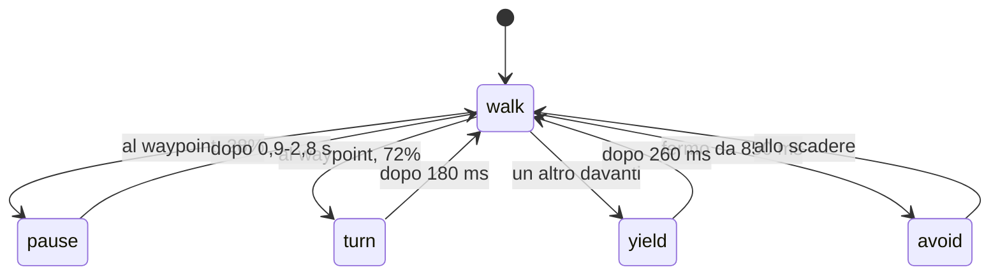

{/*
FONTI: docs/manuale-retro-future/schede/05-personaggi.md (ogni riga della scheda porta file:riga o commit) e docs/manuale-retro-future/intervista.md (risposte 5, 7, 8, 10).
Blocco 1: scheda §1 (30 cloni src/character/characters.js:89; colori character-colors.js:7-23; chi accoglie runner-greeter.js:10-29 e runner-crowd-runtime.js:437-457; fermo runner-idle-character.js:55; rivelo runner-reveal.js:25-32, ac5c3915); intervista risposta 7.
Blocco 2: scheda §2 (SkeletonUtils vendor/SkeletonUtils.js:385-420; 1b3d0c5c; 45 Hz characters.js:72-74; 3e960a7f; b6929ba2; 83b3c5c7; b4f08ad5; speech-bubbles.js:404-407; 8666e535; daa7c65b).
Blocco 3: scheda §3.1 (GLB, c84edc8c), §3.2 (loader, clone, coda), §3.3 (tuta, colori, LED runner-crowd-leds.js:8-25), §3.4 (passo a distanza character-movement.js:13-40), §3.6 (runtime, LOD, culling, griglia, stati, avoidance, deadlock, battute), §3.7 (rotte), §3.8 (chi accoglie), §3.9 (fermo), §3.10 (cartelli), §3.11 (testi), §3.12 (rivelo), §3.13 (battito), §3.14 (passi); §7 per i termini; intervista risposte 7 e 8.
Blocco 4: scheda §4 (3e960a7f, b6929ba2, b03119f5, 718e617c, 43f14f1f, 78fb31ee, 41d937ec, 695b44ba, a8a796e3, 144b150d, 89acba9d, 83e0287c, b4726aad, ab9e3822, 9f75e2a0, 0a0e646c, 9b34f3bf, b4f08ad5, 2992dfb2, 68af3652, 1b76f8a9, ac5c3915, a8c3c23d, fc94351f, a1d3c24c, 83b3c5c7, 1b3d0c5c, speech-bubbles.js:449-455) e §9 (domande aperte dichiarate come tali, compreso il commit "corridors" assente); intervista risposte 5 e 10.
Blocco 5: scheda §5.
Blocco 6: scheda §6 (wc -l 2026-09-20).
Blocco 7: ponte scritto dall'autore del manuale, senza affermazioni tecniche nuove.
*/}

# Personaggi

:::note In breve

Una skinned mesh sorgente clonata con `SkeletonUtils.clone` per 30 membri, costruiti uno per frame in coda, con geometria e materiali condivisi. Folla aggiornata a 45 Hz con accumulatore, macchina a stati per membro, avoidance su griglia spaziale, LOD a stride 1/2/4 e ciclo del passo guidato dalla distanza.

:::

## Cosa vede l'utente

Finito il rivelo dei palazzi, 30 figure in tuta nera con linee LED colorate si
materializzano dal basso, un anello di luce ciano che sale dai piedi alla testa, e
si mettono a camminare sui marciapiedi. Una, verde, viene incontro a chi arriva, si
ferma, mostra un cartello “Benvenuto in avstudio.ai”, poi “Seguimi”, e corre al
tabellone dei reparti. Un'altra, arancione, sta appoggiata al palazzo con civico 2
e, se ci si avvicina, dice “Mi godo la pausa”. Volevo che la città avesse una
parvenza viva: il boulevard è la mia azienda, o la mia testa, i palazzi sono i
dipartimenti, i personaggi sono colleghi IA.

## Il problema

Un solo modello con scheletro (49 ossa) deve diventare 30 personaggi animati più
uno fermo, senza 30 caricamenti. E la folla è il lavoro per frame più denso della
demo: membri per sottopassi di movimento, ogni frame. Nel codice caldo non si
alloca niente: oggetti di appoggio riusati, chiavi numeriche al posto delle
stringhe.

Poi i dettagli che si vedono subito, se sbagliati:

- **Le gambe devono piantarsi a terra.** Con l'animazione guidata dal tempo, un
  personaggio che rallenta o si ferma scivola sui piedi: il “moonwalk”.
- **I riflessi a pavimento passano attraverso i palazzi.** Cloni specchiati
  disegnati senza test di profondità: dipingevano anche dove un palazzo stava fra
  il personaggio e la camera.
- **I cartelli finivano sotto i pannelli della città** anche con un `renderOrder`
  altissimo, perché three.js confronta prima quello del gruppo, e i cartelli erano
  appesi alla scena.
- **Il logo animato nel cartello di benvenuto** ridisegnato a 60 Hz rifaceva un
  canvas 896x360 con 3 passaggi di ombra sfocata per frame; e la cache delle
  texture, senza sfratto, teneva residenti circa 40 texture, circa 70 MB di GPU.
- **La materializzazione era già scritta ma nessuno la vedeva:** la folla restava
  nascosta per 1.000 ms mentre l'effetto da 1.400 ms era già al 71%.

## Come funziona

### Un modello, 31 corpi

Il modello sorgente è un GLB da 1.229.812 byte: 2 mesh (corpo 7.325 vertici,
visiera 109), 49 giunti, 4 clip (`Idle`, `Run`, `TPose`, `Walk`). La base è un
modello Mixamo già riggato, lo stesso che three.js distribuisce fra i suoi esempi;
l'ho adattato e alleggerito. Non porta texture: le 2 JPEG da 931 KB non venivano mai
mostrate, perché ogni consumatore sostituisce il materiale con la tuta procedurale.
Toglierle ha portato il file da 2,16 a 1,23 MB, il 43% in meno sull'asset vivo più
grande, con 2 decodifiche JPEG in meno all'avvio. Verificato con due primi piani di
chi accoglie, prima e dopo: identici.

Il loader glTF e `SkeletonUtils` arrivano in parallelo ai moduli di
post-produzione, così le richieste si sovrappongono; se l'import fallisce, i
personaggi restano spenti con un avviso. Caricato una volta, il modello viene
ruotato di 180 gradi, portato a 8,66 unità di altezza, stretto a 0,74 in X e 0,70
in Z, ricentrato con i piedi a y=0. Non si vede mai: è il padre dei cloni e porta la
scala, 0,55 nel file canonico, che dà una folla alta circa 4,76.

Ogni membro della folla è `SkeletonUtils.clone` del sorgente. Una skinned mesh non
si copia con `clone()`: le ossa resterebbero dell'originale. `SkeletonUtils` ne crea
di nuove e le rimappa sul clone, geometria e materiali restano condivisi per
riferimento. Ogni membro riceve un materiale
suo, clone di quello della tuta con il proprio colore, condiviso dalle sue 2 mesh. La folla si costruisce un membro per frame: la coda fa un lavoro e restituisce il
controllo, e al boot un ciclo la svuota un frame alla volta, prima dei prewarm
pesanti. Il personaggio fermo è un altro clone, costruito subito dopo la
folla. I riflessi a pavimento di un membro sono altri 2 cloni, corpo e LED, con
`AnimationMixer` propri: si costruiscono solo se l'effetto è acceso, perché
costruirli spenti dava circa 60 scheletri che non potevano mai disegnarsi.

La tuta è disegnata su canvas: 512x512, gradiente scuro, 1.400 puntini, 5 pannelli,
4 linee diagonali; una seconda texture emissiva ripete lo stesso impianto e ci
aggiunge le 9 linee ciano. Il colore segue un piano di 15 voci ciclico sull'indice,
con 2 eccezioni fisse: indice 0 ciano e indice 1 verde, i due sulla strada di
partenza.

### La folla a 45 Hz

Il runtime gira a ogni frame ma aggiorna la simulazione a 45 Hz: accumula il tempo
(al massimo 0,12 s) e lavora quando ha raggiunto 1/45 di secondo. Poi, in ordine: culling, budget dei riflessi, matrici, griglia spaziale, e per ogni
membro trigger delle battute, velocità, passo del LOD, animazione e avanzamento in
sottopassi da 0,035 s.

Il LOD qui è uno stride: entro 190 unità un membro si aggiorna ogni frame, entro
520 uno su 2, oltre uno su 4; nascosto dal culling, uno su 12. Il
culling usa una sfera di raggio 24 a mezza altezza: fuori dal frustum o oltre 900
unità il gruppo diventa invisibile e le sue matrici si congelano. La griglia
spaziale è una `Map` con celle da 9,5 unità e chiave numerica, non stringa: la
versione con le stringhe allocava fra 5.000 e 13.000 stringhe al secondo. I vicini
si cercano nelle 9 celle intorno, in un array di appoggio. Il giocatore urta contro
i membri e non li attraversa: entro 1,6 unità la camera viene spinta fuori.

### La macchina a stati di un membro

Ogni membro segue una rotta di waypoint, raggiunto uno entro 0,85 unità punta al
successivo, e sta in uno di 5 stati:

Ogni stato ha una scadenza e una scala di velocità: `pause` 0, `turn` 0,56, `yield`
0,34. L'avoidance somma le spinte dei vicini entro 5,2 unità, pesate con la
distanza. Se un altro è davanti, chi ha l'indice minore ha la precedenza: rallenta a
0,82 e si sposta di lato; l'altro rallenta a 0,18 e cede per 260 ms. Il lato di
sorpasso dipende dalla parità dell'indice. Il giocatore è un repulsore a parte:
entro 3,6 unità spinge con forza 12, contro 7,5 dei vicini. Contro i palazzi vale un
collisore a pianta rettangolare con gli angoli smussati che spinge fuori dal lato più
vicino; la correzione è annullata se porterebbe fuori dal poligono della rotta.
Se un membro è lontano dal suo waypoint e fermo da 850 ms con vicini attorno o una
collisione, tenta uno spostamento laterale di 3,4 e salta al waypoint successivo.

### Le rotte

Le rotte nascono dai palazzi laterali: una per ogni stradina fra 2 palazzi con un
varco di almeno 5,5 unità, poi un ciclo di 3 che si ripete, anello davanti a una
facciata sola, segmento lungo il marciapiede, un altro anello. L'anello
davanti alla facciata sta al 62% verso il bordo della strada, mai più vicino al muro
di una guardia di 2,4 più il raggio di collisione moltiplicato per 1,35: il
collisore può essere più stretto del palazzo disegnato. Gli indici 0 e 1 hanno una
rotta a parte, 2 punti sulla strada intorno al punto di atterraggio. Il civico 2 è
escluso, perché lì c'è chi sta in pausa. Ogni membro parte da un punto sfalsato
(0,18, 0,38, 0,62 o 0,82 del segmento) e cammina a 0,72 della velocità del
giocatore, con una variazione per indice fra 0,86 e 1.

### Il passo guidato dalla distanza

La clip `Walk` non avanza con il tempo. La fase del ciclo è la distanza percorsa
divisa per 3,225, più uno sfasamento per membro (`indice × 0,173` mod 1, così non
marciano all'unisono); il tempo della clip viene fissato a quella fase e
l'`AnimationMixer` aggiornato con delta zero. Un ciclo, 2 passi, vale 3,225 unità;
per la corsa di chi accoglie 4,999. Chi è in pausa ha scala di velocità zero, la
distanza non cresce e le gambe restano ferme. Se la posa è identica alla precedente
(stessa azione, stesso tempo a 1e-4), lo scheletro non viene ricampionato.

### Chi accoglie

È il membro di indice 1, il verde. Parte 16 unità dietro il punto di atterraggio e
2,8 di lato, e cammina verso la camera a 1,155 volte il passo della folla: il test
pretende circa 6 passi prima del saluto, (16 − 7,4) / (3,225 / 2) = 5,33. A 7,4 unità si ferma, passa dalla camminata alla clip `Idle` con una
dissolvenza di 0,45 s, si gira verso il giocatore e mostra “Benvenuto in
avstudio.ai” per 3.600 ms. Poi “Seguimi” per 8.000 ms; dopo 1.500 ms parte di corsa
verso il tabellone dei reparti, con il passo moltiplicato per altre 3,064 volte e un
cambio secco da `Idle` a `Run`, non una dissolvenza: la corsa è guidata dalla
distanza a terra, e una dissolvenza non avanzerebbe. Al tabellone, entro 0,8 unità
dall'ancora (bordo destro, più 5,2 di lato e 1,4 verso il giocatore), si mette a 45
gradi fra giocatore e tabellone e dice “Qui puoi vedere i nostri reparti” a chiunque
sia entro 32 unità.

Solo la testa segue il giocatore: l'osso `head` ruota verso la camera, limitato a
±80 gradi perché il collo non si torca, interpolato con `dt × 4`, e la stessa
rotazione si copia sull'osso del riflesso. Si aggiorna sempre, anche fuori schermo,
con stride 1; non subisce avoidance né collisioni e non partecipa alle battute della
folla.

### Chi sta in pausa

Al palazzo con civico 2, sul muro lato strada dalla parte dello spawn, un clone con
il preset arancione e l'emissiva a 1,6 volte, inclinato di 5 gradi, a braccia
conserte: niente `AnimationMixer`, le 7 ossa di spina, braccia, avambracci e mani
sono cercate per nome e ruotate una volta sola. Ha una battuta sola, “Mi godo la
pausa”, con lo stesso trigger della folla, e il suo cartello resta orientato come lui
invece di inseguire la camera.

### I cartelli

Un cartello è un piano `1x1`, materiale non illuminato e trasparente, `depthWrite`
spento e `depthTest` acceso: chi parla sta davanti al proprio cartello. Non è uno
`Sprite`: quello di three.js è un billboard sferico che si inclina a guardare la
camera dall'alto, qui il piano ruota solo intorno a Y. Stanno tutti in un gruppo, ed
è il gruppo a portare il `renderOrder` 2000, che un test tiene come massimo del
progetto.

La texture è un canvas 896x360: pannello squadrato con doppio bordo ciano, sfondo
quasi nero, testo bianco monospace con ombra ciano, font da 84 px che scende a passi
di 2 finché la riga più larga entra. La riga `avstudio.ai` è riconosciuta e
disegnata a parte: `av` arancione con un tratteggio che scorre, `/studio` bianco,
`.ai` con un anaglifo ciano e rosso e un burst di 360 ms ogni 2.200 ms; per questo
la seconda riga del benvenuto resta `avstudio.ai` in entrambe le lingue. La texture
animata si ridisegna a 15 Hz, non a 60. Le battute della folla usano un canvas a
metà scala, 448x180: da lontano non si distingue, e raster e upload costano un
quarto.

Le texture vivono in una cache LRU con tetto 48: a 12, contro una quarantina di
battute, sfrattava di continuo, e ogni sfratto ricomprava un raster
sincrono nel frame in cui il prossimo parlava. In `requestIdleCallback` un prewarm
rasterizza una battuta alla volta e la carica sulla GPU. Il cartello si ancora alla
posizione del gruppo più `8,66 × scala + 1,1`, non all'osso della testa, che oscilla
con l'animazione. Si monta dal basso in 420 ms a orologio, bordo inferiore fermo,
opaco al 40% del tempo; a orologio e non a frame perché il primo frame, quello che
genera la texture, è lungo: l'apertura finiva in 30 ms. I cartelli non entrano nei
palazzi né nei pannelli sospesi: per i palazzi si riusa il collisore smussato, per
tabelloni e terminale si prende l'ingombro 3D e si spinge il cartello verso la
camera a passi di un quarto di larghezza.

### Le battute

41 frasi in italiano e 41 in inglese, in un solo file, scelte dalla lingua della
pagina. Le ho scritte io, come se fossero colleghi di un ufficio che salutano e si
confidano: “Hei, un viso nuovo!”, “Oggi ho dimenticato il pranzo.”, “Mi servirebbe
un caffè.”, “Ho i piedi a pezzi.”, “Qui costruiamo cose che funzionano.”, “Dietro
ogni schermo c'è una persona.”, “Le torri non dormono mai.”. 4 categorie: saluti,
quotidiano, mondo avstudio, fantascienza. Ogni membro ne riceve 3, senza
ripetizioni, da un generatore lineare congruenziale seminato dall'indice: la stessa
persona dice sempre le stesse cose. Entro 15 unità dice la prossima del suo ciclo
per 4.000 ms e si riarma quando il giocatore supera le 18, un'isteresi contro il
parlato a raffica sulla soglia. 4 cartelli in un pool servono i parlanti più vicini
alla camera.

### L'intelligenza

Non c'è apprendimento e non c'è pianificazione: l'ispezione la dichiara
`waypoint-state-machine`. Un membro segue punti fissi, cambia stato a scadenze, si
scansa con spinte pesate e si sblocca con una regola a tempo. Basta per una parvenza
viva, e resta fra le cose che vorrei ridefinire.

### Il rivelo

Finito il rivelo della città, il runtime aspetta 1.000 ms e fa partire 1.400 ms di
materializzazione. Ogni gruppo ha un clipping plane con normale verso il basso,
attaccato ai materiali solo quando cambia. L'altezza di ciascuno è misurata una
volta; la quota del taglio sale dal 6% al 100% dell'altezza, e il piano sta un 4%
più su della luce, così il corpo si forma dietro l'anello. Durante il rivelo il
corpo è opaco, non un fantasma che si solidifica, e l'emissiva sale da 0,2 a 1 della
base, con sopra una pulsazione moltiplicata per 2,3. Gli anelli sono un solo
`InstancedMesh` di tori, raggio 2,7, additivi, un'istanza per soggetto alla quota
del suo taglio, con opacità `sin(π × avanzamento)`. La misura in Chromium: 18 anelli
accesi sui personaggi in vista, opacità 0,07 all'inizio e 1,00 a metà corsa.

### Il battito

Il tempo viene dall'elemento audio della colonna sonora, che ho prodotto con Suno
(piano Pro): 128 bpm. Le battute sono `tempo × 128/60`; la fase è la parte
frazionaria; il valore è `exp(−fase × decadimento)`, e il moltiplicatore
`1 + valore × 3` tagliato a 4. A ogni frame l'emissiva di tutti i materiali della
folla e del sorgente diventa `base × moltiplicatore`, con un tetto a 24 che un test
tiene sopra 3 × 1,6 × 4 = 19,2, il caso di chi sta in pausa a piena battuta. Le
scritture sotto 0,0005 si saltano, e l'intero passaggio si salta se niente è
cambiato. Un percorso alternativo dal kick dell'equalizzatore esiste, spento.

L'intensità dei LED nasce da una costante moltiplicata per i cursori del pannello,
poi passa per un tetto. Chi sta in pausa parte da 1,6 volte la base, perché
non cammina e senza il movimento a segnalarlo si perdeva nel fondo. Catene di
moltiplicazioni e tetti come questa sono quello che i test sulle invarianti tengono
sotto controllo: un valore che ne annulla un altro non si vede a schermo, si vede
solo mettendo la relazione sotto test.

### I passi

Nel ciclo del passo i contatti sono a fase 0,18 (sinistro) e 0,68 (destro),
rilevati anche quando la fase riparte da 0, e un passo scatta solo se la distanza
percorsa supera 0,001. Il suono userebbe un bus spaziale con HRTF, intervallo minimo
105 ms, passa-basso a 1.900 Hz sul marciapiede e 1.550 sulla strada. Ma
l'aggiornamento esce subito se il personaggio sorgente è invisibile, e lo è: nessun
passo viene mai suonato, e la folla non chiama funzioni di passi.

### I riflessi a pavimento

Un riflesso è il gruppo dei 2 cloni scalato `(1, −0,58, 1)` a quota 0,018, senza
test di profondità. Il budget è di 2 riflessi attivi entro 240 unità, i più vicini;
sotto 50 fps uno in meno, sotto 42 nessuno, con una rampa di 2.400 ms dopo il
rivelo. Se un palazzo sta fra la camera e il membro (test segmento contro
rettangolo, in pianta), il riflesso si spegne.

## Perché così e non altrimenti

- **Il passo guidato dalla distanza, non dal tempo.** Con l'`AnimationMixer` a tempo
  i piedi scivolavano in corsa e in pausa; con la distanza si piantano, e in pausa
  restano fermi.
- **Cambio secco da `Idle` a `Run` per chi accoglie.** La dissolvenza non può
  avanzare quando la sincronizzazione chiama l'`AnimationMixer` con delta zero.
- **30 membri e non 60.** Da 29 a 40 per una prima passata “più viva”, poi 60 per un
  boulevard più affollato contando su culling, LOD e budget dei riflessi; lo stesso
  giorno 30 e budget dei riflessi da 3 a 2, per recuperare frame.
- **2 soli sulla strada di partenza, colori fissi.** Prima il gruppo era passato da
  3 a 5 per spostare la folla sul boulevard; poi 2, un ciano e un verde ai fianchi
  del giocatore.
- **Chi accoglie salta la ressa ed è esente dal culling.** Deve arrivare sempre;
  solo la testa si gira, entro 80 gradi.
- **Cartello come piano a un asse, ancorato al corpo.** Lo `Sprite` si inclinava
  guardando in alto o in basso; l'osso della testa oscilla di 80 gradi e faceva
  dondolare il cartello.
- **Cartello di benvenuto dimezzato, quello dei reparti pure.** Il primo riempiva
  mezzo schermo da vicino (da 8,68 x 3,18 a 4,34 x 1,59); il secondo finiva addosso
  al terminale dei contatti, e chi accoglie si è spostato a destra da 2,4 a 5,2.
- **Cartelli opachi e squadrati, montati dal basso.** Erano rettangoli stondati con
  alone e sfondo al 94%, e sembravano fumetti; “si monta” si legge come un arrivo,
  “sfuma” come un popup.
- **`renderOrder` sul gruppo.** three.js ordina prima per gruppo, poi per oggetto:
  il 2000 del singolo oggetto non veniva mai guardato.
- **Il rivelo taglia invece di sfumare.** Una dissolvenza si leggeva come un popup;
  gli anelli in un solo `InstancedMesh` perché altrettante chiamate di disegno per
  un lampo di un secondo e mezzo erano uno spreco.
- **Battute in un solo file JS.** Il mirror markdown era online e conteneva
  un'istruzione rivolta a un assistente AI. Una sola regola di lingua, perché la
  folla salutava in inglese mentre chi accoglieva rispondeva in italiano.
- **Il riflesso occluso si spegne.** Senza test di profondità, dipingeva dritto
  attraverso i palazzi.
- **Nel codice caldo niente allocazioni.** Migliaia di oggetti effimeri al secondo
  finivano nella nursery del garbage collector.

Sul metodo: ho fermato il lavoro provando altre tecnologie che non rispecchiavano
il prodotto che volevo, anche per la logica di percorso dei personaggi.

Cose che non so spiegare, e lo dico:

- Il commit “stream residents along local corridors” del 22 agosto 2026 non è in
  questo branch: la parola `corridor` non compare in `src/` e nessun commit ha quel
  soggetto. Se esiste altrove, è da riconciliare.
- I passi audio sono scritti (135 righe, bus spaziale, HRTF) e non suonano mai,
  perché il sorgente è invisibile: la folla cammina in silenzio, e nessuna fonte dice
  se è voluto.
- Il sorgente resta invisibile come padre dei cloni e portatore della scala, con
  rotta, ombra e riflesso propri. Nessun commit spiega perché non è un membro della
  folla.
- Il battito ha un percorso dal kick audio, scritto e spento; i commit del 13
  giugno che sincronizzano ai bassi e poi bloccano il bpm non hanno corpo.
- Il decadimento del battito vale 8 nelle costanti e 3 nel file canonico dei
  cursori.
- Lo stile di rotta che attraversa la strada fra 2 palazzi è implementato e mai
  prodotto.
- Un secondo modello per chi accoglie è esistito 4 giorni a giugno; il commit
  che lo toglie non lo dice.
- Il GLB del sorgente non porta metadati d'autore, a differenza dei modelli della
  copertina che li hanno dentro il file: la provenienza si ricostruisce dai nomi di
  ossa e materiali, quelli della base Mixamo.

## I numeri

| cosa | valore | fonte e data |
|---|---|---|
| membri della folla | 30, di cui 2 sulla strada di partenza | `src/character/characters.js`, 2026-09-20 |
| modello sorgente | 1.229.812 byte, 49 giunti, 4 clip da 156 canali | intestazione del GLB, 2026-09-20 |
| dieta del modello | 2,16 MB → 1,23 MB, 2 JPEG mai mostrate | commit c84edc8c, 2026-07-08 |
| altezza | sorgente 8,66, scala canonica 0,55, folla circa 4,76 | `src/character/characters.js`; `boulevard-canonical-settings.json` |
| aggiornamento folla | 45 Hz, accumulo massimo 0,12 s, sottopassi 0,035 s | `src/character/characters.js` |
| LOD e culling | stride 1 / 2 / 4 a 190 / 520 / oltre; culling a 900, sfera 24 | `src/character/characters.js` |
| ciclo del passo | 3,225 unità (2,15 × 1,5); corsa 4,999 | `src/character/characters.js`; `src/character/runner-wiring.js` |
| pausa al waypoint | 28%, 900-2.800 ms | `src/config/costanti.js` |
| avoidance | vicini raggio 5,2 forza 7,5; giocatore raggio 3,6 forza 12 | `src/character/characters.js` |
| chi accoglie | parte a 16 dietro e 2,8 di lato; saluta a 7,4; benvenuto 3.600 ms; Seguimi 8.000 ms | `src/character/runner-greeter.js`; `src/character/runner-crowd-runtime.js` |
| battute | 41 per lingua, 3 a testa, entro 15, riarmo a 18, 4.000 ms | `src/character/runner-crowd-lines.js`, 2026-09-20 |
| cartelli | canvas 896x360, folla 448x180, cache 48, logo a 15 Hz, apertura 420 ms | `src/character/speech-bubbles.js` |
| cache prima del tetto | circa 40 texture, circa 70 MB di GPU | commit 8666e535, 2026-07-08 |
| LED dei personaggi | base moltiplicata dal battito fino a 4 volte, con un tetto | `src/character/runner-crowd-leds.js`, 2026-09-20 |
| rivelo | attesa 1.000 ms, durata 1.400 ms, 18 anelli in vista | `src/character/runner-reveal.js`; commit a8c3c23d, 2026-09-18 |
| battito | 128 bpm, decadimento 3 nel file canonico | `src/character/characters.js`; `boulevard-canonical-settings.json` |
| folla ridotta | 60 → 30, riflessi 3 → 2 | commit b03119f5, 2026-06-17 |

## Dove sta nel codice

| file | righe | ruolo |
|---|---|---|
| `src/character/characters.js` | 142 | tutte le costanti del dominio |
| `src/character/runner-crowd-runtime.js` | 886 | avanzamento, ciclo a 45 Hz, stati, visibilità |
| `src/character/runner-crowd-build-runtime.js` | 241 | coda di costruzione e montaggio del singolo |
| `src/character/runner-crowd-inspect-runtime.js` | 260 | la fotografia diagnostica |
| `src/character/character-crowd.js` | 311 | LOD, culling, griglia spaziale, avoidance, deadlock |
| `src/character/character-routes.js` | 706 | tutte le rotte e i punti di partenza |
| `src/character/character-movement.js` | 50 | passo a distanza, chiavi della griglia |
| `src/character/character-collision.js` | 116 | collisore smussato, punto dentro la rotta |
| `src/character/runner-greeter.js` | 172 | chi accoglie: testi, partenza, ancora, corsa, sguardo |
| `src/character/runner-idle-character.js` | 291 | chi sta in pausa al civico 2 |
| `src/character/speech-bubbles.js` | 804 | cartelli: resa, logo, cache, scansamento, apertura |
| `src/character/runner-crowd-lines.js` | 120 | 41 + 41 battute, portate, scelta per membro |
| `src/character/runner-reveal.js` | 497 | rivelo con piani di taglio e anelli |
| `src/character/runner-beat-pulse.js` | 273 | battito sui materiali |
| `src/character/runner-crowd-leds.js` | 55 | intensità LED con clamp |
| `src/character/character-reflections.js` | 289 | riflessi: costruzione, budget, occlusione |
| `src/character/runner-footsteps.js` | 135 | passi audio del sorgente |
| `src/character/runner-orchestration.js` | 630 | caricamento del GLB, rotta del sorgente, update |
| `src/character/runner-wiring.js` | 1132 | cablaggio del dominio e lettura dei cursori |
| `vendor/SkeletonUtils.js` | | il clone dello scheletro |

I test, con `node:test`: `runner-crowd-runtime.test.mjs` verifica la partenza di chi
accoglie a 16 unità con circa 6 passi, i testi bilingue e i tempi;
`runner-reveal.test.mjs` fa il rivelo su 3 personaggi finti di altezza diversa e
controlla che il taglio si fermi alla testa; `speech-bubbles.test.mjs` e
`cartelli-scena.test.mjs` provano la riga del logo, l'opacità piena e l'orientamento
del cartello di chi sta in pausa; `cartelli-apparizione.test.mjs` e
`cartelli-collisioni.test.mjs` il montaggio dal basso e lo scansamento;
`invarianti.test.mjs` tiene il `renderOrder` massimo e il tetto del battito.

## Per chi viene dal backend

Un membro della folla è un worker con macchina a stati e scadenza per stato; la
griglia spaziale è un indice tipo geohash, per non confrontare tutti con tutti.
L'aggiornamento a 45 Hz con accumulatore è uno scheduler a tick fisso che assorbe le
irregolarità dei frame; la coda che costruisce un membro per frame è un batch
spezzato in job piccoli per non bloccare il thread. Il prewarm in
`requestIdleCallback` è il warm-up prima di aprire il traffico, e
`SkeletonUtils.clone` è il pattern degli asset immutabili condivisi per riferimento,
con il solo stato mutabile copiato per istanza.
