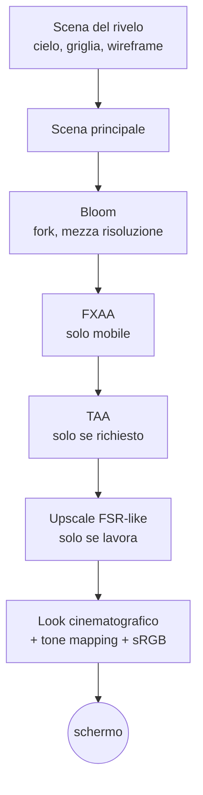

{/*
FONTI: docs/manuale-retro-future/schede/02-rendering.md (ogni riga della scheda porta file:riga o commit).
Blocco 1: scheda §1 (renderer src/main.js:317-364; look src/engine/shaders.js:120-150; AA src/engine/post-pipeline.js:185-189; canonico exposure 0.51, bloom 0.09/0/0.79).
Blocco 2: scheda §2 (8cbaaaf1 GPU-bound CPU ~1.2ms; vendor/README.md bloom costo piu' alto; docs/retro-future-mobile-fill-benchmark.md:112-114; af1f6cd6; eb57f0c9; 54e11f4d).
Blocco 3: scheda §3a-3m.
Blocco 4: scheda §4 e §9 (domande aperte dichiarate come tali).
Blocco 5: scheda §5.
Blocco 6: scheda §6 (wc -l 2026-09-20).
Blocco 7: ponte scritto dall'autore del manuale, senza affermazioni tecniche nuove.
*/}

# Rendering

:::info Se è la prima volta

Disegnare una scena 3D non finisce quando gli oggetti sono a posto: l'immagine passa per una catena di ritocchi, come i filtri di una foto ma calcolati sessanta volte al secondo. Questo capitolo segue quella catena, dal primo disegno all'ultimo pixel.

:::

## Cosa vede l'utente

Una città di notte, con i LED ciano che emettono un alone morbido, i bordi dei palazzi
netti su un computer e un po' più morbidi su un telefono, e sopra tutto una pellicola:
contrasto appena alzato, una deriva verso il ciano, le alte luci che si chiudono
dolcemente, la vignetta ai bordi e una grana che cambia a ogni fotogramma. Chi vuole
la versione pulita aggiunge `?look=classic` all'indirizzo.

## Il problema

Questa demo non è limitata dal processore. La CPU spende circa 1,2 millisecondi a
fotogramma; tutto il resto è la scheda grafica che colora pixel. Quando il costo sta
nel numero di pixel per il costo di ciascuno, ogni scelta di rendering è una scelta
su quanti pixel disegnare e quante volte ripassarci sopra.

Tre cose lo rendono difficile:

- **Il bloom costa più di ogni altra cosa.** L'alone attorno ai LED si ottiene
  estraendo i punti più luminosi, sfocandoli a più livelli e sommandoli: il pass di
  three.js rifà tutto a ogni fotogramma. Il giorno in cui ho alzato la qualità del
  bloom la demo è scesa a circa 20 fotogrammi al secondo, e l'ho riportata indietro lo
  stesso giorno.
- **La risoluzione è la leva più grande.** A pixel ratio 2 si disegnano quattro volte
  i pixel di 1. Tutto il resto scala da lì.
- **L'anti-aliasing non ha una risposta giusta.** FXAA ammorbidisce i bordi ma sfoca;
  MSAA è nitido ma lavora solo nello spazio, non nel tempo, e a bassa risoluzione i
  bordi “tremano” durante il movimento. La prima versione con MSAA sull'iPhone era più
  lenta di FXAA: 34 fotogrammi al secondo.

E c'è una quarta, meno visibile: l'ordine dei passaggi decide se i colori sono
corretti. Sfocare, sommare e regolare il contrasto sono operazioni giuste solo su
valori lineari, prima della conversione per lo schermo. Farle dopo dà un'immagine diversa, e il look della demo era stato tarato
proprio sulla catena sbagliata.

## Come funziona

### Il renderer

Il renderer WebGL di three.js (versione r184, copiata nel repository e servita in
locale) nasce con l'anti-aliasing del contesto spento: l'AA arriva dopo, dalla catena
di post. Il colore finale passa per il tone mapping ACES Filmic e per la conversione
in sRGB; l'esposizione al boot vale 0,51, e viene dal file canonico dei controlli, non
dal codice.

### La catena dei pass

Ogni fotogramma attraversa una fila di passaggi a schermo intero, ognuno dei quali
legge il risultato del precedente e scrive nel successivo:

Un dettaglio che conta: il tone mapping e la conversione in sRGB, cioè la
“codifica di uscita”, stanno in un pass solo, l'ultimo. Ogni shader porta un
segnaposto al posto della codifica, e una funzione decide a chi darla. Una prova
verifica che nessuno shader la contenga da solo e che sia assegnata a uno e un solo
pass. Prima di agosto 2026 la codifica stava dentro il pass di upscale, e il look e il
TAA lavoravano su valori già compressi: un difetto di correttezza, con un indirizzo di
ritorno (`?pipeline=0`) per chi vuole vedere com'era.

### Il bloom, un fork

Il pass di bloom è una copia modificata di quello di three.js. Lavora a metà
risoluzione, con un tetto ulteriore allo 0,28 della finestra, e usa tre dei cinque
livelli di sfocatura invece di tutti. Quando la camera è ferma, ricalcola il bloom un
fotogramma sì e uno no e riusa quello in cache; appena la camera si muove torna a
ogni fotogramma. Durante il rivelo della città il bloom viene saltato del tutto: su telefono
per tutta la fase critica, su computer finché il drone non è atterrato.

C'è un secondo risparmio: quando FXAA, TAA e upscale sono spenti, il bloom non si
somma nel proprio buffer ma viene passato come texture al pass del look, che lo somma
da solo. Un passaggio a schermo intero in meno.

### Anti-aliasing

Su computer: MSAA hardware a 2 campioni, con un accorgimento. Il composer di three.js
clona il buffer multisample anche per il secondo buffer di scambio, e così ogni pass
di post disegnava a 2 campioni per niente. Il secondo buffer è sostituito con uno a
un campione: la scena si risolve una volta, il resto gira a 1x. Su telefono: FXAA.
Il TAA esiste, con jitter di Halton su 8 campioni e clamp del vicinato, e si
accende con `?taa=1` o `?aa=taa`. Nella catena di default tiene la sua memoria
a 16 bit; nella catena storica no.

### L'upscale “FSR-like”

Un pass che permette di disegnare tutta la catena a una risoluzione interna più bassa
(dal 65% al 100%) e ricostruire l'immagine piena con un filtro sensibile ai bordi:
undici letture, il gradiente del vicinato per trovare la direzione del bordo, due
campioni lungo la tangente, e una nitidezza finale che rafforza il dettaglio locale
senza creare aloni. Non deriva dal codice di AMD: è un filtro scritto per questa demo,
e l'ho pensato come un “simil DLSS” fatto in uno shader. Oggi in produzione è spento:
la scala interna è al 100%. Quando è spento e la nitidezza è zero, lo shader emette il
solo pixel centrale e salta le altre dieci letture, e questo è stato dimostrato
identico pixel per pixel confrontando l'hash di due fotogrammi congelati.

### Risoluzione adattiva e budget

Il pixel ratio massimo è 2, con un budget per lo schermo fisico: 1920x1080 se
lo schermo arriva almeno al Full HD, 1280x720 sotto. Ogni 500 millisecondi il ciclo misura i fotogrammi al
secondo e, se il profilo è “auto”, toglie qualità a gradini (0,15 sotto i 45, 0,10
sotto i 54, 0,05 sotto i 58) e la restituisce piano sopra i 59,7, con un tempo di
attesa fra un ritocco e l'altro. In produzione, però, il profilo è “quality”: il
budget automatico esiste e non interviene. Su telefono il pixel ratio è
fisso a 1,7, che è il 72% dei pixel di un 2x.

### Il prewarm al boot

Prima che la città appaia, quattro blocchi preparano la scheda grafica: caricano le
texture della scena, calcolano e caricano le texture delle ossa dei personaggi,
disegnano una volta i personaggi nascosti su un bersaglio di 4x4 pixel per far
compilare i loro shader, e fanno girare due volte la catena di post. Fra un blocco e
l'altro il controllo torna al browser, e la compilazione è lasciata ai thread del
driver dove il browser lo permette. La compilazione avviene con un bersaglio fuori
schermo legato, perché i fotogrammi veri disegnano lì, mai direttamente a schermo, e
la variante compilata dipende da questo.

### Misurare

Un timer GPU (`EXT_disjoint_timer_query`) prende un campione ogni 180 fotogrammi e
classifica il collo di bottiglia: scheda grafica, processore, render o presentazione.
Con `?techBreakdown=1` un pannello mostra fotogrammi al secondo, millisecondi, la
catena dei pass, draw, triangoli e texture.

## Perché così e non altrimenti

- **Bloom leggero, non di qualità.** L'ho alzato una volta (tetto da 0,24 a 0,45,
  cinque livelli, aggiornamento a ogni fotogramma): 20 fotogrammi al secondo. Rimesso
  indietro lo stesso giorno, con un tetto a 0,28. La cache e i tre livelli sono il
  motivo per cui il pass è un fork e non la copia di three.js.
- **MSAA a 2 campioni, non 4.** Quattro campioni sono banda di memoria sulle GPU a
  tile; due dimezzano il costo e risolvono la maggior parte dei bordi. Sulle GPU dei
  telefoni il multisampling si risolve in memoria locale quasi gratis, ed è più
  nitido dove la demo ha davvero l'aliasing: linee dei LED, esagoni, sagome.
- **MSAA su computer, FXAA su telefono.** Sul computer un confronto prima e dopo ha
  mostrato bordi visibilmente più netti con MSAA, e c'è margine. Su telefono l'avevo
  acceso, e l'ho tolto il giorno dopo: l'immagine “tremava” in movimento, perché a
  pixel ratio 1,7 il MSAA non ha una componente temporale e la sfocatura di FXAA
  nasconde il tremolio.
- **1,7 e non 2 su telefono.** Da 1 sono passato a 2 fisso, poi a 1,8 (19% di pixel
  in meno), poi a 1,7 (28% in meno). Decisioni mie, con FXAA che nasconde la leggera morbidezza.
- **La catena colore corretta prima come opzione, poi come default.** Correggere
  l'ordine cambia l'immagine: il 31,7% dei pixel diverso e la luminosità media da
  15,74 a 19,97. Non era una decisione tecnica ma di direzione artistica, quindi
  prima è entrata dietro `?pipeline=linear`, l'ho guardata a schermo, e poi è
  diventata il comportamento normale, con l'indirizzo di ritorno che la regola di
  casa impone per ogni cambiamento visivo dell'anti-aliasing.
- **Le mappe di riflessione della strada sono cotte su richiesta.** Sei
  rasterizzazioni e sei catene di prefiltro al boot, con sei cubemap residenti per
  tutta la sessione, erano troppo per un valore che cambia solo dal pannello.
- **I toggle di debug per sottosistema valgono solo su telefono.** Accesi di default
  e ignorati su desktop: il desktop resta identico byte per byte anche con i
  parametri nell'indirizzo.

Tre cose che non so spiegare, e lo dico:

- Il TAA è stato acceso di default e rimesso opzionale lo stesso giorno di luglio,
  e i commit non dicono quale cancello è fallito.
- Il budget automatico della risoluzione è spento in produzione (profilo “quality”),
  e nessun commit dice da quando o perché.
- Nel ciclo dei fotogrammi non c'è un tetto agli fps: il ciclo si riprenota al
  refresh dello schermo. Fra le scelte che ricordo c'è un “tetto agli fps”, e nel codice non c'è: o è
  stato tolto senza lasciare traccia, o intendevo il budget automatico qui
  sopra.

## I numeri

| cosa | valore | fonte e data |
|---|---|---|
| tetto del bloom | 0,28 della finestra, 3 livelli su 5, aggiornamento ogni 2 fotogrammi da fermi | `src/world/config.js`, letto il 2026-09-20 |
| MSAA | 2 campioni | `src/engine/post-pipeline.js` |
| pixel ratio su telefono | 1,7 fisso (72% dei pixel di un 2x) | `src/config/costanti.js`; commit d6c737d3 |
| budget automatico | soglie 45 / 54 / 58 / 59,7 fps, passi 0,15 / 0,10 / 0,05 / +0,025 | `src/engine/post-pipeline.js` |
| upscale FSR-like | 11 letture in `shaders.js`, scala 0,65..1 e nitidezza
fino a 1,25 in `post-pipeline.js` | letti il 2026-09-20 |
| fast path dell'upscale | render medio da 4,27 a 3,86 ms su M3 | commit 1902c65a, 2026-07-07 |
| bloom di qualità | circa 20 fps | commit 8cbaaaf1, 2026-06-17 |
| primo MSAA su iPhone | 34 fps | commit eb57f0c9, 2026-07-09 |
| catena colore corretta | 31,7% dei pixel cambia, luminosità media 15,74 → 19,97 | commit 5eb888ce, 2026-08-07 |

## Dove sta nel codice

| file | righe | ruolo |
|---|---|---|
| `src/engine/post-pipeline.js` | 788 | composer, bloom, FXAA/MSAA, upscale, TAA, look, risoluzione adattiva, budget |
| `src/engine/frame-loop.js` | 289 | il ciclo dei fotogrammi, contatore fps, resize, timer GPU |
| `src/engine/temporal-aa-pass.js` | 341 | il TAA: profili, jitter, accumulo |
| `src/engine/shaders.js` | 246 | look cinematografico, upscale, segnaposto della codifica |
| `src/engine/boot-prewarm.js` | 313 | i quattro prewarm e l'ordine del boot |
| `src/engine/reflection-env.js` | 114 | mappe di riflessione cotte da canvas |
| `src/world/city-reveal-render-runtime.js` | 257 | i pass del rivelo e il fotogramma composito |
| `vendor/UnrealBloomPass.js` | 569 | il fork del bloom |

Le prove: `bloom-fork.test.mjs` costruisce il pass senza GPU e verifica che i campi
del fork esistano; `cinematic-look.test.mjs` verifica che la codifica di uscita stia
in un pass solo; `temporal-aa-pass.test.mjs` e `performance-mobile.test.mjs` provano
le funzioni pure. L'ordine dentro il ciclo dei fotogrammi è protetto da una prova che
legge il file.

## Per chi viene dal backend

La catena di post è una pipeline di middleware: ogni pass riceve il buffer del
precedente e passa il proprio al successivo, e la codifica di uscita è il serializer
che deve girare una volta sola, alla fine. Il budget della risoluzione è un autoscaler
con soglie e periodo di attesa. Il prewarm è il riscaldamento dei worker prima di
aprire il traffico: compilare gli shader al primo fotogramma utile sarebbe come
compilare il codice alla prima richiesta.
