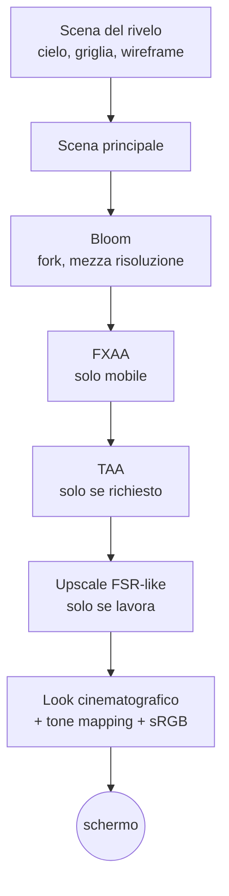

{/*
FONTI: docs/manuale-retro-future/schede/02-rendering.md (ogni riga della scheda porta file:riga o commit).
Blocco 1: scheda §1 (renderer src/main.js:317-364; look src/engine/shaders.js:120-150; AA src/engine/post-pipeline.js:185-189; canonico exposure 0.51, bloom 0.09/0/0.79).
Blocco 2: scheda §2 (8cbaaaf1 GPU-bound CPU ~1.2ms; vendor/README.md bloom costo piu' alto; docs/retro-future-mobile-fill-benchmark.md:112-114; af1f6cd6; eb57f0c9; 54e11f4d).
Blocco 3: scheda §3a-3m.
Blocco 4: scheda §4 e §9 (domande aperte dichiarate come tali).
Blocco 5: scheda §5.
Blocco 6: scheda §6 (wc -l 2026-09-20).
Blocco 7: ponte scritto dall'autore del manuale, senza affermazioni tecniche nuove.
*/}

# Rendering

:::note In breve

WebGLRenderer con tone mapping ACES e uscita sRGB; catena di post con UnrealBloomPass in fork, FXAA o MSAA 2x, TAA opzionale, upscale in shader e grade finale. La codifica di uscita sta in un pass solo, l'ultimo. Risoluzione adattiva con budget a soglie, spento in produzione.

:::

## Cosa vede l'utente

Una città di notte: LED ciano con un alone morbido, bordi dei palazzi netti su
desktop e più morbidi su mobile, e sopra tutto una pellicola con contrasto appena
alzato, deriva verso il ciano, alte luci che si chiudono dolcemente, vignetta ai
bordi e una grana che cambia a ogni frame. La versione pulita sta dietro
`?look=classic`.

## Il problema

Questa demo è GPU-bound. La CPU spende circa 1,2 ms a frame; tutto il resto è la
GPU che colora pixel. Il costo è il numero di pixel per il costo di ciascuno, quindi
ogni scelta di rendering decide quanti pixel disegnare e quante volte ripassarci
sopra.

3 cose lo rendono difficile:

- **Il bloom costa più di tutto il resto.** L'alone attorno ai LED si ottiene
  estraendo i punti più luminosi, sfocandoli su più mip e sommandoli, e
  UnrealBloomPass rifà tutto a ogni frame. Il giorno in cui ne ho alzato la qualità
  la demo è scesa a circa 20 fps, rimessa indietro lo stesso giorno.
- **La risoluzione è la leva più grande.** A pixel ratio 2 si disegnano 4 volte
  i pixel di 1. Tutto il resto scala da lì.
- **L'anti-aliasing non ha una risposta giusta.** FXAA ammorbidisce i bordi ma sfoca;
  MSAA è nitido ma lavora solo nello spazio, non nel tempo, e a bassa risoluzione i
  bordi “tremano” durante il movimento. La prima versione con MSAA su iPhone stava
  sotto FXAA: 34 fps.

E ce n'è una quarta, meno visibile: l'ordine dei pass decide se i colori sono
corretti. Sfocare, sommare e alzare il contrasto valgono solo su valori lineari,
prima della conversione in sRGB. Farlo dopo dà un'immagine diversa, e il look della
demo era stato tarato proprio sulla catena sbagliata.

## Come funziona

### Il renderer

Il renderer WebGL di three.js (r184, copiato nel repository e servito in locale)
nasce con l'anti-aliasing del contesto spento: l'AA arriva dopo, dalla catena di
post. Il colore finale passa per il tone mapping ACES Filmic e per la conversione in
sRGB; l'esposizione al boot vale 0,51 e viene dal file canonico dei controlli, non
dal codice.

### La catena dei pass

Ogni frame attraversa una fila di pass a schermo intero, ognuno legge il target del
precedente e scrive nel successivo:

Tone mapping e conversione in sRGB, la “codifica di uscita”,
stanno in un pass solo, l'ultimo. Ogni shader porta un segnaposto al suo posto e una
funzione decide a chi assegnarla; un test verifica che nessuno shader la contenga per
conto suo e che finisca in uno e un solo pass. Prima di agosto 2026 la codifica stava
dentro il pass di upscale, e look e TAA lavoravano su valori già compressi: un difetto
di correttezza, con `?pipeline=0` per vedere com'era.

### Il bloom, un fork

Il pass di bloom è un fork di UnrealBloomPass. Lavora a metà risoluzione, con un
tetto ulteriore allo 0,28 della finestra, e usa 3 dei 5 mip di sfocatura invece di
tutti. A camera ferma ricalcola un frame sì e uno no e riusa la cache; al primo
movimento torna a ogni frame. Durante il rivelo della città il bloom salta del tutto:
su mobile per tutta la fase critica, su desktop finché il drone non è atterrato.

Secondo risparmio: con FXAA, TAA e upscale spenti il bloom non si somma nel proprio
target ma arriva come uniform texture al pass del look, che lo somma da sé. Un pass a
schermo intero in meno.

### Anti-aliasing

Su desktop MSAA hardware a 2 campioni, con un accorgimento. EffectComposer clona il
WebGLRenderTarget multisample anche per il secondo buffer di scambio, e ogni pass di
post finiva per disegnare a 2 campioni per niente. Il secondo target è sostituito con
uno a 1 campione: la scena si risolve una volta, il resto gira a 1x. Su mobile FXAA.
Il TAA c'è, con jitter di Halton su 8 campioni e clamp del vicinato, e si accende con
`?taa=1` o `?aa=taa`. Nella catena di default tiene l'accumulo in HalfFloat; nella
catena storica no.

### L'upscale “FSR-like”

Disegna tutta la catena a una risoluzione interna più bassa (dal 65% al 100%) e
ricostruisce l'immagine piena con un filtro sensibile ai bordi: 11 letture, il
gradiente del vicinato per la direzione del bordo, 2 campioni lungo la tangente,
nitidezza finale che rafforza il dettaglio locale senza creare aloni. Non deriva dal
codice di AMD: è uno shader scritto per questa demo, pensato come un “simil DLSS”.
Oggi in produzione è spento, scala interna al
100%; in quel caso, con nitidezza a zero, lo shader emette il solo pixel centrale e
salta le altre 10 letture, e il fast path è dimostrato identico pixel per pixel
dall'hash di 2 frame congelati.

### Risoluzione adattiva e budget

Il pixel ratio massimo è 2, con un budget legato allo schermo fisico: 1920x1080 da
Full HD in su, 1280x720 sotto. Ogni 500 ms il ciclo misura gli fps e, se il profilo è
“auto”, toglie qualità a gradini (0,15 sotto 45, 0,10 sotto 54, 0,05 sotto 58) e la
restituisce piano sopra 59,7, con un'attesa fra un ritocco e l'altro. In produzione il
profilo è “quality”: il budget automatico esiste e non interviene. Su mobile il pixel
ratio è fisso a 1,7, il 72% dei pixel di un 2x.

### Il prewarm al boot

Prima che la città appaia, 4 blocchi preparano la GPU: caricano le texture della
scena, calcolano e caricano le texture delle ossa dei personaggi, disegnano una volta
i personaggi nascosti su un WebGLRenderTarget di 4x4 pixel per far compilare i loro
shader, e fanno girare 2 volte la catena di post. Fra un blocco e l'altro il controllo
torna al browser, e la compilazione va ai thread del driver dove il browser lo
permette. Avviene con un WebGLRenderTarget fuori schermo legato, perché i frame veri
disegnano lì, mai a schermo, e la variante compilata dipende da questo.

### Misurare

Un timer GPU (`EXT_disjoint_timer_query`) campiona ogni 180 frame e classifica il
collo di bottiglia: GPU, CPU, render o presentazione. Con `?techBreakdown=1` un
pannello mostra fps, millisecondi, la catena dei pass, draw call, triangoli e texture.

## Perché così e non altrimenti

- **Bloom leggero, non di qualità.** L'ho alzato una volta (tetto da 0,24 a 0,45,
  5 mip, aggiornamento a ogni frame): 20 fps. Rimesso indietro lo stesso giorno, con
  un tetto a 0,28. La cache e i 3 mip sono il motivo per cui il pass è un fork e non
  UnrealBloomPass così com'è.
- **MSAA a 2 campioni, non 4.** La decisione è di quando MSAA era attivo anche
  su mobile: sulle GPU a tile il multisampling si risolve in memoria locale
  quasi gratis, ma 4 campioni sono banda, e 2 dimezzano il costo risolvendo la
  maggior parte dei bordi. Resta la scelta giusta anche ora che su mobile c'è
  FXAA: 2 campioni bastano dove la demo ha davvero aliasing, cioè linee dei
  LED, esagoni e sagome.
- **MSAA su desktop, FXAA su mobile.** Su desktop un confronto prima e dopo ha
  mostrato bordi visibilmente più netti con MSAA, e c'è margine. Su mobile l'avevo
  acceso e l'ho tolto il giorno dopo: l'immagine “tremava” in movimento, perché a
  pixel ratio 1,7 MSAA non ha una componente temporale, mentre la sfocatura di FXAA
  nasconde il tremolio.
- **1,7 e non 2 su mobile.** Da 1 a 2 fisso, poi 1,8 (19% di pixel in meno), poi
  1,7 (28% in meno). Decisioni mie, con FXAA a nascondere la morbidezza residua.
- **La catena colore corretta prima come opzione, poi come default.** Correggere
  l'ordine cambia l'immagine: 31,7% dei pixel diverso e luminosità media da
  15,74 a 19,97. Non era una decisione tecnica ma di direzione artistica, quindi è
  entrata dietro `?pipeline=linear`, l'ho guardata a schermo e poi è diventata il
  default, con l'URL di ritorno che la regola di casa impone per ogni cambiamento
  visivo dell'anti-aliasing.
- **Le mappe di riflessione della strada sono cotte su richiesta.** 6
  rasterizzazioni e 6 catene di prefiltro PMREM al boot, con 6 cubemap residenti per
  tutta la sessione, erano troppo per un valore che cambia solo dal pannello.
- **I toggle di debug per sottosistema valgono solo su mobile.** Accesi di default
  e ignorati su desktop, che resta identico byte per byte anche con i parametri
  nell'URL.

3 cose che non so spiegare, e lo dico:

- Il TAA è stato acceso di default e rimesso opzionale lo stesso giorno di luglio,
  e i commit non dicono quale cancello è fallito.
- Il budget automatico della risoluzione è spento in produzione (profilo “quality”),
  e nessun commit dice da quando o perché.
- Nel ciclo dei frame non c'è un tetto agli fps: si riprenota al refresh dello
  schermo. Fra le scelte che ricordo c'è un “tetto agli fps” che nel codice non
  esiste: o è stato tolto senza lasciare traccia, o intendevo il budget automatico
  qui sopra.

## I numeri

| cosa | valore | fonte e data |
|---|---|---|
| tetto del bloom | 0,28 della finestra, 3 mip su 5, aggiornamento ogni 2 frame da fermi | `src/world/config.js`, letto il 2026-09-20 |
| MSAA | 2 campioni | `src/engine/post-pipeline.js` |
| pixel ratio su mobile | 1,7 fisso (72% dei pixel di un 2x) | `src/config/costanti.js`; commit d6c737d3 |
| budget automatico | soglie 45 / 54 / 58 / 59,7 fps, passi 0,15 / 0,10 / 0,05 / +0,025 | `src/engine/post-pipeline.js` |
| upscale FSR-like | 11 letture (`shaders.js`), scala 0,65..1 e nitidezza fino a 1,25 (`post-pipeline.js`) | letti il 2026-09-20 |
| fast path dell'upscale | render medio da 4,27 a 3,86 ms su M3 | commit 1902c65a, 2026-07-07 |
| bloom di qualità | circa 20 fps | commit 8cbaaaf1, 2026-06-17 |
| primo MSAA su iPhone | 34 fps | commit eb57f0c9, 2026-07-09 |
| catena colore corretta | 31,7% dei pixel cambia, luminosità media 15,74 → 19,97 | commit 5eb888ce, 2026-08-07 |

## Dove sta nel codice

| file | righe | ruolo |
|---|---|---|
| `src/engine/post-pipeline.js` | 788 | composer, bloom, FXAA/MSAA, upscale, TAA, look, risoluzione adattiva, budget |
| `src/engine/frame-loop.js` | 289 | il ciclo dei frame, contatore fps, resize, timer GPU |
| `src/engine/temporal-aa-pass.js` | 341 | il TAA: profili, jitter, accumulo |
| `src/engine/shaders.js` | 246 | look cinematografico, upscale, segnaposto della codifica |
| `src/engine/boot-prewarm.js` | 313 | i quattro prewarm e l'ordine del boot |
| `src/engine/reflection-env.js` | 114 | mappe di riflessione cotte da canvas |
| `src/world/city-reveal-render-runtime.js` | 257 | i pass del rivelo e il frame composito |
| `vendor/UnrealBloomPass.js` | 569 | il fork del bloom |

I test: `bloom-fork.test.mjs` costruisce il pass senza GPU e verifica i campi del
fork; `cinematic-look.test.mjs` che la codifica di uscita stia in un pass solo;
`temporal-aa-pass.test.mjs` e `performance-mobile.test.mjs` provano le funzioni pure.
L'ordine dentro il ciclo dei frame è protetto da un test che legge il file.

## Per chi viene dal backend

La catena di post è una pipeline di middleware: ogni pass riceve il target del
precedente e passa il proprio al successivo, e la codifica di uscita è il serializer
che deve girare una volta sola, alla fine. Il budget della risoluzione è un autoscaler
con soglie e cooldown. Il prewarm è il warm-up dei worker prima di aprire il traffico:
compilare gli shader al primo frame utile sarebbe come compilare alla prima richiesta.
