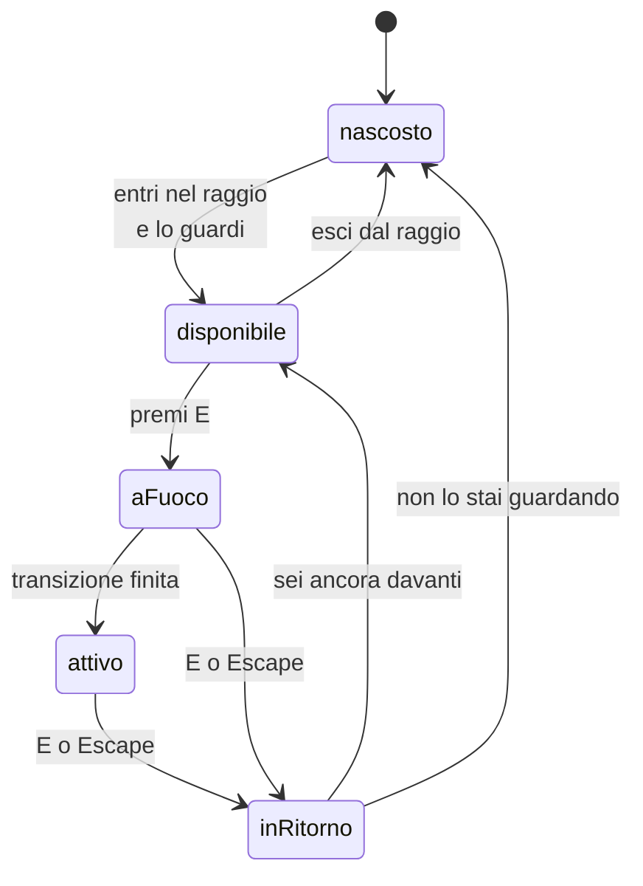

{/*
FONTI: docs/manuale-retro-future/schede/06-camera-movimento-terminale.md, sottosezioni "Terminale contatti" delle sezioni 1-6 e 9.
Blocco 1: §1 (tabellone 31,5 x 15,75 davanti al civico 2; si dissolve col fattore di rivelo; bottone [E] INTERAGISCI entro 42 e allineamento 0,45; transizione 680 ms a 24 unità; sparizione di joystick, HUD, disco; riga selezionata ambra; frecce ed Enter; mouse con raycast; ritorno 540 ms e pointer lock; prefers-reduced-motion; history back su mobile; live region e link veri; bersagli 44/48 px).
Blocco 2: §2 (il terminale deve possedere la camera; il tasto arriva prima di keys, 9167e680; la posa salvata deve essere pulita; il pannello trasparente non scrive profondità, 796a289b; il tasto indietro; pointermove non coalescente; il cartello di chi accoglie spostato).
Blocco 3: §3 Terminale e §5 (macchina a stati; disponibilità; transizione; canvas 1024x512; bersagli di hit; render order; accessori invece di snapshot; media query costruita una volta; rettangolo in cache).
Blocco 4: §4 Terminale (typedef intero e non any; elStrip mai letto; StatoTerminale verificato; accessori per non allocare; matchMedia una volta; rect in cache; pointermove differito; il traverse riassegna depthWrite e la prova legge il materiale; lo stub è un EventTarget decorato; il cartello spostato da 2,4 a 5,2).
Blocco 5: §5 Terminale.
Blocco 6: §5-6 Terminale (righe e prove).
Blocco 7: analogia scritta qui.
*/}

# Terminale contatti

:::info Se è la prima volta

Un oggetto dentro la scena che si usa davvero: ci si avvicina, si preme un tasto, la camera ci va davanti e si può scegliere email o telefono. Dietro c'è una macchina a stati che prende il controllo della camera e deve restituirla esattamente come l'ha presa.

:::

## Cosa vede l'utente

Davanti al palazzo con il numero civico 2 c'è un tabellone: “AVSTUDIO CONTACT
TERMINAL”, sotto “SECURE DIRECT CHANNELS”, a destra “NODE 02 / ONLINE”, e due righe,
l'email e il telefono. Avvicinandosi e guardandolo compare in basso il bottone
“[E] INTERAGISCI”.

Premendo E la camera scivola davanti al tabellone in poco più di mezzo secondo e lo
inquadra frontalmente. Sparisce tutto il resto: joystick, indicatore dei tasti,
pannello dei tempi, cursore a disco. Resta una freccia in alto a sinistra per tornare
indietro. Le frecce scorrono le due righe, la riga scelta si accende in ambra, Invio
apre il client di posta o il telefono.

## Il problema

Il terminale deve **possedere la camera**. Mentre lo leggi, il movimento non deve
girare, l'oscillazione del passo non deve muovere la vista, il mouse non deve
ruotarla. Se anche solo lo scarto del passo restasse attivo, il testo tremerebbe
mentre lo leggi.

Deve anche **prendersi i tasti prima degli altri**. Se E o le frecce finissero prima
nella mappa dei tasti premuti, il personaggio camminerebbe mentre scorri i contatti.

E deve **restituire la camera dove l'ha presa**. La posa salvata all'ingresso deve
essere quella pulita, senza lo scarto del passo: salvandola con lo scarto, al ritorno
la camera resterebbe alzata di qualche centimetro, ogni volta.

Un'ultima insidia: il tabellone è un pannello trasparente. Se scrivesse nel buffer di
profondità, coprirebbe i fumetti dei personaggi che gli passano davanti.

## Come funziona

### Cinque stati

Il passaggio da nascosto a disponibile ha due condizioni: distanza orizzontale non
oltre 42 unità e allineamento dello sguardo almeno 0,45. Sono provate al confine:
42,001 e 0,449 non bastano. La camera è “posseduta” nei tre stati centrali, ed è
esattamente lì che il ciclo del fotogramma salta movimento e oscillazione.

### La transizione

Entrando, la camera interpola posizione e rotazione fino a un punto a 24 unità dalla
superficie del tabellone, in 680 millisecondi; uscendo, rifà il percorso al contrario
in 540. Con la preferenza di sistema per il movimento ridotto le due transizioni sono
istantanee. Su computer, al ritorno, il mouse si riaggancia da solo e richiede il
blocco del puntatore se prima era attivo.

### Il testo è una texture

Il contenuto del tabellone è disegnato su un canvas da 1024 per 512 pixel e caricato
come texture: titolo, sottotitolo, le due righe, il segno di selezione, e la riga di
stato in basso che passa da “DIRECT ROUTING READY” a “SELECT CHANNEL / ENTER TO
CONNECT”. Si ridisegna solo quando qualcosa cambia.

### Il puntatore

Due rettangoli invisibili davanti alle righe fanno da bersaglio per il raggio del
puntatore: passandoci sopra si seleziona, cliccando si attiva. Il movimento del
puntatore non è garantito una volta per fotogramma, i mouse ad alta frequenza ne
mandano diversi: il gestore registra solo l'ultima posizione e il controllo vero si fa
una volta per fotogramma. Il rettangolo del canvas viene misurato una volta e tenuto
fino al ridimensionamento, invece che a ogni evento.

### Tastiera, telefono, accessibilità

I tasti passano dal terminale prima di finire nella mappa dei tasti premuti: E e
Escape entrano ed escono, le frecce scorrono, Invio apre il collegamento. Sul telefono,
entrare aggiunge una voce alla cronologia del browser, così il tasto indietro chiude il
terminale invece di uscire dalla pagina. Per gli screen reader ci sono i due
collegamenti veri in un gruppo etichettato e una regione che annuncia i cambi di stato.
I bersagli tattili sono almeno 44 pixel, 48 sul telefono.

## Perché così e non altrimenti

- **Il tipo delle dipendenze è scritto per intero, non lasciato libero.** Il terminale
  riceve scena, camera, renderer, bottoni ed elenco dei palazzi da chi lo monta, e il
  controllo dei tipi li deduceva dai soli valori di riserva: per lui non esistevano.
  Dove le prove passano un oggetto finto, il tipo dice il minimo che il codice tocca,
  non un elemento del DOM intero.
- **Gli accessori esistono per non allocare.** Una fotografia dello stato costruisce un
  oggetto con sei campi ogni volta che la chiedi, e i percorsi che girano a ogni
  fotogramma ne leggono uno solo.
- **La media query per il movimento ridotto è costruita una volta.** Costruirla a ogni
  richiesta alloca un oggetto nuovo, e viene letta a ogni fotogramma durante la
  transizione.
- **La prova legge il materiale, non il testo del codice.** A decidere se il pannello
  scrive nel buffer di profondità non è il valore scritto alla costruzione, ma la
  visita che lo riassegna dopo: una prova che cercava quel valore nel sorgente passava
  mentre il comportamento era l'opposto.
- **L'oggetto finto delle prove è un bersaglio di eventi decorato**, non un elemento
  del DOM finto: elenca solo quello che il codice tocca davvero, e così la prova resta
  onesta senza allargare i tipi.

Cose che non so spiegare, e lo dico:

- Il cartello di chi accoglie l'ho spostato più a destra perché finiva sopra il
  terminale. Il valore di partenza era così dalla prima versione, e non ha una ragione
  scritta da nessuna parte.
- Le due soglie che rendono il terminale disponibile, 42 unità di distanza e 0,45 di
  allineamento, sono provate al confine ma non motivate: non so perché siano proprio
  quelle.

## I numeri

| cosa | valore | fonte e data |
|---|---|---|
| tabellone | 31,5 x 15,75 unità, texture 1024 x 512 | `contact-terminal.js`, 2026-09-20 |
| soglia di disponibilità | distanza 42, allineamento 0,45 | stesso file, con prove al confine |
| distanza di lettura | 24 unità dalla superficie | stesso file |
| transizioni | 680 ms all'andata, 540 ms al ritorno | stesso file |
| opacità del pannello | 0,322; del testo 0,84 | stesso file |
| ordine di disegno | gruppo 30, pannello 28, testo 32, bersagli 34 | stesso file |
| bersagli del puntatore | 86% della larghezza, 24,5% dell'altezza | stesso file |
| bottoni | almeno 188 x 44 px, 154 x 48 sul touch | foglio di stile |
| errori di tipo chiusi qui | 23 + 4, poi 13 + 5 + 1, poi 10 nella prova | commit del 2026-09-20 |

## Dove sta nel codice

| file | righe | ruolo |
|---|---|---|
| `src/world/contact-terminal.js` | 939 | tutto: stati, transizione, canvas, puntatore, cronologia |
| `src/world/board-perimeter-pose.js` | 78 | dove si posa il tabellone rispetto al palazzo |
| `src/world/contact-terminal.test.mjs` | 424 | quattordici prove, con oggetti finti |
| `src/controls/contact-terminal-input.test.mjs` | 86 | quattro prove sull'instradamento dei tasti |

La prova sull'instradamento prima controllava l'ordine delle righe nel file; ora preme
un tasto su una finestra finta e guarda dove arriva. La controprova, cioè scrivere nella
mappa dei tasti prima di interpellare il terminale, la fa diventare rossa.

## Per chi viene dal backend

È una macchina a stati che prende un lock esclusivo su una risorsa condivisa, la
camera, e deve rilasciarlo esattamente nello stato in cui l'ha preso: per questo la
posa si salva pulita, prima che gli altri sottosistemi ci scrivano sopra. L'ordine dei
gestori dei tasti è una catena di handler dove il primo che consuma l'evento
interrompe la catena. E il controllo del puntatore una volta per fotogramma, invece che
a ogni evento, è la stessa cosa che si fa con un flusso di eventi troppo fitto: si
tiene l'ultimo e si elabora al ritmo del consumatore.
