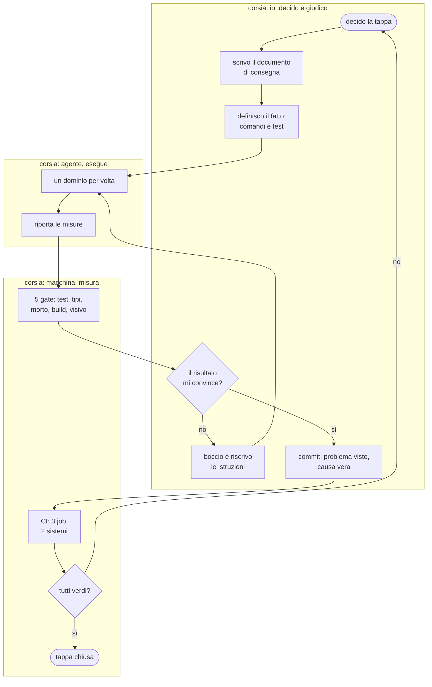
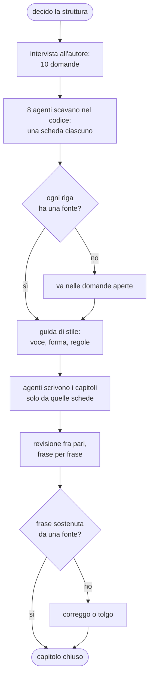

{/*
FONTI
- git log sul branch feat/retro-future-en, misurato il 2026-09-20: 457 commit sulla demo dal 2026-06-03, esclusi i 12 del manuale (git log -- public/tecnologie/retro-future ':!.../doc'); 19 commit il 18 settembre, 55 il 19, 25 il 20; tipi di commit: refactor 134, feat 115, perf 98, fix 79, docs 15, test 13.
- docs/retro-future-tappa5-opus.md (149 righe) e docs/retro-future-typecheck-opus.md (191 righe): i due documenti di consegna, con mappa del debito, ordine consigliato, criterio di arresto, trappole.
- docs/manuale-retro-future/guida-stile.md (42 righe): le regole date a chi scrive i capitoli.
- docs/manuale-retro-future/schede/ (8 schede di fatti) e verifiche/ (12 rapporti): la materia prima e la rilettura incrociata di questo manuale.
- scripts/retro-future-typecheck.mjs (soglia a cricchetto), scripts/retro-future-codice-morto.mjs, scripts/retro-future-visual-gate.mjs, .github/workflows/retro-future.yml (tre job).
- I numeri dei controlli: npm run test/typecheck/morto/build e il comparatore visivo, eseguiti il 2026-09-20.
- La nota sui diagrammi: notazione ispirata a BPMN (corsie, gateway, eventi), non BPMN conforme. Dichiarato nel testo.
*/}

# Come è organizzato il lavoro

:::note In breve

Il vincolo è la velocità di produzione degli agenti contro la mia capacità di revisione. La risposta è procedurale: tappe con documento di consegna e criterio di arresto, definizione di fatto eseguibile, 5 gate bloccanti prima di ogni commit, e separazione fra chi produce, chi verifica e chi decide.

:::

## Cosa vede l'utente

Niente, di nuovo: è un capitolo di processo. Quello che si vede è il repository. 457
commit dal 3 giugno in conventional commits, con un corpo che dice il problema visto e
la causa vera. Un branch per la demo, in un git worktree separato dal sito. Documenti
di consegna scritti prima di ogni tappa grossa. E, accanto ai moduli, i test.

## Il problema

Il vincolo di partenza: **sono una persona sola, e gli agenti di coding scrivono
codice più in fretta di quanto io possa leggerlo.**

In 3 giorni di settembre sono entrati 66 commit sulla demo, e ne ho letto per
intero solo una parte. Un metodo che mi chieda di rileggere tutto non scala; uno che si
fidi e basta produce un sistema che nessuno controlla più.

Altri 3 vincoli, che chiunque coordini lavoro tecnico riconosce:

- **Il lavoro non è verificabile a occhio.** Un refactor può lasciare la scena
  identica e romperla in un caso su 10.
- **Il contesto si perde.** Una decisione presa a giugno, senza il motivo scritto
  accanto, a settembre è indistinguibile da un errore.
- **La qualità non regredisce da sola: regredisce se nessuno la misura.** Alla prima
  fretta, il primo controllo che salta è quello che costa di più.

## Come funziona

### Il ciclo, chi fa cosa

Il diagramma prende da BPMN corsie, gateway ed eventi di inizio e fine. Non è BPMN
conforme: è un flowchart Mermaid che ne usa la grammatica.

La parte che conta è dove stanno i confini. Io decido e giudico. L'agente esegue un
dominio per volta. La macchina misura, e la sua risposta non è negoziabile.

### La tappa, e il documento che la apre

Il lavoro grosso è diviso in tappe. Ogni tappa ha un documento scritto **prima** di
cominciare, sempre con le stesse 6 voci:

1. **Dove sei**: il git worktree, il branch, i comandi.
2. **Cosa è già stato fatto**, con i numeri veri.
3. **Il problema, misurato e non assunto.** Il documento della tappa sui tipi si apre
   con una tabella: 524 errori divisi per causa, con quanti ne chiude ognuna.
4. **L'ordine consigliato, con le attese dichiarate come attese.** Non “farai 350
   correzioni”, ma “ci si aspetta un calo di circa 350: se non arriva, la mappa è
   sbagliata”.
5. **Cosa non fare**, con i motivi.
6. **Le trappole già costate care**, ognuna con la cicatrice.

Sono 149 e 191 righe, per lavori che hanno prodotto decine di commit: scrivere le
istruzioni costa una frazione dell'esecuzione, ed è il miglior investimento del
metodo.

### La definizione di fatto

Ogni tappa dichiara in anticipo quando è finita, in termini eseguibili. Per la tappa
sui tipi: conteggio sotto soglia, soglia allineata al valore vero, ogni errore rimasto
guardato almeno una volta, 0 codice morto, test e build verdi a ogni commit intermedio,
non solo all'ultimo.

La fine non è un giudizio, è una misura: non decido io quando ho finito.

### I cinque cancelli

Prima di ogni commit girano 5 gate bloccanti. [Qualità e
controlli](./qualita-e-controlli.mdx) li descrive per esteso; qui conta la funzione
organizzativa: **sono l'unico punto in cui il processo può dire di no a me.**

Due hanno una proprietà che vale la pena rubare altrove: typecheck e codice morto
hanno una soglia che **può solo scendere**. Il numero sta nello script, il gate
fallisce se sale e chiede di abbassarlo quando scende: un debito a cricchetto non torna
indietro, e nessuno deve ricordarsi di controllarlo.

### Delegare e verificare

Gli agenti di coding ricevono istruzioni scritte, non richieste a voce. Per questo
manuale la catena è stata questa:

3 regole tengono in piedi la catena:

- **Chi scava non scrive, chi scrive non verifica.** Le schede le producono agenti
  diversi da quelli che scrivono i capitoli; la revisione fra pari la fa un terzo che
  non ha scritto niente. Chi ha scritto una frase è il peggior revisore di quella
  frase.
- **Le fonti prima della prosa.** Nessuno scrive una riga prima che esista la scheda,
  e nessun capitolo può contenere qualcosa che la scheda non dica.
- **Quello che non si sa resta scritto come non saputo.** Le schede hanno una sezione
  apposta, 149 voci in tutto, e i capitoli le riportano invece di
  inventare una spiegazione plausibile.

La revisione ha trovato 23 frasi senza fonte, comprese 2 didascalie che promettevano
un'immagine diversa da quella mostrata. Tutte in capitoli che avevano già
passato il mio controllo.

### Quando qualcosa va storto

Il metodo prevede l'errore invece di sperare che non arrivi. 3 esempi veri, dichiarati
anche nei capitoli tecnici:

- **Un numero che scende troppo in fretta è un sospetto, non una vittoria.** Un `any`
  aveva fatto sparire 305 errori in un colpo: sembrava un miglioramento, erano tutti
  veri.
- **Un controllo verde non dimostra di aver controllato.** Un job di CI filtrato sul
  branch sbagliato non era mai partito, e per giorni il suo verde non voleva dire
  niente.
- **Ogni trappola diventa un test.** Non basta correggere: si rimette in circolo il
  difetto e si verifica che il gate diventi rosso. 5 trappole reintrodotte una per
  volta, 5 test accesi.

## Perché così e non altrimenti

- **Un dominio per commit, non un commit per sessione.** Quando due cose cambiano
  insieme e qualcosa si rompe, non si sa quale delle due: il costo è più commit, il
  guadagno è che ogni commit è revertibile da solo.
- **Il messaggio dice il problema e la causa, non l'intervento.** Fra 3 mesi il
  codice si legge da sé; quello che non si ricostruisce è perché quel giorno sembrava
  giusto così. I tipi più frequenti sono refactor, feat e perf, in quest'ordine: la
  forma di un progetto rifinito, non scritto una volta sola.
- **Le istruzioni sono scritte prima, non durante.** Il documento di consegna
  costringe a misurare il problema prima di toccarlo: è quello che ha evitato di
  correggere 524 errori uno per uno quando le cause erano 5.
- **Le attese sono dichiarate come attese.** “Ci si aspetta un calo di 300; se non
  arriva, fermati”: è un criterio di arresto, e senza, un esecutore continua a eseguire
  anche quando il piano è sbagliato.
- **I gate girano prima del commit, non prima del rilascio.** Un difetto trovato
  10 commit dopo costa la ricostruzione di 10 commit.
- **I documenti di lavoro non vanno in produzione.** Il build della demo li esclude e
  si ferma se ne trova uno: la trasparenza interna non deve diventare superficie
  pubblica.

Cose che non so spiegare, e lo dico:

- Non ho una misura del tempo risparmiato da questo metodo. So quanti difetti ha
  intercettato, non quanto sarebbe costato scoprirli dopo.
- La soglia a cricchetto funziona per numeri che scendono, come errori e codice morto.
  Non ho trovato il modo di applicarla alla qualità della prosa o della resa visiva,
  dove il gate visivo dice solo se è cambiato qualcosa, non se è migliorato.

## I numeri

| cosa | valore | fonte e data |
|---|---|---|
| commit sulla demo | 457, dal 3 giugno al 20 settembre 2026 (il manuale ne ha 12 suoi) | `git log`, 2026-09-20 |
| commit nei 3 giorni di risanamento | 15, 38 e 13 fra il 18 e il 20 settembre | `git log`, 2026-09-20 |
| tipi di commit | refactor 134, feat 115, perf 98, fix 79 | `git log`, 2026-09-20 |
| tappe del risanamento | 8, ognuna con la sua definizione di fatto | documenti di consegna |
| documenti di consegna | 149 e 191 righe, scritti prima di iniziare | `wc -l`, 2026-09-20 |
| gate prima di ogni commit | 5 | `package.json` e il gate visivo |
| job di CI | 3, su 2 sistemi operativi | `.github/workflows/retro-future.yml` |
| schede di fatti per questo manuale | 8, con 149 domande aperte dichiarate | `docs/manuale-retro-future/schede/` |
| rapporti di revisione | 12, circa 1.400 frasi controllate | `docs/manuale-retro-future/verifiche/` |
| frasi senza fonte trovate dalla revisione | 23 | stessi rapporti |

## Dove sta nel codice

| file | ruolo |
|---|---|
| `docs/retro-future-tappa5-opus.md` | il documento di consegna della tappa che ha spezzato `main.js` |
| `docs/retro-future-typecheck-opus.md` | quello della tappa sui tipi, con la mappa del debito e il criterio di arresto |
| `docs/manuale-retro-future/guida-stile.md` | le regole date a chi scrive i capitoli |
| `docs/manuale-retro-future/schede/` | la materia prima: 8 schede di fatti con le fonti |
| `docs/manuale-retro-future/verifiche/` | i rapporti di revisione, uno per capitolo |
| `scripts/retro-future-typecheck.mjs` | la soglia a cricchetto |
| `.github/workflows/retro-future.yml` | i 3 job GitHub Actions, con i filtri e le 2 baseline |

## Per chi viene dal backend

È controllo qualità in linea invece che a campione: i gate sono sincroni e bloccanti,
e la soglia a cricchetto è un error budget che può solo migliorare, come un SLO che non
si abbassa mai. La separazione fra chi produce, chi verifica e chi decide è quella di
una revisione fra pari, solo che il produttore è una macchina e il revisore un'altra:
il ruolo umano si sposta dal produrre al definire il fatto e al giudicare il risultato.
I documenti di consegna sono specifiche con criteri di accettazione, scritte prima,
criterio di arresto incluso.
