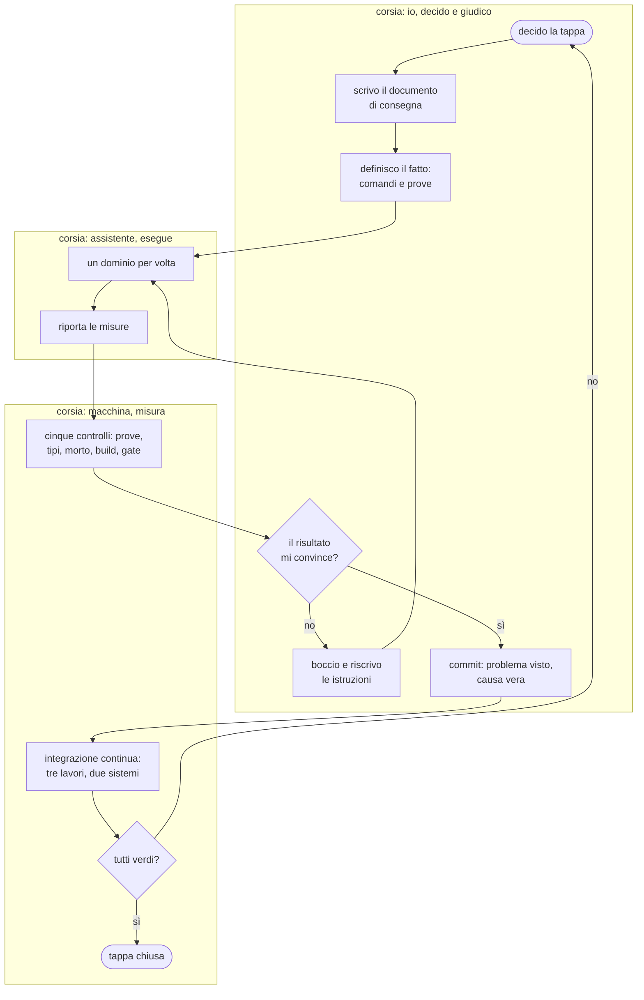
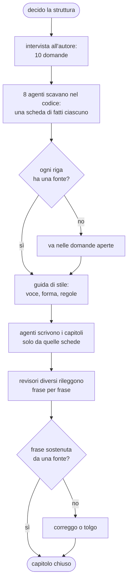

{/*
FONTI
- git log sul branch feat/retro-future-en, misurato il 2026-09-20: 459 commit sulla demo dal 2026-06-03; 19 commit il 18 settembre, 55 il 19, 25 il 20; tipi di commit: refactor 134, feat 115, perf 98, fix 79, docs 15, test 13.
- docs/retro-future-tappa5-opus.md (149 righe) e docs/retro-future-typecheck-opus.md (191 righe): i due documenti di consegna, con mappa del debito, ordine consigliato, criterio di arresto, trappole.
- docs/manuale-retro-future/guida-stile.md (42 righe): le regole date a chi scrive i capitoli.
- docs/manuale-retro-future/schede/ (8 schede di fatti) e verifiche/ (12 rapporti): la materia prima e la rilettura incrociata di questo manuale.
- scripts/retro-future-typecheck.mjs (soglia a cricchetto), scripts/retro-future-codice-morto.mjs, scripts/retro-future-visual-gate.mjs, .github/workflows/retro-future.yml (tre job).
- I numeri dei controlli: npm run test/typecheck/morto/build e il comparatore visivo, eseguiti il 2026-09-20.
- La nota sui diagrammi: notazione ispirata a BPMN (corsie, gateway, eventi), non BPMN conforme. Dichiarato nel testo.
*/}

# Come è organizzato il lavoro

:::info Se è la prima volta

Questo capitolo non parla di grafica. Parla di come si tiene insieme un progetto in
cui il codice lo scrivono degli assistenti automatici, più in fretta di quanto una
persona sola riesca a leggerlo. È il capitolo che riguarda chiunque coordini lavoro
tecnico, anche senza scriverne una riga.

:::

## Cosa vede l'utente

Niente, di nuovo: questo è un capitolo di processo. Quello che si vede è il
repository. Quattrocentocinquantanove commit dal 3 giugno, ognuno con un tipo davanti
al titolo e un corpo che dice il problema visto e la causa vera. Un ramo per la demo,
separato dal sito. Documenti di consegna scritti prima di iniziare ogni tappa grossa.
E, accanto ai moduli, le prove che li verificano.

## Il problema

Il vincolo di partenza è questo: **sono una persona sola, e gli assistenti scrivono
codice più in fretta di quanto io possa leggerlo.**

Nelle due giornate più intense di settembre sono entrati settantaquattro commit, e ho
letto per intero solo una parte del codice che contengono. Un metodo che richieda a me
di rileggere tutto non scala. Un metodo che si fidi e basta produce un sistema che
nessuno controlla più.

Ci sono altri tre vincoli, che chiunque coordini lavoro tecnico riconosce:

- **Il lavoro non è verificabile a occhio.** Un riordino del codice può lasciare la
  scena identica e romperla in un caso su dieci.
- **Il contesto si perde.** Una decisione presa a giugno, senza il motivo scritto
  accanto, a settembre è indistinguibile da un errore.
- **La qualità non regredisce da sola: regredisce se nessuno la misura.** Alla prima
  fretta, il primo controllo che salta è quello che costa di più.

## Come funziona

### Il ciclo, chi fa cosa

Questo diagramma usa tre fondamenti della notazione BPMN, che è il linguaggio con cui
si disegnano i processi aziendali: le **corsie**, cioè chi esegue ogni passo; i
**gateway**, cioè i punti in cui il processo si biforca; gli **eventi** di inizio e
fine. Non è BPMN conforme, è un diagramma di flusso che ne prende la grammatica.

La parte che conta è dove stanno i confini. Io decido e giudico. L'assistente esegue
un dominio per volta. La macchina misura, e la sua risposta non è negoziabile.

### La tappa, e il documento che la apre

Il lavoro grosso è diviso in tappe. Ogni tappa ha un documento scritto **prima** di
cominciare, che contiene sempre le stesse sei cose:

1. **Dove sei**: il ramo, la cartella, i comandi.
2. **Cosa è già stato fatto**, con i numeri veri.
3. **Il problema, misurato e non assunto.** Il documento della tappa sui tipi si apre
   con una tabella: cinquecentoventiquattro errori, divisi per causa, con quanti ne
   deve chiudere ognuna.
4. **L'ordine consigliato, con le attese dichiarate come attese.** Non "farai
   trecentocinquanta correzioni", ma "ci si aspetta un calo di circa trecentocinquanta:
   se non arriva, la mappa è sbagliata".
5. **Cosa non fare**, con i motivi.
6. **Le trappole già costate care**, ognuna con la cicatrice.

Sono centoquaranta e centonovanta righe, per lavori che poi hanno prodotto decine di
commit. Il rapporto fra il tempo speso a scrivere le istruzioni e il tempo di
esecuzione è basso, ed è il migliore investimento del metodo.

### La definizione di fatto

Ogni tappa dichiara in anticipo quando è finita, in termini eseguibili. Per la tappa
sui tipi: il conteggio sotto una soglia, con la soglia allineata al valore vero, ogni
errore rimasto guardato almeno una volta, zero codice morto, prove e build verdi a
ogni commit intermedio, non solo all'ultimo.

Questo cambia una cosa sottile: la fine non è un giudizio, è una misura. Non decido io
quando ho finito.

### I cinque cancelli

Prima di ogni commit girano cinque controlli. Sono descritti per esteso nel capitolo
[Qualità e controlli](./qualita-e-controlli.mdx); qui conta la loro funzione
organizzativa: **sono l'unico punto in cui il processo può dire di no a me.**

Due di loro hanno una proprietà che vale la pena rubare per altri contesti: il
controllo dei tipi e quello del codice morto hanno una soglia che **può solo
scendere**. Il numero è scritto nel programma, il controllo fallisce se sale, e chiede
di abbassarlo quando scende. Un debito con un cricchetto non torna indietro, e nessuno
deve ricordarsi di controllarlo.

### Delegare e verificare

Gli assistenti ricevono istruzioni scritte, non richieste a voce. Per questo manuale la
catena è stata questa:

Tre regole tengono in piedi questa catena:

- **Chi scava non scrive, chi scrive non verifica.** Le schede di fatti le producono
  agenti diversi da quelli che scrivono i capitoli, e la rilettura la fa un terzo che
  non ha scritto niente. Chi ha scritto una frase è la persona peggiore per accorgersi
  che non ha una fonte.
- **Le fonti prima della prosa.** Nessuno scrive una riga prima che esista la scheda
  dei fatti, e nessun capitolo può contenere qualcosa che la scheda non dica.
- **Quello che non si sa resta scritto come non saputo.** Le schede hanno una sezione
  apposta, centoquarantanove voci in tutto, e i capitoli le riportano invece di
  inventare una spiegazione plausibile.

La rilettura ha trovato ventitré frasi senza fonte, comprese due didascalie che
promettevano un'immagine diversa da quella mostrata. Tutte in capitoli che avevano già
passato il mio controllo.

### Quando qualcosa va storto

Il metodo prevede l'errore invece di sperare che non arrivi. Tre esempi veri,
dichiarati anche nei capitoli tecnici:

- **Un numero che scende troppo in fretta è un sospetto, non una vittoria.** Un tipo
  troppo largo aveva fatto sparire trecentocinque errori in un colpo: sembrava un
  miglioramento, erano tutti veri.
- **Un controllo verde non dimostra di aver controllato.** Un lavoro di integrazione
  continua filtrato sul ramo sbagliato non era mai partito, e per giorni il suo verde
  non voleva dire niente.
- **Ogni trappola diventa una prova.** Non basta correggere: si rimette in circolo il
  difetto e si verifica che il controllo diventi rosso. Cinque trappole reintrodotte
  una per volta, cinque prove accese.

## Perché così e non altrimenti

- **Un dominio per commit, non un commit per sessione.** Quando due cose cambiano
  insieme e qualcosa si rompe, non si sa quale delle due. Il costo è più commit; il
  guadagno è che ogni commit è annullabile da solo.
- **Il messaggio dice il problema e la causa, non l'intervento.** Fra tre mesi il
  codice si legge da sé; quello che non si ricostruisce è perché quel giorno sembrava
  giusto così. I tipi di commit più frequenti qui sono riordino, funzionalità e
  prestazioni, in quest'ordine: è la forma di un progetto che viene rifinito, non
  scritto una volta sola.
- **Le istruzioni sono scritte prima, non durante.** Un documento di consegna
  costringe a misurare il problema prima di toccarlo, ed è quello che ha evitato di
  correggere cinquecentoventiquattro errori uno per uno quando le cause erano cinque.
- **Le attese sono dichiarate come attese.** "Ci si aspetta un calo di trecento; se non
  arriva, fermati": è un criterio di arresto, e senza, un esecutore continua a
  eseguire anche quando il piano è sbagliato.
- **I controlli girano prima del commit, non prima del rilascio.** Un difetto trovato
  dieci commit dopo costa la ricostruzione di dieci commit.
- **I documenti di lavoro non vanno in produzione.** Il build della demo li esclude,
  con un controllo che si ferma se ne trova uno: la trasparenza interna non deve
  diventare superficie pubblica.

Cose che non so spiegare, e lo dico:

- Non ho una misura del tempo risparmiato da questo metodo. So quanti difetti ha
  intercettato, non quanto sarebbe costato scoprirli dopo.
- La soglia a cricchetto funziona per numeri che scendono, come errori e codice morto.
  Non ho trovato il modo di applicarla alla qualità della prosa o della resa visiva,
  dove il gate visivo dice solo se è cambiato qualcosa, non se è migliorato.

## I numeri

| cosa | valore | fonte e data |
|---|---|---|
| commit sulla demo | 459, dal 3 giugno al 20 settembre 2026 | `git log`, 2026-09-20 |
| commit nelle due giornate più intense | 19, 55 e 25 fra il 18 e il 20 settembre | `git log`, 2026-09-20 |
| tipi di commit | riordino 134, funzionalità 115, prestazioni 98, correzioni 79 | `git log`, 2026-09-20 |
| tappe del risanamento | 8, ognuna con la sua definizione di fatto | documenti di consegna |
| documenti di consegna | 149 e 191 righe, scritti prima di iniziare | `wc -l`, 2026-09-20 |
| controlli prima di ogni commit | 5 | `package.json` e il gate visivo |
| lavori di integrazione continua | 3, su due sistemi operativi | `.github/workflows/retro-future.yml` |
| schede di fatti per questo manuale | 8, con 149 domande aperte dichiarate | `docs/manuale-retro-future/schede/` |
| rapporti di rilettura | 12, circa 1.400 frasi controllate | `docs/manuale-retro-future/verifiche/` |
| frasi senza fonte trovate dalla rilettura | 23 | stessi rapporti |

## Dove sta nel codice

| file | ruolo |
|---|---|
| `docs/retro-future-tappa5-opus.md` | il documento di consegna della tappa che ha spezzato il file grande |
| `docs/retro-future-typecheck-opus.md` | quello della tappa sui tipi, con la mappa del debito e il criterio di arresto |
| `docs/manuale-retro-future/guida-stile.md` | le regole date a chi scrive i capitoli |
| `docs/manuale-retro-future/schede/` | la materia prima: otto schede di fatti con le fonti |
| `docs/manuale-retro-future/verifiche/` | i rapporti di rilettura, uno per capitolo |
| `scripts/retro-future-typecheck.mjs` | la soglia a cricchetto |
| `.github/workflows/retro-future.yml` | i tre lavori, con i filtri e le due baseline |

## Per chi viene dal backend

È un processo con controllo qualità in linea invece che a campione: i cancelli sono
sincroni e bloccanti, e la soglia a cricchetto è un budget di errore che può solo
migliorare, come un indicatore di servizio che non si abbassa mai. La separazione fra
chi produce, chi verifica e chi decide è la stessa di una revisione fra pari, con la
differenza che qui il produttore è una macchina e il revisore un'altra: il ruolo umano
si sposta dal produrre al definire il fatto e al giudicare il risultato. E i documenti
di consegna sono specifiche con criteri di accettazione, scritte prima, con il criterio
di arresto incluso.
