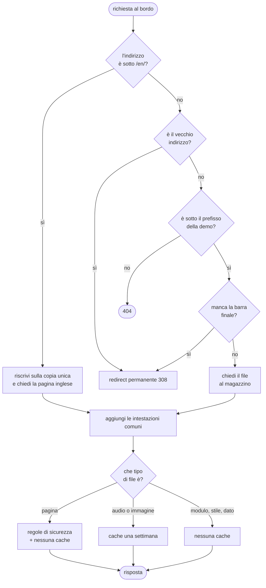

{/*
FONTI
- apps/retro-future/src/index.ts (120 righe, letto il 2026-09-20): prefissi RETRO/LEGACY/EN, CSP_DEMO, withSharedHeaders, i tre rami dei redirect 308, il fetch degli asset.
- apps/retro-future/wrangler.toml: nome del Worker, sei rotte, binding ASSETS su dist-retro, not_found_handling, run_worker_first, observability.
- apps/retro-future-doc/wrangler.toml: il Worker di questo manuale, rotta /doc*, not_found_handling 404-page.
- scripts/build-retro-future.mjs: denylist di pubblicazione, controlli che fermano il build (dist-retro/index.html non deve esistere, il prefisso di percorso deve esistere, nessun file non pubblicabile), pagina inglese generata dal dizionario.
- Commit: 0f6ef89e (2026-06-15) "isolate deploy target"; bcfd63f1 (2026-06-15) "move demo route"; b5bacf17 (2026-07-07) "no-cache for coupled ESM modules to prevent deploy skew", con il corpo che descrive lo schermo nero; 5d17b5cf (2026-09-18) pagina inglese su /en/.
- README della demo, sezione "Quanto pesa src/ sulla rete": brotli, no-cache con ETag, il numero di richieste come costo della seconda visita.
- Misure del 2026-09-20: 97 moduli, 1.428.704 byte, 317.479 in brotli, index.html 114.216 byte.
*/}

# Deploy e infrastruttura

:::info Se è la prima volta

Un sito statico si può servire in due modi: da un magazzino di file, oppure da un
piccolo programma che sta davanti a quel magazzino e decide cosa rispondere. Qui si usa
il secondo, e il programma gira sui server di frontiera di Cloudflare, cioè vicino a
chi apre la pagina invece che in un data center solo. Questo capitolo spiega che cosa
fa quel programma e perché.

:::

## Cosa vede l'utente

Un indirizzo che funziona: `avstudio.ai/chi-siamo/retro-future/`. Anche scritto senza
la barra finale, anche con il vecchio indirizzo di giugno, anche nella versione
inglese sotto `/en/`. E una pagina che, dopo un rilascio, non si rompe mai a metà.

## Il problema

Servire una demo 3D senza bundler pone tre problemi che un sito normale non ha.

**Il primo: i moduli sono accoppiati fra loro.** La pagina e i novantasette moduli
formano una sola applicazione. Se il browser prende la pagina nuova e i moduli vecchi
dalla propria cache, il risultato non è una pagina un po' vecchia: è uno schermo nero.
È successo: la pagina era senza cache, i moduli avevano cinque minuti di validità, e
subito dopo un rilascio una pagina fresca caricava moduli il cui elenco di funzioni era
cambiato.

**Il secondo: il deploy non deve essere tutto o niente.** La demo vive dentro un sito
più grande. Pubblicare il sito intero per cambiare una texture significa rischiare il
sito intero per una texture.

**Il terzo: i file di lavoro non devono finire online.** Accanto ai moduli ci sono le
prove, i documenti, la configurazione del controllo dei tipi. Senza un filtro, una
richiesta al percorso giusto li restituisce a chiunque.

## Come funziona

### Il percorso di una richiesta

Centoventi righe in tutto. Fanno quattro cose.

### Le rotte, e la versione inglese

Il programma risponde su sei rotte: l'indirizzo attuale, quello vecchio di giugno,
quello inglese, ognuno con e senza il sottodominio `www`. Il vecchio indirizzo e le
richieste senza barra finale ricevono un reindirizzamento permanente, cioè il tipo che
dice ai motori di ricerca che l'indirizzo si è spostato per sempre.

La versione inglese è la parte interessante: **non esiste una seconda copia della
demo**. La pagina inglese è generata al momento della costruzione da un dizionario di
frasi, e i suoi moduli sono gli stessi. Quando arriva una richiesta sotto `/en/`, il
programma la riscrive sulla copia unica prima di andare a prendere il file. Senza
questo, servirebbero due copie di un megabyte e mezzo che divergono alla prima
modifica.

### Le intestazioni

Ogni risposta esce con trasporto cifrato obbligatorio per due anni, divieto di
indovinare il tipo di contenuto, e una politica di provenienza per i riferimenti. Le
pagine ricevono in più una politica di sicurezza dei contenuti che elenca da dove
possono arrivare script, stili, caratteri, immagini, contenuti multimediali e
connessioni: tutto dal proprio dominio, più i caratteri e il servizio di statistiche,
niente altro.

### La politica di cache, e perché è così

Qui sta la decisione che vale il capitolo.

| tipo di file | cache | perché |
|---|---|---|
| pagina | nessuna, con etichetta di versione | è il punto di ingresso, deve essere sempre quella nuova |
| moduli, stili, dati, modelli | nessuna, con etichetta di versione | sono accoppiati alla pagina: una coppia disallineata non degrada, si rompe |
| audio e immagini | una settimana | non sono accoppiati a niente: un file audio vecchio resta un file audio |

"Nessuna cache" non significa riscaricare tutto. Significa che il browser rifà la
domanda, e il server risponde “non è cambiato” senza rimandare il contenuto. Il costo
della seconda visita non sono i byte: sono novantasette domande. È un costo che
conosco e che ho scelto, e la leva per cambiarlo è proprio questo programma.

### Il deploy separato

La demo ha il suo comando di pubblicazione, che costruisce l'artefatto e lo manda al
suo programma. Il sito ha il suo. Questo manuale, dal 20 settembre, ne ha un terzo, con
una rotta più specifica che vince su quella della demo senza toccarla.

La costruzione dell'artefatto non è una copia e basta: filtra quello che non deve
essere pubblico, e si ferma se qualcosa non torna. Tre controlli bloccanti: che non
esista una pagina nella posizione sbagliata, che esista in quella giusta, e che nessun
file escluso sia finito nell'artefatto. Se uno solo fallisce, non si pubblica niente.

## Perché così e non altrimenti

- **Un programma al bordo invece di file statici.** Serve per riscrivere la versione
  inglese sulla copia unica, per decidere la cache per tipo di file, e per aggiungere
  le intestazioni di sicurezza. Con il solo magazzino di file servirebbero due copie
  della demo e una politica di cache sola per tutti.
- **Nessuna cache sui moduli, una settimana sui media.** La distinzione non è fra file
  grandi e piccoli: è fra file accoppiati alla pagina e file indipendenti. Il criterio
  è venuto da uno schermo nero dopo un rilascio, non da un principio astratto.
- **Reindirizzamenti permanenti, non temporanei.** L'indirizzo è cambiato una volta a
  giugno e non tornerà indietro: dirlo in modo permanente evita che i motori di
  ricerca tengano vivo il vecchio.
- **Deploy isolato.** La demo si pubblica senza pubblicare il sito, e questo manuale
  senza pubblicare la demo. Ogni rilascio ha il suo raggio di esplosione.
- **La costruzione si ferma invece di pubblicare a metà.** I tre controlli bloccanti
  costano tre righe e hanno impedito che le prove e i documenti di lavoro finissero
  raggiungibili da chiunque.

Cose che non so spiegare, e lo dico:

- La politica di cache attuale è corretta ma non ottimale: con i nomi dei file
  versionati si potrebbero cachare i moduli per sempre e cambiare solo la pagina.
  Richiede un passo di costruzione che oggi non c'è, ed è una scelta di prodotto che
  non ho ancora fatto.
- Il programma dichiara l'osservabilità attiva, ma non ho costruito nessuna soglia di
  allarme sopra i suoi dati: li guardo quando ho un dubbio, non mi avvisano loro.

## I numeri

| cosa | valore | fonte e data |
|---|---|---|
| righe del programma al bordo | 120 | `wc -l`, 2026-09-20 |
| rotte servite | 6, fra indirizzo attuale, vecchio, inglese, con e senza www | `wrangler.toml` |
| moduli serviti | 97, per 1.428.704 byte | `find` e `wc -c`, 2026-09-20 |
| stessi moduli compressi | 317.479 byte | `brotli -q 11`, 2026-09-20 |
| pagina | 114.216 byte, 16.402 compressa | stesso comando |
| cache dei media | una settimana, con rivalidazione in background di un giorno | `index.ts` |
| controlli bloccanti alla costruzione | 3 | `build-retro-future.mjs` |
| deploy indipendenti | 3: sito, demo, manuale | `package.json` |

## Dove sta nel codice

| file | ruolo |
|---|---|
| `apps/retro-future/src/index.ts` | il programma al bordo: rotte, riscritture, intestazioni, cache |
| `apps/retro-future/wrangler.toml` | rotte, collegamento al magazzino di file, osservabilità |
| `apps/retro-future-doc/wrangler.toml` | lo stesso per questo manuale, su una rotta più specifica |
| `scripts/build-retro-future.mjs` | filtro di pubblicazione, pagina inglese, i tre controlli bloccanti |
| `scripts/retro-future-en.mjs` | il dizionario che genera la pagina inglese |

## Per chi viene dal backend

È un reverse proxy scritto a mano che gira al bordo, con instradamento, riscrittura
dei percorsi, intestazioni di sicurezza e politica di cache per tipo di contenuto:
quello che altrove si configura in un file di un server web, qui è codice, con i tipi
controllati e il motivo di ogni scelta nel commit accanto. La differenza che conta
rispetto a un'origine sola è che gira in ogni punto di presenza, e che il deploy è
una pubblicazione atomica del programma insieme ai suoi file. Chi arriva da un altro
cloud riconosce la forma: funzione senza stato davanti a uno storage di oggetti, con le
rotte dichiarate nella configurazione.
