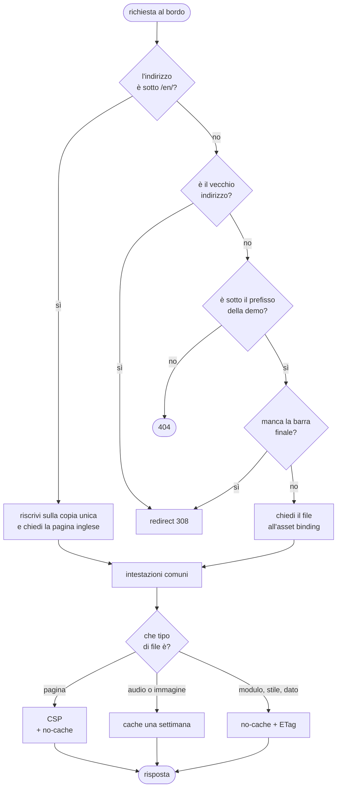

{/*
FONTI
- apps/retro-future/src/index.ts (120 righe, letto il 2026-09-20): prefissi RETRO/LEGACY/EN, CSP_DEMO, withSharedHeaders, i tre rami dei redirect 308, il fetch degli asset.
- apps/retro-future/wrangler.toml: nome del Worker, sei rotte, binding ASSETS su dist-retro, not_found_handling, run_worker_first, observability.
- apps/retro-future-doc/wrangler.toml: il Worker di questo manuale, rotta /doc*, not_found_handling 404-page.
- scripts/build-retro-future.mjs: denylist di pubblicazione, controlli che fermano il build (dist-retro/index.html non deve esistere, il prefisso di percorso deve esistere, nessun file non pubblicabile), pagina inglese generata dal dizionario.
- Commit: 0f6ef89e (2026-06-15) "isolate deploy target"; bcfd63f1 (2026-06-15) "move demo route"; b5bacf17 (2026-07-07) "no-cache for coupled ESM modules to prevent deploy skew", con il corpo che descrive lo schermo nero; 5d17b5cf (2026-09-18) pagina inglese su /en/.
- README della demo, sezione "Quanto pesa src/ sulla rete": brotli, no-cache con ETag, il numero di richieste come costo della seconda visita.
- Misure del 2026-09-20: 97 moduli, 1.428.704 byte, 317.479 in brotli, index.html 114.216 byte.
*/}

# Deploy e infrastruttura

:::note In breve

Cloudflare Worker davanti a un asset binding: 6 rotte, riscrittura della variante inglese sulla copia unica, intestazioni di sicurezza e cache decisa per tipo di file. I moduli ESM sono accoppiati a `index.html`, quindi `no-cache` con ETag: una coppia disallineata non degrada, si rompe.

:::

## Cosa vede l'utente

Un URL che funziona: `avstudio.ai/chi-siamo/retro-future/`. Anche senza barra finale,
anche con il vecchio indirizzo di giugno, anche nella versione inglese sotto `/en/`. E
una pagina che, dopo un deploy, non si rompe mai a metà.

## Il problema

Servire una demo 3D senza bundler pone 3 problemi che un sito normale non ha.

**Il primo: i moduli sono accoppiati fra loro.** La pagina e i 97 moduli ESM sono una
sola applicazione. Se il browser prende la pagina nuova e i moduli vecchi dalla cache,
il risultato non è una pagina un po' vecchia: è uno schermo nero. È successo: pagina
senza cache, moduli con 5 minuti di validità, e subito dopo un deploy una pagina fresca
caricava moduli con un altro elenco di export.

**Il secondo: il deploy non deve essere tutto o niente.** La demo vive dentro un sito
più grande. Pubblicare il sito intero per cambiare una texture significa rischiare il
sito intero per una texture.

**Il terzo: i file di lavoro non devono finire online.** Accanto ai moduli ci sono i
test, i documenti, la configurazione del typecheck: senza un filtro, una richiesta al
percorso giusto li restituisce a chiunque.

## Come funziona

### Il percorso di una richiesta

120 righe in tutto. Fanno 4 cose.

### Le rotte, e la versione inglese

Il Worker risponde su 6 rotte: indirizzo attuale, vecchio di giugno, inglese, ognuno
con e senza `www`. Il vecchio indirizzo e le richieste senza barra finale ricevono un
redirect 308.

La versione inglese è la parte interessante: **non esiste una seconda copia della
demo**. La pagina inglese è generata al build da un dizionario di frasi, e i moduli
sono gli stessi. Una richiesta sotto `/en/` viene riscritta sulla copia unica prima del
fetch all'asset binding. Senza, servirebbero 2 copie da un megabyte e mezzo che
divergono alla prima modifica.

### Le intestazioni

Ogni risposta esce con HSTS per 2 anni, `nosniff` e una `Referrer-Policy`. Le pagine
ricevono in più una CSP che elenca le origini ammesse per script, stili, font,
immagini, media e connessioni: tutto dal proprio dominio, più i font e il servizio di
statistiche, niente altro.

### La politica di cache, e perché è così

Qui sta la decisione che vale il capitolo.

| tipo di file | cache | perché |
|---|---|---|
| pagina | no-cache + ETag | è il punto di ingresso, deve essere sempre quella nuova |
| moduli, stili, dati, modelli | no-cache + ETag | sono accoppiati alla pagina: una coppia disallineata non degrada, si rompe |
| audio e immagini | una settimana | non sono accoppiati a niente: un file audio vecchio resta un file audio |

“Nessuna cache” non vuol dire riscaricare tutto: il browser rifà la richiesta e
l'ETag gli fa tornare un 304 senza corpo. Il costo della seconda visita non sono i
byte, sono 97 richieste. È un costo che conosco e che ho scelto, e la leva per
cambiarlo è il Worker.

### Il deploy separato

La demo ha il suo comando di deploy: costruisce l'artefatto e lo pubblica con wrangler
sul proprio Worker. Il sito ha il suo. Questo manuale, dal 20 settembre, ne ha un
terzo, su una rotta più specifica che vince su quella della demo senza toccarla.

Il build non è una copia: filtra quello che non deve essere pubblico e si ferma se
qualcosa non torna. 3 gate bloccanti: che non esista una pagina nella posizione
sbagliata, che esista in quella giusta, e che nessun file della denylist sia finito
nell'artefatto. Se uno fallisce, non si pubblica niente.

## Perché così e non altrimenti

- **Un Worker invece di file statici.** Serve a riscrivere la versione inglese sulla
  copia unica, a decidere la cache per tipo di file, a mettere le intestazioni di
  sicurezza. Con il solo asset binding servirebbero 2 copie della demo e una cache sola
  per tutti.
- **Nessuna cache sui moduli, una settimana sui media.** La distinzione non è fra file
  grandi e piccoli: è fra file accoppiati alla pagina e file indipendenti. Il criterio
  è venuto da uno schermo nero dopo un deploy, non da un principio astratto.
- **308 e non 302.** L'indirizzo è cambiato una volta a giugno e non tornerà indietro:
  dirlo permanente evita che i motori di ricerca tengano vivo il vecchio.
- **Deploy isolato.** La demo si pubblica senza pubblicare il sito, e questo manuale
  senza pubblicare la demo. Ogni deploy ha il suo raggio di esplosione.
- **Il build si ferma invece di pubblicare a metà.** I 3 gate costano 3 righe e hanno
  impedito che test e documenti di lavoro finissero raggiungibili da chiunque.

Cose che non so spiegare, e lo dico:

- La politica di cache attuale è corretta ma non ottimale: con i nomi dei file
  versionati si potrebbero cachare i moduli per sempre e cambiare solo la pagina.
  Richiede un passo di build che oggi non c'è, ed è una scelta di prodotto che non ho
  ancora fatto.
- Il Worker dichiara l'observability attiva, ma non ho nessuna soglia di allarme sopra
  quei dati: li guardo quando ho un dubbio, non mi avvisano loro.

## I numeri

| cosa | valore | fonte e data |
|---|---|---|
| righe del Worker | 120 | `wc -l`, 2026-09-20 |
| rotte servite | 6: indirizzo attuale, vecchio, inglese, con e senza www | `wrangler.toml` |
| moduli serviti | 97, per 1.428.704 byte | `find` e `wc -c`, 2026-09-20 |
| stessi moduli compressi | 317.479 byte | `brotli -q 11`, 2026-09-20 |
| pagina | 114.216 byte, 16.402 compressa | stesso comando |
| cache dei media | una settimana, con `stale-while-revalidate` di 1 giorno | `index.ts` |
| gate bloccanti al build | 3 | `build-retro-future.mjs` |
| deploy indipendenti | 3: sito, demo, manuale | `package.json` |

## Dove sta nel codice

| file | ruolo |
|---|---|
| `apps/retro-future/src/index.ts` | il Worker: rotte, riscritture, intestazioni, cache |
| `apps/retro-future/wrangler.toml` | rotte, asset binding su `dist-retro`, observability |
| `apps/retro-future-doc/wrangler.toml` | lo stesso per questo manuale, su una rotta più specifica |
| `scripts/build-retro-future.mjs` | denylist di pubblicazione, pagina inglese, i 3 gate bloccanti |
| `scripts/retro-future-en.mjs` | il dizionario che genera la pagina inglese |

## Per chi viene dal backend

È un reverse proxy scritto a mano che gira al bordo: routing, rewrite dei percorsi,
intestazioni di sicurezza e cache per tipo di contenuto. Quello che altrove sta in un
`nginx.conf`, qui è codice TypeScript, con i tipi controllati e il motivo di ogni
scelta nel commit accanto. Rispetto a un'origine sola cambiano due cose: gira in ogni
PoP, e il deploy è atomico, Worker e asset insieme. Chi arriva da un altro cloud
riconosce la forma: funzione senza stato davanti a uno storage di oggetti, con le rotte
dichiarate in `wrangler.toml`.
