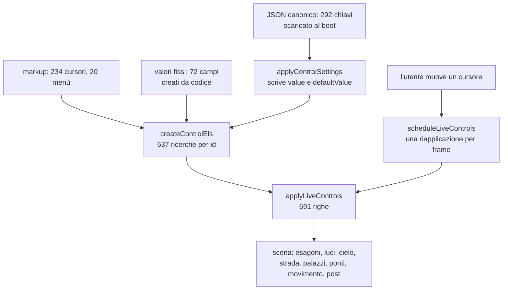

{/*
FONTI: docs/manuale-retro-future/schede/01-architettura-qualita-pannello.md, sottosezioni "Pannello di regia" delle sezioni 1-6 e 9, più §3 Qualità per le prove sui cursori.
Blocco 1: §1 e §3 Pannello (dieci schede, cursori, bottoni; trimProductionControls in produzione).
Blocco 2: §2 Pannello (72 input nascosti su una riga da 8 KB, 5317daa0; tre sorgenti che si sovrappongono e il clamp silenzioso, bb923c56; il tasto P che faceva una POST in produzione, c3232255; applyLiveControls 691 righe senza prove, 335e2dfb; due cursori con value fuori dal proprio step dalla v1.0, 00b3c82e).
Blocco 3: §3 Pannello (fixed-control-defaults; createControlEls 538 chiavi e i quattro aiutanti; PRODUCTION_LIVE_CONTROL_SELECTOR; i dodici insiemi *_FAST_CONTROL_IDS; scheduleLiveControls e la via veloce; applyLiveControls e le funzioni per gruppo; le sette sorgenti del boot in ordine; applyControlSettings; LOCKED_LED_POSITION_VALUES; il JSON canonico; il salvataggio scheda e l'endpoint locale; lo spawn; il bottone Settaggi; il benchmark FSR; l'OSD; i parametri URL; le scorciatoie di console) e §3 Qualità (live-controls.test.mjs, control-defaults.test.mjs, scorciatoie-console.test.mjs).
Blocco 4: §4 Pannello (dati travestiti da DOM; lo span di lettura; endpoint solo da localhost; il pannello ritirato ma i valori restano; i quattro aiutanti invece di any; ?osd nello script inline; una riapplicazione per fotogramma; le quattro coppie della prova; resetCameraHeightToDefault(true); applyBloomEnabled boolean|string; le tredici chiavi placement-* tolte; i sei output senza slider; l'etichetta non aggiornata se nascosto; niente pannello su telefono).
Blocco 5: §5 Pannello (numeri).
Blocco 6: §6 Pannello (file).
Blocco 7: analogia scritta qui.
Nota: lo screenshot del pannello esiste perché l'harness del manuale tiene gli elementi nel DOM; detto nel testo.
*/}

# Il pannello di regia

:::note In breve

537 `getElementById` in una funzione sola, 4 helper tipizzati, 12 gruppi per la via veloce e una riapplicazione per frame agganciata a `requestAnimationFrame`. Tre sorgenti di valori che si sovrappongono al boot, con il JSON canonico che vince e i clamp che possono silenziare una modifica.

:::

## Cosa vede l'utente

In produzione, niente: il pannello esce dal DOM subito dopo il boot. Mentre costruivo la
demo era la cosa che guardavo di più: una ventina di schede, più di 200 cursori e una
ventina di menù a tendina, che cambiano la scena mentre è in movimento. Larghezza del
boulevard, altezza dei palazzi, colore e intensità di ogni famiglia di LED, esposizione,
nuvole, velocità del passo, soglie di collisione.

Questa immagine esiste perché lo script che fotografa la demo per il manuale
intercetta la rimozione di quei 2 elementi e li lascia nel DOM. È l'unico punto in cui
la cattura cambia il comportamento della pagina, e sta scritto qui perché il manuale
non mostra cose che il visitatore non può vedere senza dirlo.

## Il problema

Una scena 3D ha centinaia di numeri, e nessuno è giusto a priori. L'altezza di un LED,
la saturazione dell'asfalto, la velocità del dondolio del passo: si trovano guardando,
e solo se puoi cambiarli mentre guardi. Il ciclo “modifica il codice, ricarica, aspetta
il rivelo, giudica” è troppo lento.

Il costo è che il pannello diventa la fonte dei valori. Lì sono nati 3 problemi veri.

Il primo: i valori fissi della scena, quelli che non sono controlli ma dati, vivevano
in 72 `<input>` nascosti su una riga sola da 8 KB dentro il markup. Dati travestiti da
DOM, perché il codice legge tutto per id e si aspetta quella forma.

Il secondo: le sorgenti dei valori sono 3 e si sovrappongono, attributi del markup,
valori fissi, JSON di impostazioni canoniche applicato al boot. La terza vince sulla
prima, ma solo se il valore sta fra `min` e `max` del cursore: abbassare un `max` nel
markup cambia la scena in silenzio.

Il terzo: la funzione che riapplica tutto è lunga 691 righe, scrive una cinquantina di
campi in 6 domini, e fino al 19 settembre 2026 non la guardava nessun test. Il
gate visivo fotografa la scena con i valori di partenza, quindi un cursore scollegato
passava inosservato.

## Come funziona

### Dai dati al DOM, e ritorno

I valori fissi non stanno più nel markup: sono dati in un modulo, e una funzione li
trasforma negli stessi `<input>` nascosti che il resto del codice si aspetta, stesso id
e stesso valore. Accanto a ognuno crea anche l'etichetta di lettura, perché la funzione
che riapplica scrive lì dentro e senza esploderebbe.

La ricerca degli elementi avviene una volta sola, in una funzione che restituisce un
oggetto con 538 chiavi. Ogni chiave passa da uno di 4 aiutanti che fanno il cast:
`HTMLInputElement` per i cursori, `HTMLSelectElement` per i menù, `HTMLButtonElement`
per i bottoni, `HTMLElement` per le etichette. L'assegnazione è stata decisa guardando
il tag vero nel markup, non indovinata.

### Una modifica, un frame

Quando muovi un cursore non si riapplica tutto: l'id viene mappato su uno di 12 gruppi
(cielo, post-produzione, wireframe, effetti audio, movimento, personaggio, luci,
esagoni, materiali della strada, dei palazzi, delle piazzole, errore di confine). Se in
un frame arrivano modifiche a 2 gruppi diversi si riapplica tutto, e comunque una volta
sola per frame, dentro un `requestAnimationFrame`.

La funzione grande rilegge ogni cursore e riapplica ogni dominio; le funzioni di
gruppo, una per scheda, fanno la stessa cosa su una fetta sola e scrivono anche il
numero accanto al cursore.

### Come parte la scena

All'avvio i valori arrivano in 7 passaggi: gli attributi del markup; il JSON canonico
scaricato con `cache: 'no-store'`; quello rimasto in localStorage da una sessione
precedente; i tempi del rivelo forzati dalle costanti; l'upscale forzato a risoluzione
piena; lo spawn salvato del giocatore; infine la riapplicazione generale.

Il JSON canonico ha 292 chiavi ed è quello che vince: i numeri che vedi nella demo
stanno lì, non nel codice. 31 valori dei LED del palazzo principale sono invece
bloccati: scritti e poi `disabled`, con la riga marcata come tale.

### I test sul pannello

3 file, 3 cose diverse. Il primo prende 4 coppie cursore/effetto (risoluzione, qualità
del bloom, scala del personaggio, bagliore dei suoi LED), porta ognuna all'estremo e la
riporta indietro leggendo l'effetto da una scorciatoia di ispezione; poi porta
**tutti** i cursori a `min` e `max`, 2 frame per passata, pretendendo che l'ispezione
tenga lo stesso numero di chiavi. Il secondo verifica le sorgenti: ogni cursore con
`min`, `max` e `value`, il browser che parte da dove dice il markup, nessun valore del
JSON canonico tagliato, ogni etichetta di lettura con il suo controllo. Il terzo chiama
tutte e 11 le scorciatoie di console e pretende un numero minimo di campi da ciascuna.

### Gli strumenti di contorno

Un pannello in alto a sinistra mostra fps, millisecondi di frame, tempo GPU,
risoluzione attiva, draw call e triangoli. Il salvataggio di una scheda scrive in
localStorage, copia il JSON negli appunti e, **solo se la pagina gira in locale**, lo
manda a un servizio di appoggio. Un tasto fotografa la posizione corrente del giocatore
come nuovo spawn. Un bottone gira un confronto fra i 4 preset dell'upscale, 18 frame
ciascuno.

## Perché così e non altrimenti

- **I valori fissi sono dati, non markup.** 8.000 caratteri su una riga sola non si
  leggono e non si modificano. Ora sono un oggetto in un modulo, e il DOM equivalente
  lo costruisce il codice.
- **Il pannello è ritirato, ma i valori restano.** In produzione spariscono bottone e
  pannello; gli elementi staccati continuano a essere letti, perché sono la forma che
  il resto del codice si aspetta.
- **4 aiutanti che fanno il cast, non `any`.** `any` avrebbe fatto sparire gli errori
  veri insieme ai falsi, ed era già successo. Il cast sta dove nasce il valore, una
  volta sola.
- **Il servizio di salvataggio risponde solo da locale.** È uno strumento per chi
  costruisce, in ascolto su una porta locale, e il suo codice non sta in questo
  repository; in produzione il ramo restava raggiungibile e un tasto faceva partire una
  richiesta verso una porta del dominio pubblico, che falliva con un avviso in console.
  Ora l'indirizzo esiste solo quando la pagina gira in locale.
- **Una riapplicazione per frame.** Le modifiche si raggruppano e si applicano una
  volta per frame, dentro un `requestAnimationFrame` invece che a ogni evento.
- **Le 4 coppie del test sono quelle e non altre**, perché il loro effetto si legge da
  una scorciatoia di ispezione ed è stabile fra un frame e l'altro: la folla si muove
  da sola e quasi tutti gli altri campi cambiano comunque.
- **`?osd` è applicato da uno script inline nel markup**, non da `src/main.js`: quel
  pannello sta nel markup e il modulo arriva dopo, quindi si vedrebbe comparire e
  sparire.

Cose che non so spiegare, e lo dico:

- 2 cursori avevano dalla prima versione un valore che non è un multiplo del proprio
  passo, e il browser li correggeva da solo senza dirlo. Ora un test lo intercetta,
  ma non so quando e perché quei due numeri siano stati scritti così.
- 31 valori dei LED del palazzo principale sono bloccati, con l'input
  disabilitato. Nessuna fonte dice perché siano proprio quei 31, né da quando.
- L'upscale viene forzato a risoluzione piena al boot da una funzione apposta, anche se
  il file canonico dice già la stessa cosa. Il doppione non è spiegato da nessuna parte.
- Il servizio che riceve i salvataggi in locale non sta in questo repository: so che
  ascolta su una porta, non dove viva il suo codice.
- Sei etichette di lettura non hanno un cursore corrispondente. Le ho verificate una
  per una e sono display scritti dal codice, ma il fatto che servisse una verifica dice
  che la struttura non lo rende ovvio.

## I numeri

| cosa | valore | fonte e data |
|---|---|---|
| elementi cercati per id | 537 chiamate, 538 chiavi | conteggio su `controls.js`, 2026-09-20 |
| divisi per tipo | 246 cursori, 264 etichette, 20 menù, 7 bottoni | stesso conteggio |
| cursori nel markup | 234, più 20 menù | conteggio su `index.html`, 2026-09-20 |
| valori fissi creati da codice | 72 (36 LED, 4 ponti per 9 parametri) | `fixed-control-defaults.js`, 2026-09-20 |
| chiavi del file canonico | 292, in 371 righe e 12.264 byte | `boulevard-canonical-settings.json`, 2026-09-20 |
| valori bloccati | 31, sui LED del palazzo principale | `control-settings-runtime.js` |
| righe della funzione che riapplica | 691 | `wc -l`, 2026-09-20 |
| gruppi della via veloce | 12 | `controls.js` |
| attesa del confronto fra preset | 18 frame più 180 ms per preset | `control-panel.js` |

## Dove sta nel codice

| file | ruolo |
|---|---|
| `src/controls/controls.js` | i 537 id, i 4 aiutanti, i 12 gruppi |
| `src/controls/live-controls.js` | la riapplicazione generale e la via veloce per gruppo |
| `src/controls/control-panel.js` | le funzioni per gruppo, le schede, lo spawn, il confronto fra preset |
| `src/controls/control-settings-runtime.js` | JSON canonico, localStorage, valori bloccati, salvataggio |
| `src/controls/fixed-control-defaults.js` | i valori fissi come dati, e il DOM equivalente |
| `boulevard-canonical-settings.json` | i 292 valori con cui la scena parte davvero |

I test: `live-controls.test.mjs` (i cursori arrivano alla scena),
`control-defaults.test.mjs` (le sorgenti e i loro limiti),
`scorciatoie-console.test.mjs` (le 11 funzioni di ispezione rispondono).

## Per chi viene dal backend

È configurazione a caldo con 3 livelli di sorgenti, come un servizio che legge dal
file, poi dall'ambiente, poi da un registro remoto, con l'ultimo che vince. Il
raggruppamento per frame è un debounce agganciato al `requestAnimationFrame` invece che
a un timer. E i 537 id sono un contratto fra markup e codice: senza tipi si rompe in
silenzio, ed è esattamente quello che il typecheck ha trovato.
