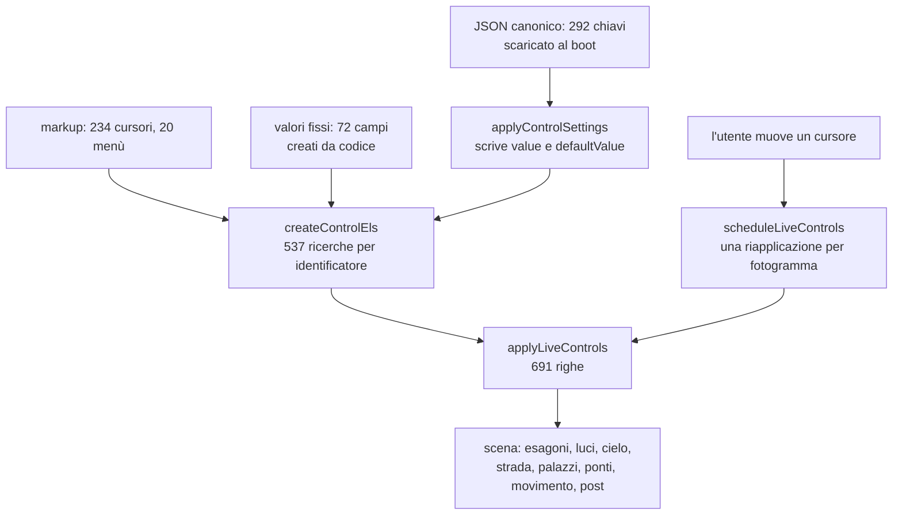

{/*
FONTI: docs/manuale-retro-future/schede/01-architettura-qualita-pannello.md, sottosezioni "Pannello di regia" delle sezioni 1-6 e 9, più §3 Qualità per le prove sui cursori.
Blocco 1: §1 e §3 Pannello (dieci schede, cursori, bottoni; trimProductionControls in produzione).
Blocco 2: §2 Pannello (72 input nascosti su una riga da 8 KB, 5317daa0; tre sorgenti che si sovrappongono e il clamp silenzioso, bb923c56; il tasto P che faceva una POST in produzione, c3232255; applyLiveControls 691 righe senza prove, 335e2dfb; due cursori con value fuori dal proprio step dalla v1.0, 00b3c82e).
Blocco 3: §3 Pannello (fixed-control-defaults; createControlEls 538 chiavi e i quattro aiutanti; PRODUCTION_LIVE_CONTROL_SELECTOR; i dodici insiemi *_FAST_CONTROL_IDS; scheduleLiveControls e la via veloce; applyLiveControls e le funzioni per gruppo; le sette sorgenti del boot in ordine; applyControlSettings; LOCKED_LED_POSITION_VALUES; il JSON canonico; il salvataggio scheda e l'endpoint locale; lo spawn; il bottone Settaggi; il benchmark FSR; l'OSD; i parametri URL; le scorciatoie di console) e §3 Qualità (live-controls.test.mjs, control-defaults.test.mjs, scorciatoie-console.test.mjs).
Blocco 4: §4 Pannello (dati travestiti da DOM; lo span di lettura; endpoint solo da localhost; il pannello ritirato ma i valori restano; i quattro aiutanti invece di any; ?osd nello script inline; una riapplicazione per fotogramma; le quattro coppie della prova; resetCameraHeightToDefault(true); applyBloomEnabled boolean|string; le tredici chiavi placement-* tolte; i sei output senza slider; l'etichetta non aggiornata se nascosto; niente pannello su telefono).
Blocco 5: §5 Pannello (numeri).
Blocco 6: §6 Pannello (file).
Blocco 7: analogia scritta qui.
Nota: lo screenshot del pannello esiste perché l'harness del manuale tiene gli elementi nel DOM; detto nel testo.
*/}

# Il pannello di regia

:::info Se è la prima volta

Nessuno dei numeri di una scena 3D è giusto a priori: si trovano guardando. Per questo esiste un pannello con oltre duecento cursori che cambiano la scena mentre è in movimento, e che in produzione viene tolto.

:::

## Cosa vede l'utente

In produzione, niente: il pannello viene tolto dal DOM subito dopo il boot. Mentre
costruivo la demo, invece, era la cosa che guardavo di più: una ventina di schede, più di duecento
cursori e una ventina di menù a tendina, che cambiano la scena mentre è in
movimento. Larghezza del boulevard, altezza dei palazzi, colore e intensità di ogni
famiglia di LED, esposizione, nuvole, velocità del passo, soglie di collisione.

Questa immagine esiste perché lo script che fotografa la demo per il manuale
intercetta la rimozione di quei due elementi e li lascia nel documento. È l'unico
punto in cui la cattura cambia il comportamento della pagina, ed è detto qui perché
il manuale non deve mostrare cose che il visitatore non può vedere senza dirlo.

## Il problema

Una scena 3D ha centinaia di numeri, e nessuno di quei numeri è giusto a priori.
L'altezza di un LED, la saturazione dell'asfalto, la velocità del dondolio del passo:
si trovano guardando, e si trovano solo se puoi cambiarli mentre guardi. Un ciclo
“modifica il codice, ricarica, aspetta il rivelo, giudica” è troppo lento per un
lavoro di quel tipo.

Il costo di quella comodità è che il pannello diventa la fonte dei valori. E lì sono
nati tre problemi veri.

Il primo: i valori fissi della scena, quelli che non sono controlli ma dati, vivevano
in settantadue campi nascosti su una riga sola da 8 KB dentro il markup. Erano dati
travestiti da DOM, perché il codice legge tutto per identificatore e si aspetta quella
forma.

Il secondo: le sorgenti dei valori sono tre e si sovrappongono. Gli attributi del
markup, i valori fissi, e un file di impostazioni canoniche applicato al boot. La terza
vince sulla prima, ma solo se il valore sta fra il minimo e il massimo del cursore:
abbassare un massimo nel markup cambia la scena in silenzio.

Il terzo: la funzione che riapplica tutto è lunga 691 righe, scrive una cinquantina di
campi in sei domini, e fino al 19 settembre 2026 non la guardava nessuna prova. Il
gate visivo fotografa la scena con i valori di partenza, quindi un cursore scollegato
passava inosservato.

## Come funziona

### Dai dati al DOM, e ritorno

I valori fissi non stanno più nel markup: sono dati in un modulo, e una funzione li
trasforma negli stessi campi nascosti che il resto del codice si aspetta, con lo stesso
identificatore e lo stesso valore. Accanto a ognuno crea anche l'etichetta di lettura,
perché la funzione che riapplica scrive lì dentro e senza esploderebbe.

La ricerca degli elementi avviene una volta sola, in una funzione che restituisce un
oggetto con 538 chiavi. Ogni chiave passa da uno di quattro aiutanti, che dicono che
cosa c'è dietro quell'identificatore: un cursore, un menù, un bottone o un'etichetta.
L'assegnazione è stata decisa guardando il tag vero nel markup, non indovinata.

### Una modifica, un fotogramma

Quando muovi un cursore non si riapplica tutto: l'identificatore viene mappato su uno
di dodici gruppi (cielo, post-produzione, wireframe, effetti audio, movimento,
personaggio, luci, esagoni, materiali della strada, dei palazzi, delle piazzole,
errore di confine). Se in un fotogramma arrivano modifiche a due gruppi diversi, si
riapplica tutto. In ogni caso una sola volta per fotogramma, agganciata al ciclo di
disegno.

La funzione grande rilegge ogni cursore e riapplica ogni dominio; le funzioni di
gruppo, una per scheda, fanno la stessa cosa su una fetta sola e scrivono anche il
numero accanto al cursore.

### Come parte la scena

All'avvio i valori arrivano in sette passaggi, in quest'ordine: gli attributi del
markup; il file canonico scaricato senza cache; quello che è rimasto nella memoria del
browser da una sessione precedente; i tempi del rivelo forzati dalle costanti;
l'upscale forzato a risoluzione piena; la posizione di partenza del giocatore salvata;
e infine la riapplicazione generale.

Il file canonico ha 292 chiavi ed è quello che vince: i numeri che vedi nella demo
stanno lì, non nel codice. Trentuno valori dei LED del palazzo principale sono invece
bloccati: vengono scritti e l'input viene disabilitato, con la riga marcata come tale.

### Le prove sul pannello

Tre file, e coprono tre cose diverse. Il primo prende quattro coppie cursore/effetto
(risoluzione, qualità del bloom, scala del personaggio, bagliore dei suoi LED), porta
ognuna all'estremo e la riporta indietro leggendo l'effetto da una scorciatoia di
ispezione; poi porta **tutti** i cursori al minimo e al massimo, due fotogrammi per
passata, pretendendo che l'ispezione tenga lo stesso numero di chiavi. Il secondo
verifica le sorgenti: che ogni cursore abbia minimo, massimo e valore, che il browser
parta da dove dice il markup, che nessun valore del file canonico venga tagliato, che
ogni etichetta di lettura abbia il suo controllo. Il terzo chiama tutte e undici le
scorciatoie di console e pretende un numero minimo di campi da ciascuna.

### Gli strumenti di contorno

Un pannello in alto a sinistra mostra fotogrammi al secondo, millisecondi di
fotogramma, tempo della scheda grafica, risoluzione attiva, passaggi e triangoli. Il
salvataggio di una scheda scrive nella memoria del browser, copia il JSON negli
appunti e, **solo se la pagina gira in locale**, lo manda a un piccolo servizio di
appoggio. Un tasto fotografa la posizione corrente del giocatore come nuovo punto di
partenza. Un bottone gira un confronto fra i quattro preset dell'upscale, misurando
ognuno per diciotto fotogrammi.

## Perché così e non altrimenti

- **I valori fissi sono dati, non markup.** Ottomila caratteri su una riga sola non si
  leggono e non si modificano. Ora sono un oggetto in un modulo, e il DOM equivalente
  lo costruisce il codice.
- **Il pannello è ritirato, ma i valori restano.** In produzione spariscono il bottone
  e il pannello; gli elementi staccati continuano a essere letti, perché sono la forma
  che il resto del codice si aspetta. Sono la forma che il resto del codice si aspetta, e continuano a essere letti
da lì.
- **Quattro aiutanti che fanno il cast, non un tipo “qualunque cosa”.** Il secondo
  avrebbe fatto sparire gli errori veri insieme a quelli falsi, ed era già successo. Il
  cast sta dove nasce il valore, una volta sola.
- **Il servizio di salvataggio risponde solo da locale.** È uno strumento per chi
  costruisce, con un servizio in ascolto su una porta locale che non vive in
  questo repository; in produzione il ramo restava
  raggiungibile e un tasto faceva partire una richiesta verso una porta del dominio
  pubblico, che falliva lasciando un avviso in console. Ora l'indirizzo esiste solo
  quando la pagina gira in locale.
- **Una riapplicazione per fotogramma.** Le modifiche vengono raggruppate e applicate
  una volta per fotogramma, agganciate al ciclo di disegno invece che a ogni evento.
- **Le quattro coppie della prova sono quelle e non altre**, perché il loro effetto si
  legge da una scorciatoia di ispezione ed è stabile fra un fotogramma e l'altro: la
  folla si muove da sola e quasi tutti gli altri campi cambiano comunque.
- **Il parametro che accende il pannello dei tempi è applicato da uno script nel
  markup**, non dal modulo principale: quel pannello sta nel markup e il modulo arriva
  dopo, quindi si vedrebbe comparire e sparire.

Cose che non so spiegare, e lo dico:

- Due cursori avevano dalla prima versione un valore che non è un multiplo del proprio
  passo, e il browser li correggeva da solo senza dirlo. Ora una prova lo intercetta,
  ma non so quando e perché quei due numeri siano stati scritti così.
- Trentuno valori dei LED del palazzo principale sono bloccati, con l'input
  disabilitato. Nessuna fonte dice perché siano proprio quei trentuno, né da quando.
- L'upscale viene forzato a risoluzione piena al boot da una funzione apposta, anche se
  il file canonico dice già la stessa cosa. Il doppione non è spiegato da nessuna parte.
- Il servizio che riceve i salvataggi in locale non sta in questo repository: so che
  ascolta su una porta, non dove viva il suo codice.
- Sei etichette di lettura non hanno un cursore corrispondente. Le ho verificate una
  per una e sono display scritti dal codice, ma il fatto che servisse una verifica dice
  che la struttura non lo rende ovvio.

## I numeri

| cosa | valore | fonte e data |
|---|---|---|
| elementi cercati per identificatore | 537 chiamate, 538 chiavi | conteggio su `controls.js`, 2026-09-20 |
| divisi per tipo | 246 cursori, 264 etichette, 20 menù, 7 bottoni | stesso conteggio |
| cursori nel markup | 234, più 20 menù | conteggio su `index.html`, 2026-09-20 |
| valori fissi creati da codice | 72 (36 LED, 4 ponti per 9 parametri) | `fixed-control-defaults.js`, 2026-09-20 |
| chiavi del file canonico | 292, in 371 righe e 12.264 byte | `boulevard-canonical-settings.json`, 2026-09-20 |
| valori bloccati | 31, sui LED del palazzo principale | `control-settings-runtime.js` |
| righe della funzione che riapplica | 691 | `wc -l`, 2026-09-20 |
| gruppi della via veloce | 12 | `controls.js` |
| attesa del confronto fra preset | 18 fotogrammi più 180 ms per preset | `control-panel.js` |

## Dove sta nel codice

| file | ruolo |
|---|---|
| `src/controls/controls.js` | i 537 identificatori, i quattro aiutanti, i dodici gruppi |
| `src/controls/live-controls.js` | la riapplicazione generale e la via veloce per gruppo |
| `src/controls/control-panel.js` | le funzioni per gruppo, le schede, lo spawn, il confronto fra preset |
| `src/controls/control-settings-runtime.js` | file canonico, memoria del browser, valori bloccati, salvataggio |
| `src/controls/fixed-control-defaults.js` | i valori fissi come dati, e il DOM equivalente |
| `boulevard-canonical-settings.json` | i 292 valori con cui la scena parte davvero |

Le prove: `live-controls.test.mjs` (i cursori arrivano alla scena),
`control-defaults.test.mjs` (le sorgenti e i loro limiti),
`scorciatoie-console.test.mjs` (le undici funzioni di ispezione rispondono).

## Per chi viene dal backend

È un pannello di configurazione a caldo con tre livelli di sorgenti, come un servizio
che legge i valori dal file, poi dall'ambiente, poi da un registro remoto, con
l'ultimo che vince. Il raggruppamento per fotogramma è un debounce agganciato al ciclo
di disegno invece che a un timer. E i 537 identificatori sono un contratto fra markup e
codice: senza tipi, quel contratto si rompe in silenzio, ed è esattamente quello che
il typecheck ha trovato.
