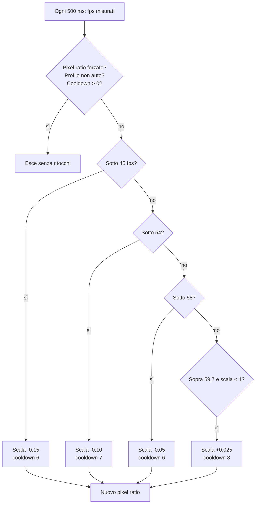

{/*
FONTI: docs/manuale-retro-future/schede/08-prestazioni.md (ogni riga della scheda porta file:riga o commit) e docs/manuale-retro-future/intervista.md (risposte 4 e 6).
Blocco 1: scheda §1 (OSD a richiesta retro-future.css:310-314, index.html:208-224, 9f75e2a0; contatore src/engine/frame-loop.js:153-160; #hud-tl nascosto su mobile bec22a41; paesaggio f7d4bcbb) e §2 (rivelo 8139be8d; folla 2ee61695).
Blocco 2: scheda §0 (intervista:6,8 e 3c35080c; assenza di misure su telefono vecchio e su M1 verificata con grep e git log il 2026-09-20) e §2 (fill-bound 74dfccba, docs/retro-future-mobile-fill-benchmark.md:8-10; render-bound 8cbaaaf1; rivelo a 6 pass 8139be8d; A/B senza leve 6298451c; SwiftShader 36266d52; boot sincrono src/engine/boot-prewarm.js:295-300; grafo dei moduli c4b32ffc; no-cache README.md:120-126).
Blocco 3: scheda §0 (misure be30701c, d84bc2d0, src/world/sky-dome.js:34, eb57f0c9, 1902c65a, 3d877968, a4beb9ec, 5ec6cec9), §3a-3i, §5, §7 (termini).
Blocco 4: scheda §4 e §9 (domande aperte dichiarate come tali).
Blocco 5: scheda §5.
Blocco 6: scheda §6 (wc -l 2026-09-20).
Blocco 7: ponte scritto dall'autore del manuale, senza affermazioni tecniche nuove.
*/}

# Prestazioni

## Cosa vede l'utente

Su un computer la città scorre; su un telefono va più morbida, e prima di partire la
demo chiede di girare lo schermo in orizzontale. I due punti dove ha scattato, in
passato, sono il rivelo della città, con sei passaggi a schermo intero, e la prima
apparizione di un personaggio con le risorse non ancora sulla scheda grafica. Di
default nessun numero: il contatore dei fotogrammi è uno strumento di lavoro e resta
spento. Con `?osd` nell'indirizzo compare in alto a sinistra un pannello di dieci
righe, FPS in testa, aggiornato ogni 500 millisecondi. Su telefono resta nascosto
anche con il parametro.

## Il problema

Prima gli obiettivi, poi le misure, e non li mescolo.

Gli obiettivi li ho dichiarati io: 30 fotogrammi al secondo su un telefono di sei o
sette anni, cioè a fine ciclo di vita, e 60 stabili su un portatile o un desktop di
fascia Apple M1 o un PC Windows simile. Lavoro con un pannello di numeri sotto gli
occhi e cerco il giusto mix fra qualità e prestazioni, perché la demo deve girare su
qualsiasi browser, telefoni compresi.

Le misure sono un'altra cosa. Nel repository non c'è nessuna misura di fps su un
telefono di sei o sette anni, e nessuna su un M1. Quelle che esistono sono su un Mac
M3, su una macchina di sviluppo non dichiarata, e su un iPhone “vero” del 9 luglio
2026 di cui i commit non scrivono il modello. Nessuna fonte dice che i 30 fps sul
telefono vecchio siano stati raggiunti o mancati. È un obiettivo, e qui resta tale.

Il problema tecnico ha una forma precisa:

- **Su telefono la demo è fill-bound.** Il fotogramma costa in proporzione ai pixel da
  colorare, area per costo dello shader (il programma che la GPU esegue per pixel),
  non ai vertici né alle draw call, le chiamate di disegno alla scheda.
- **Su computer è limitata dal render, non dal processore.** La CPU spende circa 1,2
  millisecondi a fotogramma.
- **Il rivelo non è la città a regime.** Sei pass a schermo intero, circa 20 fps al
  percentile 1, e l'evento di fine rivelo scatta 1 o 2 secondi prima che il wireframe
  smetta davvero. Un benchmark partito lì misura il rivelo.
- **Un A/B senza registro delle leve non vale.** Due run su iPhone non erano
  confrontabili perché il JSON non diceva quali leve avesse ciascuna, e il calore del
  telefono faceva sembrare peggiore la seconda.
- **Il browser senza testa non misura la GPU del telefono.** Chromium headless usa
  SwiftShader, un rasterizzatore software: i delta di fps possono perfino invertirsi.
- **Il boot ha blocchi sincroni pesanti.** In fila, senza pause, sono centinaia di
  millisecondi con input e disegno congelati su telefono.
- **La rete conta le richieste, non i byte.** Il grafo dei moduli (circa 89 file) è
  profondo, e le intestazioni live sono `cache-control: no-cache` con ETag: ogni
  visita rifà una richiesta condizionata per modulo.

## Come funziona

### Le misure che esistono

Su iPhone, il 9 luglio 2026, modello non scritto: spegnere la luce direzionale ha
dato +3,7 fps (render da 8,26 a 6,87 ms); togliere la mappa d'ambiente (la texture che
le superfici riflettono) da palazzi e marciapiedi +1,7; il cielo bilanciato +5,4,
senza data; il primo MSAA andava a 34 fps, più lento di FXAA. Su Mac M3, il 7 luglio:
il fast path dell'upscale ha portato il render medio da 4,27 a 3,86 ms. L'8 luglio, su
una macchina non dichiarata: 60 fps con 295 draw e 287.919 triangoli, prima che il
batch dei ponti portasse le draw a 248. Il commit che ha scelto MSAA su desktop parla
di “60 fps vsync, circa 3x di margine”, senza dire su cosa.

### Il profilo mobile

Il profilo è attivo se vale una di quattro condizioni: la media query
`(max-width: 760px), (hover: none), (pointer: coarse)`, `navigator.maxTouchPoints > 0`,
una finestra larga al massimo 760 pixel, oppure `?forceMobile=1`. Le tre funzioni di
cap sono pure: `min(base, cap)` se attivo, `base` altrimenti, per la scala di render,
il pixel ratio e la scala del bloom (l'alone attorno ai LED, ottenuto sfocando le
parti sopra soglia a risoluzione ridotta). I cap valgono 1, 1 e 0,14. Una prova
verifica che abbassino e non alzino mai: un errore di segno non si vede sul desktop
dello sviluppatore.

Le leve decise per default su telefono, tutte con override dall'indirizzo: cielo
`balanced`, pavimento leggero (anisotropia da 16 a 4, normal map tolta), riflesso del
pavimento sostituito da un fresnel di Schlick (più riflettente ad angolo radente),
riflesso dei palazzi leggero, luce direzionale spenta, FXAA invece di MSAA, bake del
cielo su un cubo da 128. Sopra c'è un registro di 29 toggle `?fx.<nome>=0` che
spengono un sottosistema alla volta, solo su mobile: su desktop il parametro viene
registrato e non applicato.

### La risoluzione, e il budget che non interviene

Il pixel ratio attivo (pixel del buffer per pixel CSS; a 2x sono quattro volte quelli
di 1x) è il minimo fra `devicePixelRatio`, il valore richiesto per la scala manuale per
la scala dinamica (non sotto 0,25), il tetto di 2, il cap del rivelo (1,5, solo
desktop) e il cap del bersaglio adattivo: 1920x1080 se lo schermo arriva al Full HD,
altrimenti 1280x720. Su mobile tutto questo è scavalcato: il pixel ratio è forzato a
1,7, e un valore forzato salta i cap e spegne il downscaler automatico.

Il budget automatico gira nella stessa finestra di 500 ms del contatore:

Il cooldown conta finestre, quindi 6 vale 3 secondi; la scala non scende sotto 0,25.
Ora l'onestà: in produzione questo ciclo esce sempre al primo rombo. Il valore
iniziale del profilo è `auto`, ma al boot i controlli lo sovrascrivono con il select,
il cui default nel markup e nei valori canonici è `quality`; con `quality` la scala
torna a 1 e il cooldown a 0. Su mobile lo spegne il pixel ratio forzato. Il budget
esiste, e non agisce.

Gli altri budget per fotogramma: effetti secondari e tessere esagonali un fotogramma
su due, la folla pensa a 45 Hz, i cartelli ricontrollano la posa ogni 250 ms, il bloom
a camera ferma si ricalcola un fotogramma su due. I riflessi della folla sono al
massimo 2 entro 240 unità, 0 sotto i 42 fps.

### Il benchmark

Con `?benchmark=1&benchmarkSeconds=N` compare un pannello con FPS medi, FPS al
percentile 5 (il valore sotto cui cade il 5% dei campioni), fotogramma peggiore in
ms, draw, triangoli e fotogrammi contati; la durata di default è 60 secondi, il
pannello si aggiorna ogni 250 ms. Il JSON che esce fotografa l'ambiente: browser,
schermo, viewport con pixel ratio, buffer, GPU dichiarata dal driver, il profilo di
qualità (modo, pixel ratio, scale, antialias, bloom, FSR, TAA, profilo mobile), le
leve (cielo, pavimento, riflessi, luce, i 29 toggle, i parametri dell'indirizzo) e il
riassunto dell'OSD. Si scarica da solo come `retro-benchmark-<data ISO>.json`.

L'avvio da indirizzo aspetta la scena ferma: rivelo completo, drone atterrato, nessun
compositing, nessun overlay del LED principale, e questo stato che dura da almeno
1.500 ms. Il documento del benchmark fissa le regole sul telefono: stesso dispositivo,
modalità aereo, luminosità fissa, raffreddare fra un run e l'altro, una leva alla
volta. E tre cose da non fare: tagliare draw call o fondere geometrie (il fill è area
per shader, indipendente dai vertici), accendere l'upscale FSR su mobile (aggiunge un
pass a piena risoluzione), rimettere la mappa d'ambiente sul pavimento. Una matrice
headless (944x430, pixel ratio 2, 8 s a configurazione) serve solo a contare triangoli
e draw: 9 toggle su 9 verificati, 29 leve su 29 nel JSON.

### Prewarm e tempi di boot

Il boot della città parte in sottofondo appena la copertina ha caricato
(`requestIdleCallback` con timeout 1.500 ms, altrimenti `setTimeout` 300 ms), dopo
91 `<link rel="modulepreload">` (15 vendor, 76 src). Poi quattro blocchi di prewarm,
cioè caricare e compilare prima che serva: le texture della scena (12 chiavi di
materiale), le texture delle ossa (le matrici dello scheletro caricate in una texture
per lo skinning, la deformazione della pelle sulla GPU), un render nascosto dei
personaggi su un bersaglio 4x4 con `compileAsync`, e due render della catena di post.
Fra un blocco e l'altro il controllo torna al browser; l'ordine è protetto da una
prova che legge il sorgente.

I tempi, misurati il 19 settembre 2026: sul mio Mac con GPU vera il boot dura una
ventina di secondi, il rivelo finisce di solito entro 40 e la foto fissa del gate
visivo si scatta a 60.110,1 ms; sul runner Linux di GitHub, senza GPU, la prima foto
arriva a 143.983 ms.

### Culling statico e LOD

Il frustum culling, cioè non disegnare quello che sta fuori dalla piramide di vista,
è fatto a mano: gira per ultimo nel tick, subito prima del render, e testa una sfera
per ogni palazzo, ponte e cartello, con un margine di 6 blocchi di griglia per palazzi
e ponti, 3 per i cartelli. Nascondere un palazzo nasconde anche marciapiede, numero
civico, porta e LED del marciapiede. Il LOD (level of detail: meno o niente oltre una
distanza) delle tessere esagonali usa la distanza dal rettangolo del batch, con
isteresi, cioè una soglia diversa per entrare e per uscire: 520 e 120 su desktop, 320
e 80 su mobile. Ogni istanza nascosta risparmia 24 triangoli; il flush per fotogramma
carica al massimo 10 batch sporchi. Con la semina su richiesta, l'8 luglio 2026, la
capacità è passata da 189.263 a 33.155 tessere e l'heap da 119 a 67 MB; a regime 2
batch visibili, 14.887 istanze nascoste, 21.637 attive.

### Memoria

Le cache hanno un tetto e smontano quello che espellono. I fumetti: LRU (esce la voce
usata meno di recente) da 48 voci, canvas 896x360 a metà scala per la folla; era da
12 contro circa 40 frasi, e 40 texture residenti erano circa 70 MB di GPU. I punti
degli anelli LED: 64 voci, FIFO. I cartelli di ruolo a 512x256, i numeri civici a
512x320. La mappa d'ambiente è prefiltrata con PMREM (versioni sfocate per livelli di
ruvidità) a 6 livelli, riempiti su richiesta. Il composer smonta pass e bersagli
quando viene ricostruito, e `renderer.info.memory` finisce nel benchmark e nell'OSD.

### Il peso sulla rete

Niente bundler: `index.html` usa una importmap (la mappa dei nomi dei moduli ai
percorsi) e i moduli sono serviti senza minificazione. Misurato il 20 settembre 2026:
97 moduli in `src/` per 1.428.704 byte; compressi in brotli a livello 11, come fa
Cloudflare, la somma per file è 317.479 byte, e `main.js` passa da 47.778 a 11.909.
La politica di cache è `no-cache` con ETag: il browser rifà la richiesta e il server
risponde 304 se il file non è cambiato.

### L'OSD

I tempi: `updateMs` da inizio tick a inizio render, `renderMs` la durata del render,
`frameMs` la somma; le medie sono EMA, cioè `prev + (next - prev) x 0,12`. Il timer
GPU (`EXT_disjoint_timer_query`) prende una query ogni 180 fotogrammi attorno al
render, e il collo di bottiglia è `present`, `gpu`, `cpu` o `render`. I picchi
(fotogramma da 22 ms o più, o sotto 50 fps) si registrano al massimo uno ogni 320 ms,
fino a 12, con il contesto: `texture-upload`, rivelo, bloom, equalizzatore, folla o
scena. Dalla console, `__tronPerfInspect` restituisce diagnostica e statistiche dei
prewarm; `__tronPerfIsolation` spegne bloom, equalizzatore, folla o riflessi per
isolarne il costo.

## Perché così e non altrimenti

- **1,7 su telefono, non 2 e non 1.** All'inizio il mobile rendeva a pixel ratio 1,
  circa un nono del nativo. L'ho fissato a 2 perché i benchmark riflettessero la
  risoluzione bersaglio, sapendo che da 309.000 a 1,24 milioni di pixel il calo
  sarebbe stato grande. Poi 1,8 (19% di pixel in meno), poi 1,7 (28% in meno):
  decisione mia, e FXAA nasconde la morbidezza. Il valore forzato spegne il downscaler
  perché resti fermo durante un run.
- **Il benchmark parte a scena ferma, non all'evento di fine rivelo.** Quell'evento
  scatta 1 o 2 secondi prima della fine vera, con il compositor a sei pass; ora parte
  sul compositor a tre pass, e i delta misurano la camminata, non il rivelo.
- **Le leve dentro il JSON, tutte e 29.** Senza, un A/B non è attendibile. Un `&&` in
  testa faceva saltare la registrazione, e quei toggle mancavano dal JSON.
- **I toggle fx solo su mobile.** Il desktop resta identico byte per byte anche con i
  parametri nell'indirizzo. Il culling statico li riapplica perché gira per ultimo e
  riscriveva la visibilità sopra i toggle.
- **Cielo bilanciato su telefono.** Il ramo pieno fa circa 340 operazioni di seno e
  hash per pixel di cielo, 3,5 volte il costo del bilanciato, e il default `full`
  dell'interfaccia passava senza cancello mobile.
- **Pavimento e riflesso leggeri.** La normal map veniva campionata per ogni pixel a
  effetto zero. La mappa d'ambiente del pavimento era il costo per pixel più alto
  sulla superficie più grande: al suo posto un fresnel, con metallicità da 0,88 a
  0,32 e ruvidità da 0,16 a 0,5 perché il pavimento non diventi nero. Il pavimento
  perde i riflessi al neon dei palazzi.
- **Luce direzionale spenta su telefono.** La sola luce puntuale eseguiva un BRDF per
  ogni pixel illuminato di pavimento e facciate; a intensità 0,18 l'atmosfera la
  fanno la luce d'ambiente e i LED emissivi, e gli screenshot prima e dopo non si
  distinguono.
- **Cache dei fumetti a 48, non 12.** Con 12 voci contro circa 40 frasi l'espulsione
  era continua, e ogni espulsione ricomprava un raster sincrono nel fotogramma in cui
  parlava il prossimo. A scala ridotta una texture pesa circa 0,32 MB.
- **Prewarm a blocchi, con pause e `compileAsync`.** In fila sarebbero un solo lungo
  task del thread principale. Il bersaglio fuori schermo resta legato durante la
  compilazione perché la variante compilata dipende dal bersaglio.
- **Boot in sottofondo dopo la copertina.** Il click trova la scena pronta. Il costo è
  che three.js e la scena si scaricano anche per chi non entra: scelta presa apposta.
- **OSD spento per il pubblico, niente minificazione, niente cache lunga.** Il pannello
  è uno strumento di lavoro; le altre due sono scelte di prodotto.

Cose che non so spiegare, e lo dico:

- I commit del 9 luglio dicono “real iPhone” e non il modello; non so che fps faccia
  oggi a regime. Su M1 non c'è nessuna misura: quelle desktop sono su M3 e una senza
  macchina.
- Il budget automatico della risoluzione è codice dormiente in produzione, per il
  profilo `quality` su desktop e per il pixel ratio forzato su mobile, e nessun commit
  dice che sia voluto.
- Il pannello ha pixel ratio di default 2, i valori canonici dicono 1,5, e non è scritto
  quale valga né perché siano due.
- Le soglie del LOD (520/120 e 320/80), i margini di culling (6 e 3 blocchi) e le
  soglie del budget (45/54/58/59,7) vengono dal primo commit o da commit senza corpo,
  senza una riga che spieghi i numeri.
- Il documento della matrice dice che il bloom è già bypassato su mobile; nel codice il
  bypass vale solo durante il rivelo e resta il cap 0,14. Non so se a regime il bloom
  mobile sia acceso o spento.

## I numeri

| cosa | valore | fonte e data |
|---|---|---|
| obiettivo su telefono | 30 fps su un dispositivo di 6 o 7 anni; nessuna misura nel repo | intervista, commit 3c35080c, 2026-09-20 |
| obiettivo su computer | 60 fps stabili su Apple M1 o PC simile; nessuna misura su M1 | intervista, commit 3c35080c, 2026-09-20 |
| luce direzionale spenta | +3,7 fps, render 8,26 → 6,87 ms | commit be30701c, 2026-07-09, iPhone non specificato |
| envMap di palazzi e marciapiedi | +1,7 fps | commit d84bc2d0, 2026-07-09, iPhone |
| cielo bilanciato | +5,4 fps | `src/world/sky-dome.js`, iPhone, data non scritta |
| primo MSAA su telefono | 34 fps, più lento di FXAA | commit eb57f0c9, 2026-07-09, iPhone |
| rivelo con 6 pass | circa 20 fps al percentile 1 | commit 8139be8d, 2026-07-09, iPhone |
| buffer a 2x contro 1x | 1688x780 (1,24 M pixel) contro 844x390 (309 k) | commit e9bf0a9e, 2026-07-09, headless |
| fast path dell'upscale | render medio 4,27 → 3,86 ms, peggiore 14,3 → 10,9 | commit 1902c65a, 2026-07-07, Mac M3 |
| batch dei ponti | draw 295 → 248, geometrie 224 → 177, 287.919 triangoli, 60 fps | commit 3d877968, 2026-07-08, macchina non dichiarata |
| margine desktop | “60 fps vsync, circa 3x” | commit 5ec6cec9, 2026-07-09, macchina non dichiarata |
| CPU su desktop | circa 1,2 ms per fotogramma | commit 8cbaaaf1, 2026-06-17 |
| bloom pesante | circa 20 fps | commit 8cbaaaf1, 2026-06-17 |
| semina delle tessere | capacità 189.263 → 33.155, batch 20 → 6, heap 119 → 67 MB | commit 37754726, 2026-07-08 |
| LOD della strada a regime | 2 batch visibili, 14.887 istanze nascoste, 21.637 attive | commit 37754726, 2026-07-08 |
| pulizia del codice | deploy 13 → 7,0 MB, geometrie residenti 338 → 232 | commit 77f76c79, 2026-07-07 |
| fumetti con cache | texture 237 → 240 in 110 s di folla parlante | commit 8666e535, 2026-07-08 |
| modello del soldato | 2,16 → 1,23 MB | commit c84edc8c, 2026-07-08 |
| matrice headless, solo triangoli | hexFloor -121.500 tris; post spento +194.053 tris e +120 draw; 9/9 toggle, 29/29 leve | `docs/retro-future-mobile-fill-benchmark.md`, 2026-07-09, SwiftShader |
| boot con GPU vera | foto fissa a 60.110,1 ms, 116 richieste | `test/retro-future-baseline/fingerprint.json`, 2026-09-19, macOS Chrome |
| boot senza GPU | prima foto a 143.983 ms, 129 richieste | `test/retro-future-baseline-linux/fingerprint.json`, 2026-09-19, runner Linux |
| moduli in `src/` | 97 moduli, 1.428.704 byte, 34.578 righe | `find`, `wc`, 2026-09-20 |
| brotli livello 11 | somma 317.479 byte; `main.js` 47.778 → 11.909; `index.html` 114.216 → 16.402; `three.core.js` 410.546 → 83.155 | `brotli -q 11 -c`, 2026-09-20 |
| preload e cartelle | 91 hint (15 vendor, 76 src); `vendor/` 1,0 MB, `assets/` 1,3 MB, `audio/` 4,5 MB | `index.html`, `du -sh`, 2026-09-20 |
| triangoli per tessera | 24 | `src/world/hex-tiles.js`, 2026-09-20 |
| budget automatico | soglie 45 / 54 / 58 / 59,7 fps, passi -0,15 / -0,10 / -0,05 / +0,025, cooldown 6 / 7 / 6 / 8, minimo 0,25 | `src/engine/post-pipeline.js`, `src/world/config.js` |
| pixel ratio | massimo 2, minimo 0,25, cap rivelo 1,5, mobile forzato 1,7, cap mobile 1 e bloom 0,14 | `src/world/config.js`, `src/config/costanti.js` |
| benchmark e OSD | 60.000 ms, aggiornamento 250 ms, settle 1.500 ms; EMA 0,12, picco a 22 ms, timer GPU ogni 180 fotogrammi | `src/engine/retro-benchmark*.js`, `src/engine/performance-diagnostics.js` |
| culling e LOD | margine 6 e 3 blocchi; 520/120 desktop, 320/80 mobile, 10 batch per fotogramma | `src/engine/static-city-culling.js`, `src/world/hex-tiles.js`; commit 4aef8dcc, 2026-06-28 |
| folla e cache | 30 membri, 45 Hz, LOD 190/520, cull 900, riflessi 2 entro 240; fumetti 48, anelli 64 | `src/character/characters.js`, `src/character/speech-bubbles.js`, `src/world/building-leds.js` |

## Dove sta nel codice

| file | righe | ruolo |
|---|---|---|
| `src/engine/performance-mobile.js` | 51 | profilo mobile e le tre funzioni di cap |
| `src/engine/post-pipeline.js` | 788 | pixel ratio, bersaglio adattivo, `tunePerformanceBudget`, bloom, MSAA/FXAA, FSR |
| `src/engine/frame-loop.js` | 289 | il tick, contatore fps, timer GPU, alimentazione del benchmark |
| `src/engine/performance-diagnostics.js` | 701 | OSD, EMA, picchi, riassunto |
| `src/engine/retro-benchmark.js` | 272 | motore puro del benchmark, percentili, export JSON |
| `src/engine/retro-benchmark-runtime.js` | 336 | pannello, fotografia dell'ambiente, avvio da indirizzo |
| `src/engine/fx-debug-toggles.js` | 108 | registro dei 29 toggle |
| `src/engine/boot-prewarm.js` | 313 | quattro prewarm e ordine del boot |
| `src/engine/static-city-culling.js` | 251 | frustum culling di palazzi, ponti, cartelli |
| `src/world/hex-tiles.js` | 1010 | LOD delle tessere, upload parziali |
| `src/character/speech-bubbles.js` | 804 | cache LRU dei fumetti |
| `src/world/config.js` | 50 | costanti di risoluzione, bloom, mobile |
| `docs/retro-future-mobile-fill-benchmark.md` | 240 | il rapporto di misura del 9 luglio 2026 |

Le prove: `performance-mobile.test.mjs` verifica che i cap abbassino e non alzino
mai; `retro-benchmark.test.mjs` prova il riassunto su 10 campioni, il ritmo del
pannello e il nome del file esportato; `hex-tiles.test.mjs` copre il LOD con quattro
prove; `ordine-boot-frame.test.mjs` legge il sorgente e protegge l'ordine del boot e
del tick.

## Per chi viene dal backend

Il budget della risoluzione è un autoscaler con soglie e periodo di attesa, configurato
ma disattivato da un flag di produzione. Il JSON del benchmark è il log strutturato di
un load test che annota build e configurazione, perché un numero senza le sue leve non
si confronta. Il prewarm è il warm-up dei worker prima di aprire il traffico. Le cache
hanno una dimensione massima e un'espulsione, come un LRU in memoria; il `no-cache`
con ETag è la richiesta condizionata che torna 304. Il culling è il filtro che scarta
i record prima del percorso caldo.
