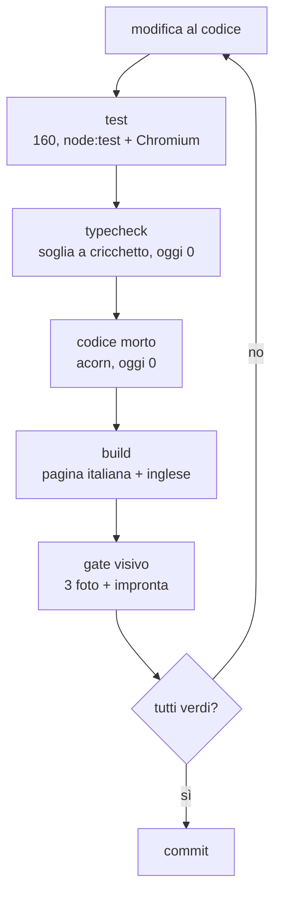

{/*
FONTI: docs/manuale-retro-future/schede/01-architettura-qualita-pannello.md, sottosezioni "Qualità" delle sezioni 1-6 e 9.
Blocco 1: §1 Qualità (le tre immagini del gate; la baseline Linux guardata prima di committarla).
Blocco 2: §2 Qualità (129 prove che non giravano, d5105801; prove a regex, 00b3c82e; nessuna prova guardava il risultato, cfb54b9a; workflow mai partito, a78c48ef; scena statica che pulsa, 658a84b5; baseline macOS non regge su Linux; "26 nomi mai usati" non verificabili, 31d138d6; la famiglia dei bug, invarianti.test.mjs; any che nasconde 305 errori, 995e925f; 354 su 524 errori da una radice sola).
Blocco 3: §3 Qualità (comando delle prove; 160 prove e 35 file; tre famiglie di prove; controprove; le 8 invarianti; scorciatoie-console; live-controls.test; control-defaults.test; typecheck e jsconfig; globali.d.ts; storia 524->0 con i dodici commit; codice morto con acorn; gate: cattura, impronta, maschere, confronto; due baseline; CI a tre job).
Blocco 4: §4 Qualità (prove sul comportamento; solo quattro file leggono il sorgente; soglia che non punisce chi corregge; vendor escluso; @types/three; mai any; Object3D & Partial<Mesh>; npm install invece di npm ci; acorn dichiarato; la regex dello spread; il gate aspetta lo stato; MASK_PADDING 16; due baseline; RF_GATE_* sul runner; l'impronta con i valori di runtime; la baseline si guarda prima di rigenerarla; il filtro paths senza package.json; il job manuale).
Blocco 5: §5 Qualità (numeri) e misure della sessione 2026-09-20.
Blocco 6: §6 Qualità (file e righe).
Blocco 7: analogia scritta qui, nessuna affermazione tecnica nuova.
Omesse per decisione dell'autore: le due eccezioni registrate in invarianti.test.mjs (cielo, LED della folla).
*/}

# Qualità e controlli

## Cosa vede l'utente

Niente. È l'unico capitolo su cose che il visitatore non incontra mai: 5 controlli
automatici prima di ogni commit, 3 job su GitHub Actions a ogni push. Quello che il
visitatore vede lo fotografa uno di quei controlli: il gate visivo apre la demo in
Chrome, aspetta la città e scatta 3 immagini: copertina, scena libera, scena con folla
ed equalizzatore fermi.

## Il problema

A settembre 2026 la demo aveva 3 mesi di vita, 129 test e un problema: non giravano da
nessuna parte. Nessuno script che li lanciasse, nessun job di CI che li eseguisse, e i
moduli di scena morivano all'avvio: importano three.js con uno specifier che il
browser risolve con la importmap e Node non conosce. Erano rossi da giorni
senza che nessuno lo sapesse.

Peggio: quelli che giravano guardavano il posto sbagliato. Leggevano il sorgente con
espressioni regolari, cercando un margine di 62 pixel o il nome di una funzione:
cambiare apposta un margine li rompeva, e nessuno avrebbe visto un bottone coperto da
un altro elemento. Nessuno guardava il risultato, e un riordino poteva passarli tutti
e cambiare la scena.

C'era anche un job di CI, mai partito nemmeno una volta: filtrava il ramo principale,
dove la demo non c'è più da agosto.

E infine la famiglia dei bug: tutti quelli trovati fino a quel momento erano lo stesso
difetto, un valore che ne annulla un altro in silenzio. Un cursore che sovrascrive una
costante, un tetto che taglia ogni aumento, un ritardo che si mangia un'animazione, un
`renderOrder` mai confrontato con gli altri. Nessuno si vede a schermo: l'immagine
resta quasi uguale, e l'impronta strutturale non cambia. Per intercettarli serve un
test che confronti fra loro valori che stanno in file diversi.

## Come funziona

5 controlli, in quest'ordine, e devono essere tutti verdi.

### I test

160 test in 35 file, accanto ai moduli che provano, in 3 famiglie.

I **test di pagina** aprono la demo in un Chromium guidato da Playwright, con
`page.route` che serve i file da disco: niente server, niente porta da liberare.
`src/main.js` viene sostituito da un modulo vuoto quando al test interessa solo il
markup, e allora ognuno dura meno di un secondo. Se il browser non c'è falliscono:
saltarli sarebbe un timbro.

I **test di scena** girano in node:test con un DOM finto, dove ogni metodo del contesto
canvas è un no-op. Basta a costruire cartelli, tabelloni e terminale, e il test guarda
dove finiscono gli oggetti nella scena e con quali materiali.

I **test che leggono il sorgente** sono 4, e solo per cose che il sorgente può dire da
solo: l'`AudioContext` unico, la importmap, le invarianti, l'ordine del boot e
del frame.

Ogni test nuovo ha la sua controprova: si rompe apposta ciò che deve intercettare e si
verifica che diventi rosso. Rimesse in circolo 5 trappole già corrette, una per volta,
ognuna ha acceso almeno un test.

Il file delle **invarianti** copre la famiglia di bug qui sopra: 8 test, ognuno con
accanto il bug che l'ha generato e la data. Tengono relazioni fra valori che stanno in
file diversi: nessun `renderOrder` del progetto sopra quello dei fumetti, ogni cursore
del markup con un valore multiplo del proprio `step`, il tetto del battito musicale
sopra il massimo che il calcolo può produrre.

### Il typecheck a cricchetto

Uno script fa girare tsc sui `.js` con `checkJs` dal `jsconfig.json` della demo, senza
emettere, tiene solo gli errori dei file miei e confronta il totale con una soglia
scritta nello script. Fallisce se il numero **sale**; se scende non
fallisce, chiede di abbassare la soglia nello stesso commit. Rendere rossa una
correzione insegnerebbe a non correggere.

La soglia era 524 il 19 settembre ed è 0 dal giorno dopo, in 12 commit, ognuno con
il conteggio nel titolo. Il primo da solo ne ha chiusi 312, perché 354 errori su 524
erano un solo errore ripetuto: la funzione che cerca i 537 elementi del pannello li
restituiva come `HTMLElement`, e ogni lettura di `.value` su un cursore diventava un
errore.

`vendor/` è fuori dal conteggio e i tipi di three arrivano da `@types/three`, pinnato
alla stessa r184, non dal file minificato: inferirli da lì dava in `src/` centinaia di
falsi errori, e il cricchetto puniva ogni test nuovo.

### Il rilevatore di codice morto

Un secondo script parsa ogni modulo con acorn e cerca 2 cose: nomi dichiarati che in
tutta la cartella compaiono una volta sola, nomi importati che nel corpo del file non
compaiono mai. Conta anche gli export, perché senza bundler un export che nessuno
importa viaggia comunque sulla rete. Oggi trova 0 e 0.

### Il gate visivo

Il pezzo più interessante. Uno script serve la cartella della demo su un server
locale, apre Chrome, clicca il bottone di avvio e **aspetta uno stato**, non un tempo:
funzione di ispezione presente, copertina chiusa, rivelo della città concluso. Con
un'attesa a tempo la foto finiva sulla copertina e il confronto dichiarava cambiata
tutta la scena: un falso allarme molto convincente.

Poi scatta le 3 immagini e raccoglie un'**impronta strutturale**: quanti oggetti per
tipo nella scena, i loro nomi ordinati, la posa della camera, i numeri civici, i ponti,
i tabelloni, il terminale, gli id nel DOM, più una sezione di valori di runtime, fra
cui il `renderOrder` dei fumetti e la catena dei pass di post-produzione. Quei valori
ci sono perché i 5 bug della famiglia lasciano l'immagine quasi uguale: rimessa la
trappola del `renderOrder`, i pixel diversi erano lo 0,17% e l'impronta ha detto il
nome esatto del campo cambiato.

Il confronto maschera le zone con rumore per costruzione: il pannello dei tempi, il
bottone che pulsa, l'equalizzatore. La soglia è 0,05% di pixel diversi sulla copertina,
1,5% sulla scena.

Un dettaglio che conta: **la scena “statica” non è ferma**. Con folla
ed equalizzatore spenti restano le luci che pulsano a tempo e le nuvole che scorrono.
Due frame a 3 secondi di distanza nella stessa sessione differivano del 2,3%, e a
codice identico la baseline della mattina batteva le catture del pomeriggio del 3,7%,
sopra soglia. Fermare l'orologio della scena non si può senza toccare 15 moduli.
Quindi il gate fotografa a un **istante fisso** dell'orologio, poi scatta una
**raffica**: il confronto prende il frame più vicino alla baseline e stampa anche il
singolo e il peggiore. Una fase diversa abbassa solo il migliore; una regressione vera
li alza tutti.

### Le due baseline e la CI

La baseline fatta sul mio Mac con Chrome e GPU vera non vale sul runner di GitHub
Actions: lì manca il carattere della copertina e il disegno è software, quindi la
copertina differisce dell'1,44% contro una soglia dello 0,05%. Non è una regressione, è
un altro sistema. Il runner ha quindi la sua baseline, generata da lui e guardata prima
del commit. Finché non esisteva, il job fotografava e diceva come procedere,
senza fingere di aver confrontato.

Su GitHub Actions girano 3 job: i test con typecheck, codice morto e build; il gate
visivo; il build di questo manuale, dove un link rotto ferma tutto.

## Perché così e non altrimenti

- **I test guardano il comportamento, non il sorgente.** Un test costruisce la scena o
  apre la pagina e misura dove finiscono le cose. 27 test che leggevano il markup con
  espressioni regolari sono stati sostituiti da test che aprono la pagina vera.
- **4 file leggono ancora il sorgente, e sono dichiarati.** L'ordine del boot e
  del frame è logica, non stile, e finché il ciclo vive in un file non c'è altro
  modo di osservarlo. I 3 test sull'`AudioContext` lo fanno perché il difetto compare
  solo se fra apertura della pagina e click passa tempo, e un test di comportamento
  clicca subito.
- **Mai `any`.** Metterlo sulle dipendenze del pannello aveva fatto sparire 305 errori
  veri in un colpo, e sembrava un miglioramento. Se un conteggio crolla più del
  previsto, il primo sospetto sono io.
- **Il nodo della scena è `Object3D & Partial<Mesh>`, non un cast a `Mesh`.** La
  visita all'albero passa gruppi e luci: dire che sono mesh sarebbe una bugia.
- **`MASK_PADDING` a 16 pixel, non 6.** Il bottone di avvio ha un bagliore che sborda
  di 14 pixel dal proprio rettangolo, e il rettangolo non lo sa: una copertina
  identica sforava lo 0,05%. Prima di alzare una soglia si guarda dove stanno i pixel
  diversi.
- **La baseline si rigenera solo dopo aver guardato le immagini.** Una baseline
  rigenerata senza guardarla trasforma il gate in un timbro: da quel momento approva
  qualunque cosa.
- **In CI si installa con `npm install --no-package-lock`, non `npm ci`**, perché il
  lockfile è fermo al primo commit e `npm ci` lo rifiuta come fuori sincrono.

Cose che non so spiegare, e lo dico:

- Il typecheck gira senza la modalità severa, e nessuna fonte dice se sia una
  scelta o solo il punto di partenza di allora.
- Il numero degli elementi del pannello non torna fra i documenti e il codice: 529 in
  un posto, 537 chiamate e 538 chiavi nell'altro.
- Il file che spiega la baseline dice che il gate lascia il server acceso a fine corsa;
  il codice lo chiude. Uno dei due è rimasto indietro, e non so quale.

## I numeri

| cosa | valore | fonte e data |
|---|---|---|
| test | 160 in 35 file | `npm run test:retro-future`, 2026-09-20 |
| errori di tipo | 0, soglia 0 (524 il giorno prima) | `npm run typecheck:retro-future`, 2026-09-20 |
| commit per andare da 524 a 0 | 12, ognuno con il conteggio nel titolo | `git log`, 2026-09-20 |
| errori dovuti a una radice sola | 354 su 524 (68%) | documento della tappa 8 |
| codice morto | 0 nomi, 0 import, su 132 file | `npm run morto:retro-future`, 2026-09-20 |
| soglia del gate, copertina | 0,05% di pixel diversi | `retro-future-visual-compare.py` |
| soglia del gate, scena | 1,5% | stesso file |
| margine delle maschere | 16 pixel | stesso file, commit 914cd431 |
| scena statica, 2 foto a 3 secondi | 2,3% di pixel diversi | misura del 2026-09-19 |
| baseline macOS sul runner Linux | copertina 1,44%, scena 12,4% | misura del 2026-09-19 |
| test sulle invarianti | 8, ognuno con il bug e la data | `src/invarianti.test.mjs` |

## Dove sta nel codice

| file | ruolo |
|---|---|
| `scripts/retro-future-typecheck.mjs` | typecheck con soglia a cricchetto |
| `scripts/retro-future-codice-morto.mjs` | nomi e import mai usati, con acorn |
| `scripts/retro-future-visual-gate.mjs` | cattura: server, browser, attesa dello stato, impronta |
| `scripts/retro-future-visual-compare.py` | confronto: maschere, soglie, raffica, impronta |
| `src/invarianti.test.mjs` | le otto relazioni che si annullano in silenzio |
| `src/scorciatoie-console.test.mjs` | chiama tutte e 11 le scorciatoie di ispezione |
| `test/pagina.mjs`, `test/finti-dom.mjs` | le due impalcature dei test |
| `.github/workflows/retro-future.yml` | i 3 job di GitHub Actions |

Le due baseline stanno in `test/retro-future-baseline/` (il mio Mac) e
`test/retro-future-baseline-linux/` (il runner), ognuna con le 3 immagini, l'impronta e
un file che dice da dove viene e quando si rigenera.

## Per chi viene dal backend

Il typecheck a cricchetto è una soglia di copertura che può solo migliorare, applicata
ai tipi invece che alle righe coperte. Il gate visivo è un test di integrazione il cui
oggetto è un'immagine: la parte difficile non è confrontare, è rendere deterministico
ciò che si confronta; la soluzione, istante fisso più raffica, è quella di sempre per
un sistema con orologio proprio. L'impronta strutturale è uno snapshot test: più
stabile dei pixel e più eloquente, perché quando fallisce dice il nome del campo.
